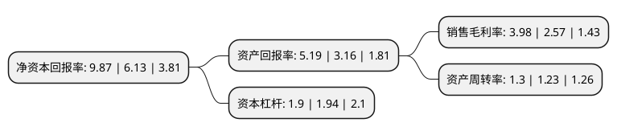

> 本页面由自动化程序生成于 2022年5月20日 01:12
> 内容可能存在错误，如有bug请提交issue至：https://github.com/Eroleice/doc-pi/issues
{.is-warning}

# 上市公司基本情况

## 基本资料

新疆天顺供应链股份有限公司（以下简称“天顺股份”）成立于2008年12月10日，乌鲁木齐市。于2016年05月30日在深交所中小板上市。

天顺股份注册资本10,875.219万元，主要从事于大宗货物和大件货物的第三方物流业务，并从事于相应的供应链管理，物流园区经营及物流金融监管等业务。以下是详细信息：

- 公司名称: 新疆天顺供应链股份有限公司
- 股票代码: 002800.SZ
- 所在地: 新疆 - 乌鲁木齐市
- 成立日期: 2008年12月10日
- 注册资本: 10,875.219万元
- 法定代表人: 王普宇
- 主营业务: 主要从事于大宗货物和大件货物的第三方物流业务，并从事于相应的供应链管理，物流园区经营及物流金融监管等业务
- 公司官网: www.xjtsscm.com
- 公司介绍: 公司是一家管理水平先进、产业链覆盖较广、综合配套能力很强的专业从事综合型供应链服务的企业，业务链以持续做大做强第三方物流为基础，并延伸至供应链管理、物流园区经营及物流金融监管等业务领域，能够为客户提供包括供应链方案设计、物流、供应链流程管理、仓储、采购、分销、物流监管等在内的一站式、全方位的综合型供应链服务。公司是疆内营业收入最大的综合性第三方物流供应商，先后被评定为AAAA级物流企业、中国物流与采购联合会常务理事单位、“2011年度中国大件物流行业模范单位”和“2012年度全国特种物流行业全国三十强企业”称号、“大件道路安全运输示范单位”等，未来公司将不断巩固和加强第三方物流的基础优势，打造物流园区的平台，充分发挥物流园区的聚集功能，努力发展成为专业化一站式综合型供应链服务供应商。

## 股东及高管情况

上市公司第一大股东为新疆天顺投资集团有限公司，持股47,040,000股，占比43.25%，为上市公司实际控制人。

截至2022年03月31日，上市公司的前十大股东中，共有9名自然人股东，1名机构股东，其中5%以上大股东共有1名。上市公司前十大股东明细如下：

> 截至2022年03月31日，上市公司前十大股东信息如下：

| 股东名称 | 持股数量（股） | 持股比例 |
| --- | --- | --- |
| 新疆天顺投资集团有限公司 | 47,040,000 | 43.25% |
| 王普宇 | 4,494,000 | 4.13% |
| 胡晓玲 | 4,200,191 | 3.86% |
| 白炳辉 | 1,260,000 | 1.16% |
| 赵素菲 | 1,181,250 | 1.09% |
| 黄海棠 | 1,120,000 | 1.03% |
| 肖瑶 | 730,497 | 0.67% |
| 陈琴香 | 500,000 | 0.46% |
| 谭武征 | 361,100 | 0.33% |
| 肖国辉 | 355,400 | 0.33% |

## 利润表分析

上市公司2021年总收入为13.02亿元，净利润为0.51亿元，实现盈利。

## 杜邦分析

> 数据列示周期：2021年 | 2020年 | 2019年
{.is-info}

上市公司的净资产收益率在近一年有所上升，上升幅度为61.01%，其变化情况分解如下：
- 上市公司的销售毛利率在近一年上升了54.86%，可能是生产效率的提升、商品原材料价格下跌或商品价格的上涨所致。
- 上市公司的资产周转率在近一年上升了5.69%，可能是源自于更快的销售回款或库存管理效果提升。
- 上市公司的财务杠杆比率在近一年下降了-2.06%，可能是减少负债降低财务费用。

