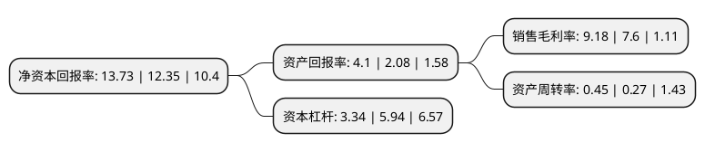

> 本页面由自动化程序生成于 2022年5月20日 01:13
> 内容可能存在错误，如有bug请提交issue至：https://github.com/Eroleice/doc-pi/issues
{.is-warning}

# 上市公司基本情况

## 基本资料

深圳市东方嘉盛供应链股份有限公司（以下简称“东方嘉盛”）成立于2001年07月09日，深圳市。于2017年07月31日在深交所中小板上市。

东方嘉盛注册资本13,810.143万元，主营业务是提供综合供应链管理服务。业务模式包括:深度整合供应链管理服务和基础供应链管理服务。以下是详细信息：

- 公司名称: 深圳市东方嘉盛供应链股份有限公司
- 股票代码: 002889.SZ
- 所在地: 广东 - 深圳市
- 成立日期: 2001年07月09日
- 注册资本: 13,810.143万元
- 法定代表人: 孙卫平
- 主营业务: 主营业务是提供综合供应链管理服务业务模式包括:深度整合供应链管理服务和基础供应链管理服务
- 公司官网: www.easttop.com.cn
- 公司介绍: 公司是一家创新型、综合性专业第三方物流企业，在国内市场居于领先地位，在行业内具有较高的知名度和影响力。公司主要致力于为不同客户设计并实施个性化的供应链管理集成解决方案。就具体服务产品而言，公司目前较为成熟的服务产品包括成品采购执行、零部件采购执行、渠道销售执行、最终用户销售执行、国际分拨、国际采购、逆向物流、商业性再加工等。公司具备跨行业拓展并有效复制成功经验的能力，具备成熟的供应链解决方案研发设计流程；同时，公司拥有一支具备较强的实施和执行能力供应链管理人才队伍。

## 股东及高管情况

上市公司第一大股东为孙卫平，持股64,255,400股，占比46.53%，为上市公司实际控制人。

截至2022年03月31日，上市公司的前十大股东中，共有8名自然人股东，1名机构股东，1个海外主体，其中5%以上大股东共有3名。上市公司前十大股东明细如下：

> 截至2022年03月31日，上市公司前十大股东信息如下：

| 股东名称 | 持股数量（股） | 持股比例 |
| --- | --- | --- |
| 孙卫平 | 64,255,400 | 46.53% |
| 邓思晨 | 17,800,000 | 12.89% |
| 邓思瑜 | 17,800,000 | 12.89% |
| 上海智君投资管理中心(有限合伙) | 1,500,000 | 1.09% |
| 祁洪娟 | 670,600 | 0.49% |
| 张列 | 467,700 | 0.34% |
| JPMORGAN CHASE BANK,NATIONAL ASSOCIATION | 436,700 | 0.32% |
| 陈小丽 | 331,100 | 0.24% |
| 杜涛 | 301,100 | 0.22% |
| 许金福 | 262,600 | 0.19% |

## 杜邦分析

> 数据列示周期：2021年 | 2020年 | 2019年
{.is-info}

上市公司的净资产收益率在近一年有所上升，上升幅度为11.17%，其变化情况分解如下：
- 上市公司的销售毛利率在近一年上升了20.79%，可能是生产效率的提升、商品原材料价格下跌或商品价格的上涨所致。
- 上市公司的资产周转率在近一年上升了66.67%，可能是源自于更快的销售回款或库存管理效果提升。
- 上市公司的财务杠杆比率在近一年下降了-43.77%，可能是减少负债降低财务费用。

