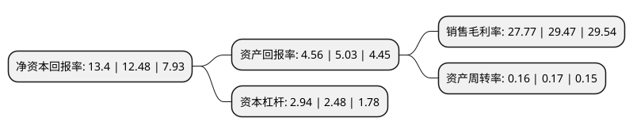

> 本页面由自动化程序生成于 2022年5月20日 01:13
> 内容可能存在错误，如有bug请提交issue至：https://github.com/Eroleice/doc-pi/issues
{.is-warning}

# 上市公司基本情况

## 基本资料

广东宏川智慧物流股份有限公司（以下简称“宏川智慧”）成立于2012年11月06日，东莞市。于2018年03月28日在深交所中小板上市。

宏川智慧注册资本44,682.673万元，主要业务:仓储综合服务，中转及其他服务，物流金融服务及物流链管理服务四大业务。以下是详细信息：

- 公司名称: 广东宏川智慧物流股份有限公司
- 股票代码: 002930.SZ
- 所在地: 广东 - 东莞市
- 成立日期: 2012年11月06日
- 注册资本: 44,682.673万元
- 法定代表人: 林海川
- 主营业务: 仓储综合服务，中转及其他服务，物流金融服务及物流链管理服务四大业务
- 公司官网: www.grsl.cn
- 公司介绍: 公司系一家创新型石化产品物流综合服务提供商，主要为境内外石化产品生产商、贸易商和终端用户提供仓储综合服务及其他相关服务。公司主要从事仓储综合服务、中转及其他服务、物流金融服务及物流链管理服务四大业务。公司码头可靠泊能力与储罐容量匹配度高，码头及储罐可最大程度地得到合理利用，为公司追求效益最大化提供有力保障。公司始终将安全管理工作放在首位，紧紧围绕“安全第一、安全发展、预防为主、综合治理”的管理理念灌输到企业运营的各方面，遵从国际高标准的安全、环保和职业健康管理规范，制定了严格的“三标一体”管理体系，三江港储、太仓阳鸿、南通阳鸿多次获评当地“安全工作先进单位”等荣誉称号。公司各库区均通过ISO9001、ISO14001、OSAS18001体系认证，以及行业内最高标准欧洲化学品分拨协会CDI-T审核认证，并且公司各库区及码头均已取得安全评估报告及环境影响报告书。

## 股东及高管情况

上市公司第一大股东为广东宏川集团有限公司，持股144,144,000股，占比32.24%，为上市公司实际控制人。

截至2022年03月31日，上市公司的前十大股东中，共有2名自然人股东，5名机构股东，1个产品账户，2个海外主体，其中5%以上大股东共有3名。上市公司前十大股东明细如下：

> 截至2022年03月31日，上市公司前十大股东信息如下：

| 股东名称 | 持股数量（股） | 持股比例 |
| --- | --- | --- |
| 广东宏川集团有限公司 | 144,144,000 | 32.24% |
| 东莞市宏川化工供应链有限公司 | 79,266,678 | 17.73% |
| 香港中央结算有限公司(陆股通) | 65,088,443 | 14.56% |
| 林海川 | 20,381,973 | 4.56% |
| JPMORGAN CHASE BANK,NATIONAL ASSOCIATION | 19,632,364 | 4.39% |
| 中国工商银行股份有限公司-诺安先锋混合型证券投资基金 | 10,054,767 | 2.25% |
| 工银资管(全球)有限公司-客户资金(交易所) | 6,790,070 | 1.52% |
| 广发控股(香港)有限公司-客户资金 | 5,419,988 | 1.21% |
| 福建百源股权投资合伙企业(有限合伙) | 4,555,004 | 1.02% |
| 林南通 | 3,303,370 | 0.74% |

## 利润表分析

上市公司2021年总收入为10.87亿元，净利润为3.02亿元，实现盈利。

## 杜邦分析

> 数据列示周期：2021年 | 2020年 | 2019年
{.is-info}

上市公司的净资产收益率在近一年有所上升，上升幅度为7.37%，其变化情况分解如下：
- 上市公司的销售毛利率在近一年下降了-5.77%，可能是生产效率的下降、商品原材料价格上涨或商品价格的下跌所致。
- 上市公司的资产周转率在近一年下降了-5.88%，可能是源自于更慢的销售回款或库存管理效果下降。
- 上市公司的财务杠杆比率在近一年上升了18.55%，可能是增加负债扩大生产规模。

