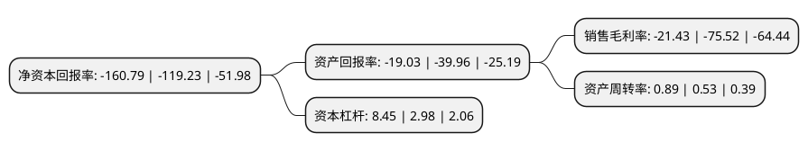

> 本页面由自动化程序生成于 2022年5月20日 01:14
> 内容可能存在错误，如有bug请提交issue至：https://github.com/Eroleice/doc-pi/issues
{.is-warning}

# 上市公司基本情况

## 基本资料

江苏新宁现代物流股份有限公司（以下简称“新宁物流”）成立于1997年02月24日，苏州市。于2009年10月30日在深交所创业板上市。

新宁物流注册资本44,668.712万元，主要业务:以电子元器件保税仓储为基础，并为电子信息产业供应链中的原料供应，采购与生产环节提供一体化的物流与供应链管理服务，主要包括进出口货物保税仓储管理，配送方案设计与实施，及与之相关的货运代理，进出口通关报检等综合物流服务。以下是详细信息：

- 公司名称: 江苏新宁现代物流股份有限公司
- 股票代码: 300013.SZ
- 所在地: 江苏 - 苏州市
- 成立日期: 1997年02月24日
- 注册资本: 44,668.712万元
- 法定代表人: 周博
- 主营业务: 以电子元器件保税仓储为基础，并为电子信息产业供应链中的原料供应，采购与生产环节提供一体化的物流与供应链管理服务，主要包括进出口货物保税仓储管理，配送方案设计与实施，及与之相关的货运代理，进出口通关报检等综合物流服务
- 公司官网: www.xinning.com.cn
- 公司介绍: 公司是长三角地区一流综合仓储物流服务提供商，一直专注于保税仓储及配套物流服务，国内较早进入电子信息产业的仓储物流企业之一，已经成长为行业内知名的保税仓储服务商。公司主营业务是以电子元器件保税仓储为基础，并为电子信息产业供应链中的原料供应、采购与生产环节提供一体化的物流与供应链管理服务，主要包括进出口货物保税仓储管理、配送方案设计与实施，及与之相关的货运代理、进出口通关报检等综合物流服务。在相关仓储物流行业“盈利模式”的复制和国内电子信息产业的发展为公司带来良好的发展前景，并已形成了支持公司持续发展的核心竞争优势具备高端综合物流服务能力。公司已经形成相对稳定的电子信息行业服务对象，包括：泰科、MOLEX、金像、东芝、富士康等电子元器件供应商(或代理商)和仁宝、名硕、伟创力、联想、纬创、佳能等的电子信息产品制造商。公司以推动智能物流供应链管理的发展为己任，坚持技术与服务的两大核心优势，凭借自身产品与服务的创新、供应链管理和卓越执行力，立志将公司建设成中国最具竞争力的综合物流集团。

## 股东及高管情况

上市公司第一大股东为曾卓，持股36,300,000股，占比8.13%，**疑似为**上市公司实际控制人。

截至2022年04月22日，上市公司的前十大股东中，共有6名自然人股东，4名机构股东，其中5%以上大股东共有7名。上市公司前十大股东明细如下：

> 未能通过持股比例判定出上市公司实际控制人（持股30%以上）
> 可能存在通过间接持股、联合持股、协议控制等方式拥有实际控制权的主体，具体请参考上市公司定期公告！
{.is-warning}

> 上市公司第一大股东持股不超过10%，请检查是否存在公司控制权风险！
{.is-danger}

> 截至2022年04月22日，上市公司前十大股东信息如下：

| 股东名称 | 持股数量（股） | 持股比例 |
| --- | --- | --- |
| 曾卓 | 36,300,000 | 8.13% |
| 曾卓 | 36,300,000 | 8.13% |
| 曾卓 | 36,300,000 | 8.13% |
| 河南中原金控有限公司 | 33,202,650 | 7.43% |
| 河南中原金控有限公司 | 33,202,650 | 7.43% |
| 宿迁京东振越企业管理有限公司 | 25,147,611 | 5.6298% |
| 宿迁京东振越企业管理有限公司 | 22,336,312 | 5.0004% |
| 吴晓娴 | 4,673,700 | 1.05% |
| 邹春秀 | 1,993,809 | 0.45% |
| 汪洪勇 | 1,672,500 | 0.37% |

## 利润表分析

上市公司2021年总收入为8.83亿元，净利润为-1.9亿元，**未实现盈利**。

## 杜邦分析

> 数据列示周期：2021年 | 2020年 | 2019年
{.is-info}

上市公司的净资产收益率在近一年有所上升，上升幅度为34.86%，其变化情况分解如下：
- 上市公司的销售毛利率在近一年下降了-71.62%，可能是生产效率的下降、商品原材料价格上涨或商品价格的下跌所致。
- 上市公司的资产周转率在近一年上升了67.92%，可能是源自于更快的销售回款或库存管理效果提升。
- 上市公司的财务杠杆比率在近一年上升了183.56%，可能是增加负债扩大生产规模。

