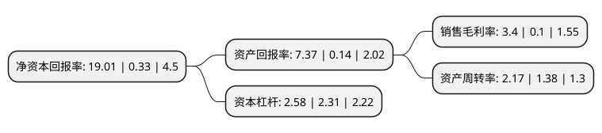

> 本页面由自动化程序生成于 2022年5月20日 01:16
> 内容可能存在错误，如有bug请提交issue至：https://github.com/Eroleice/doc-pi/issues
{.is-warning}

# 上市公司基本情况

## 基本资料

江苏飞力达国际物流股份有限公司（以下简称“飞力达”）成立于1993年04月22日，苏州市。于2011年07月06日在深交所创业板上市。

飞力达注册资本36,724.875万元，主要业务:设计并提供一体化供应链管理解决方案，通过市场定位与业务规划设计，业务流程设计，信息系统设计，组织设计，硬件规划等方面，为客户提供一站式物流解决方案。以下是详细信息：

- 公司名称: 江苏飞力达国际物流股份有限公司
- 股票代码: 300240.SZ
- 所在地: 江苏 - 苏州市
- 成立日期: 1993年04月22日
- 注册资本: 36,724.875万元
- 法定代表人: 姚勤
- 主营业务: 设计并提供一体化供应链管理解决方案，通过市场定位与业务规划设计，业务流程设计，信息系统设计，组织设计，硬件规划等方面，为客户提供一站式物流解决方案
- 公司官网: www.feiliks.com
- 公司介绍: 公司是国内IT制造业最专业的现代物流服务商之一。公司从事的主营业务为设计并提供一体化供应链管理解决方案，通过市场定位与业务规划设计、业务流程设计、信息系统设计、组织设计、硬件规划等方面，为客户提供一站式物流解决方案。根据业务功能的不同，公司的物流服务划分为基础物流、综合物流和特色物流。从三方面共同打造一体化供应链管理的现代物流。公司以货运代理和进出口通关等基础物流服务起步，逐步开发拓展精品航线、快进快出、关务外包等延伸增值类服务，凭借坚实的基础物流服务平台，公司积极向综合物流服务领域发展，形成以IT制造业品牌商客户为核心的品牌商VMI、分销以及备品备件分拨中心管理模式，并逐步横向拓展形成了制造商VMI模式、供应商DC模式等综合物流服务产品。经过多年发展，公司开始为全球第一大笔记本电脑品牌商—宏碁提供一体化供应链管理服务，已成为其指定的大中华地区唯一品牌商VMI模式物流服务商。公司与全球知名品牌商联想、华硕、索尼和爱立信建立了良好的合作关系，成功融入品牌商的一体化产业链管理体系，是品牌商有效降低营运成本、提高产品竞争力、实现价值最大化的重要环节和有力保障。

## 股东及高管情况

上市公司第一大股东为昆山飞达投资管理有限公司，持股48,990,000股，占比13.31%，**疑似为**上市公司实际控制人。

截至2022年03月31日，上市公司的前十大股东中，共有2名自然人股东，6名机构股东，2个产品账户，其中5%以上大股东共有4名。上市公司前十大股东明细如下：

> 未能通过持股比例判定出上市公司实际控制人（持股30%以上）
> 可能存在通过间接持股、联合持股、协议控制等方式拥有实际控制权的主体，具体请参考上市公司定期公告！
{.is-warning}

> 截至2022年03月31日，上市公司前十大股东信息如下：

| 股东名称 | 持股数量（股） | 持股比例 |
| --- | --- | --- |
| 昆山飞达投资管理有限公司 | 48,990,000 | 13.31% |
| 昆山亚通汽车维修服务有限公司 | 47,190,000 | 12.82% |
| 昆山吉立达投资咨询有限公司 | 43,223,625 | 11.74% |
| 昆山创业控股集团有限公司 | 33,988,478 | 9.23% |
| 苏州古玉鼎若股权投资合伙企业(有限合伙) | 18,240,460 | 4.95% |
| 江苏飞力达国际物流股份有限公司-第一期员工持股计划 | 8,775,425 | 2.38% |
| 耿昊 | 7,240,000 | 1.97% |
| 王又馗 | 6,115,100 | 1.66% |
| 昆山市创业投资有限公司 | 2,763,017 | 0.75% |
| 上海宁泉资产管理有限公司-宁泉致远39号私募证券投资基金 | 1,684,700 | 0.46% |

## 利润表分析

上市公司2021年总收入为69.55亿元，净利润为2.36亿元，实现盈利。

## 杜邦分析

> 数据列示周期：2021年 | 2020年 | 2019年
{.is-info}

上市公司的净资产收益率在近一年有所上升，上升幅度为5660.61%，其变化情况分解如下：
- 上市公司的销售毛利率在近一年上升了3300%，可能是生产效率的提升、商品原材料价格下跌或商品价格的上涨所致。
- 上市公司的资产周转率在近一年上升了57.25%，可能是源自于更快的销售回款或库存管理效果提升。
- 上市公司的财务杠杆比率在近一年上升了11.69%，可能是增加负债扩大生产规模。

