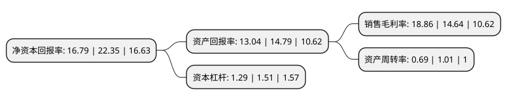

> 本页面由自动化程序生成于 2022年5月20日 01:21
> 内容可能存在错误，如有bug请提交issue至：https://github.com/Eroleice/doc-pi/issues
{.is-warning}

# 上市公司基本情况

## 基本资料

江苏海晨物流股份有限公司（以下简称“海晨股份”）成立于2011年08月18日，苏州市。于2020年08月24日在深交所创业板上市。

海晨股份注册资本13,333.333万元，主营业务是为电子信息行业相关企业提供全方位，一体化的现代综合物流服务，深度嵌入电子信息行业内企业采购，生产，销售及售后服务等各业务环节。以下是详细信息：

- 公司名称: 江苏海晨物流股份有限公司
- 股票代码: 300873.SZ
- 所在地: 江苏 - 苏州市
- 成立日期: 2011年08月18日
- 注册资本: 13,333.333万元
- 法定代表人: 梁晨
- 主营业务: 主营业务是为电子信息行业相关企业提供全方位，一体化的现代综合物流服务，深度嵌入电子信息行业内企业采购，生产，销售及售后服务等各业务环节
- 公司官网: www.hichain.com
- 公司介绍: 公司利用现代信息技术、依托综合物流管理平台，积极整合已有物流资源并打造专业化的现代物流服务体系，涵盖了制造业企业原材料物流、生产物流、成品物流以及逆向物流等供应链的全流程，实现了物流业和制造业的深入联动和良好互动，能够帮助客户缩短生产周期、降低库存量、提高生产效率，充分利用不断发展的物流行业技术及丰富的现代物流管理经验，帮助客户降低综合物流成本并实现业务共赢。经过多年的发展与积累，公司服务网点已遍布江苏、安徽、上海、广东、湖北、四川等多个省份，已建立了覆盖全国主要地区的物流网络，并在中国香港、泰国和德国等部分区域建立公司，形成了便捷高效的集货运代理、仓储服务等于一体的现代物流服务体系，获得了江苏省重点物流企业、江苏省十佳物流企业、江苏省高新技术企业等多项殊荣，在物流行业具有一定的市场地位和品牌知名度，并拥有联想集团、索尼公司、台达电子、光宝科技、大联大控股、康宁公司、伟创力公司等全球知名电子信息行业客户资源。同时公司充分利用不断发展的物流行业技术，依托完善的物流网络、丰富的物流行业经验和人才储备，积极拓展冷链物流及同城物流等业务，不断拓展综合物流业务的覆盖领域和范围。

## 股东及高管情况

上市公司第一大股东为梁晨，持股64,547,680股，占比30.26%，为上市公司实际控制人。

截至2022年04月26日，上市公司的前十大股东中，共有1名自然人股东，4名机构股东，5个产品账户，其中5%以上大股东共有3名。上市公司前十大股东明细如下：

> 截至2022年04月26日，上市公司前十大股东信息如下：

| 股东名称 | 持股数量（股） | 持股比例 |
| --- | --- | --- |
| 梁晨 | 64,547,680 | 30.26% |
| 吴江兄弟投资中心(有限合伙) | 41,292,000 | 19.36% |
| 纽诺金通有限公司 | 25,136,610 | 11.78% |
| 苏州亨通永鑫创业投资企业(有限合伙) | 6,714,893 | 3.15% |
| 中国工商银行股份有限公司-交银施罗德趋势优先混合型证券投资基金 | 5,872,272 | 2.75% |
| 普信投资公司-客户资金 | 4,939,103 | 2.32% |
| 中国农业银行-大成创新成长混合型证券投资基金(LOF) | 3,536,971 | 1.66% |
| 中国农业银行股份有限公司-大成新锐产业混合型证券投资基金 | 2,026,640 | 0.95% |
| 中国农业银行股份有限公司-大成高新技术产业股票型证券投资基金 | 1,448,409 | 0.68% |
| 广发证券股份有限公司-大成睿景灵活配置混合型证券投资基金 | 1,315,676 | 0.62% |

## 利润表分析

上市公司2021年总收入为14.67亿元，净利润为3.22亿元，实现盈利。

## 杜邦分析

> 数据列示周期：2020年 | 2019年 | 2018年
{.is-info}

上市公司的净资产收益率在近一年有所下降，下降幅度为-24.88%，其变化情况分解如下：
- 上市公司的销售毛利率在近一年上升了28.83%，可能是生产效率的提升、商品原材料价格下跌或商品价格的上涨所致。
- 上市公司的资产周转率在近一年下降了-31.68%，可能是源自于更慢的销售回款或库存管理效果下降。
- 上市公司的财务杠杆比率在近一年下降了-14.57%，可能是减少负债降低财务费用。

