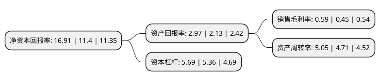

> 本页面由自动化程序生成于 2022年5月20日 01:24
> 内容可能存在错误，如有bug请提交issue至：https://github.com/Eroleice/doc-pi/issues
{.is-warning}

# 上市公司基本情况

## 基本资料

厦门象屿股份有限公司（以下简称“厦门象屿”）成立于1997年05月23日，厦门市。于1997年06月04日在上交所主板上市。

厦门象屿注册资本215,745.409万元，主营业务:大宗商品贸易，采购供应管理与综合物流服务等以下是详细信息：

- 公司名称: 厦门象屿股份有限公司
- 股票代码: 600057.SH
- 所在地: 福建 - 厦门市
- 成立日期: 1997年05月23日
- 注册资本: 215,745.409万元
- 法定代表人: 邓启东
- 主营业务: 主营业务:大宗商品贸易，采购供应管理与综合物流服务等
- 公司官网: www.xiangyu.cn
- 公司介绍: 公司主营业务为商品采购供应及综合物流服务、物流园区平台开发运营。公司以“创造流通价值，服务企业成长”为经营宗旨，紧跟中国由世界工厂向世界市场发展的步伐，为客户提供从原辅材料与半成品的采购供应直至产成品的分拨配送之间的全价值链流通服务，对全过程的商流、物流、资金流以及信息流进行系统、完善的计划、组织、协调、控制，协助制造和流通企业全方位打造供应链核心竞争力。公司已形成覆盖全国的市场网络，并拥有完善的海外代理网络，已成为国内外一批大型企业的战略合作伙伴。作为行业未来方向的引领者，公司将致力于打造全新的绿色供应链，以绿色的理念和服务，帮助客户赢得更加美好的前景和未来，将自身打造成为具有国际竞争力的中国先进物流品牌企业。

## 股东及高管情况

上市公司第一大股东为厦门象屿集团有限公司，持股1,122,603,723股，占比52.03%，为上市公司实际控制人。

截至2022年03月31日，上市公司的前十大股东中，共有3名机构股东，6个产品账户，1个海外主体，其中5%以上大股东共有1名。上市公司前十大股东明细如下：

> 截至2022年03月31日，上市公司前十大股东信息如下：

| 股东名称 | 持股数量（股） | 持股比例 |
| --- | --- | --- |
| 厦门象屿集团有限公司 | 1,122,603,723 | 52.03% |
| 全国社保基金五零三组合 | 58,999,904 | 2.73% |
| 厦门海翼集团有限公司 | 50,226,994 | 2.33% |
| 中国农垦产业发展基金(有限合伙) | 43,149,000 | 2% |
| 香港中央结算有限公司(陆股通) | 40,488,354 | 1.88% |
| 全国社保基金一一四组合 | 37,899,943 | 1.76% |
| 象屿地产集团有限公司 | 30,388,100 | 1.41% |
| 银华基金管理股份有限公司-社保基金1105组合 | 14,980,438 | 0.69% |
| 中国工商银行股份有限公司-广发多因子灵活配置混合型证券投资基金 | 14,410,314 | 0.67% |
| 全国社保基金四一二组合 | 14,097,500 | 0.65% |

## 利润表分析

上市公司2021年总收入为4,625.16亿元，净利润为27.2亿元，实现盈利。

## 杜邦分析

> 数据列示周期：2021年 | 2020年 | 2019年
{.is-info}

上市公司的净资产收益率在近一年有所上升，上升幅度为48.33%，其变化情况分解如下：
- 上市公司的销售毛利率在近一年上升了31.11%，可能是生产效率的提升、商品原材料价格下跌或商品价格的上涨所致。
- 上市公司的资产周转率在近一年上升了7.22%，可能是源自于更快的销售回款或库存管理效果提升。
- 上市公司的财务杠杆比率在近一年上升了6.16%，可能是增加负债扩大生产规模。

