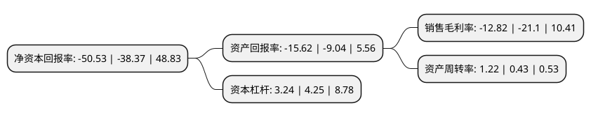

> 本页面由自动化程序生成于 2022年5月20日 01:24
> 内容可能存在错误，如有bug请提交issue至：https://github.com/Eroleice/doc-pi/issues
{.is-warning}

# 上市公司基本情况

## 基本资料

长发集团长江投资实业股份有限公司（以下简称“长江投资”）成立于1997年11月28日，上海市。于1998年01月15日在上交所主板上市。

长江投资注册资本30,740万元，主要业务:房地产开发经营，商贸经营，宾馆餐饮，劳务服务，加工制造。以下是详细信息：

- 公司名称: 长发集团长江投资实业股份有限公司
- 股票代码: 600119.SH
- 所在地: 上海 - 上海市
- 成立日期: 1997年11月28日
- 注册资本: 30,740万元
- 法定代表人: 鲁国锋
- 主营业务: 房地产开发经营，商贸经营，宾馆餐饮，劳务服务，加工制造
- 公司官网: www.cjtz.cn
- 公司介绍: 公司是一家以现代综合物流为主营业务的产业类上市公司。公司依托覆盖全球的物流服务网络、B2B的物流电子商务平台，业务功能涵盖国际货运、公共信息平台、国内快件、市内货运等。公司现代物流龙头企业上海陆上货运交易中心，是上海市唯一政府授权的道路货运公共信息平台，公司依靠强大的公共信息平台、电子信息系统网络和长江流域及海外的众多代理机构，提供全方位的物流配套及增值服务。长江现代物流服务平台是公司的主营业务板块，业务范围覆盖国际海运、国际空运、国际快递、精品物流配送、国内物流快递、陆上货运公共信息平台、城市配送等，拥有无船承运人资格证书并获得美国联邦海事委员会(FMC)认证、国际航空运输协会(IATA)会员证书、ISO9001:2000质量管理体系证书和企业诚信度评估A级证书。公司投资控股的专业生产气象仪器高科技产品，拥有自主开发的GPS探空仪、火箭探空仪等新型高空和地面气象仪器；在国内同行业中具有一定的优势。公司投资的BT项目，有着丰富施工管理经验，2011年浦东新区拱极东路新建工程BT项目，多次得到浦东新区、上海市市政工程金奖。

## 股东及高管情况

上市公司第一大股东为长江经济联合发展(集团)股份有限公司，持股167,418,761股，占比45.83%，为上市公司实际控制人。

截至2022年03月31日，上市公司的前十大股东中，共有6名自然人股东，4名机构股东，其中5%以上大股东共有1名。上市公司前十大股东明细如下：

> 截至2022年03月31日，上市公司前十大股东信息如下：

| 股东名称 | 持股数量（股） | 持股比例 |
| --- | --- | --- |
| 长江经济联合发展(集团)股份有限公司 | 167,418,761 | 45.83% |
| 武汉金融控股(集团)有限公司 | 11,009,181 | 3.01% |
| 顾沈晨 | 5,049,841 | 1.38% |
| 九洲瑞盈控股有限公司 | 2,721,000 | 0.74% |
| 许海培 | 2,040,000 | 0.56% |
| 上海埃森化工有限公司 | 1,758,583 | 0.48% |
| 郭萍萍 | 1,673,501 | 0.46% |
| 金耀明 | 1,348,192 | 0.37% |
| 梅湛成 | 1,292,498 | 0.35% |
| 吴红梅 | 1,279,500 | 0.35% |

## 利润表分析

上市公司2021年总收入为11亿元，净利润为-1.42亿元，**未实现盈利**。

## 杜邦分析

> 数据列示周期：2021年 | 2020年 | 2019年
{.is-info}

上市公司的净资产收益率在近一年有所上升，上升幅度为31.69%，其变化情况分解如下：
- 上市公司的销售毛利率在近一年下降了-39.24%，可能是生产效率的下降、商品原材料价格上涨或商品价格的下跌所致。
- 上市公司的资产周转率在近一年上升了183.72%，可能是源自于更快的销售回款或库存管理效果提升。
- 上市公司的财务杠杆比率在近一年下降了-23.76%，可能是减少负债降低财务费用。

