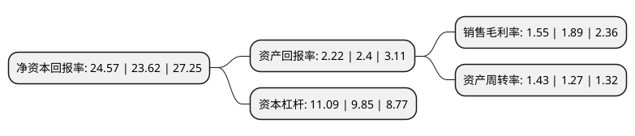

> 本页面由自动化程序生成于 2022年5月20日 01:24
> 内容可能存在错误，如有bug请提交issue至：https://github.com/Eroleice/doc-pi/issues
{.is-warning}

# 上市公司基本情况

## 基本资料

厦门建发股份有限公司（以下简称“建发股份”）成立于1998年06月10日，厦门市。于1998年06月16日在上交所主板上市。

建发股份注册资本286,342.253万元，主营业务:以供应链运营和房地产开发为主业的现代服务型企业。以下是详细信息：

- 公司名称: 厦门建发股份有限公司
- 股票代码: 600153.SH
- 所在地: 福建 - 厦门市
- 成立日期: 1998年06月10日
- 注册资本: 286,342.253万元
- 法定代表人: 郑永达
- 主营业务: 主营业务:以供应链运营和房地产开发为主业的现代服务型企业
- 公司官网: www.chinacnd.com
- 公司介绍: 公司是一家以供应链运营和房地产开发为主业的现代服务型企业。公司以“开拓新价值，让更多人过上更有品质的生活”为使命，以“专业、高效、优质、诚信”的服务理念为客户提供供应链增值服务和房地产综合服务。公司致力于供应链增值，提供“LIFT供应链服务”，以“物流”、“信息”、“金融”、“商务”四类服务要素为基础，为您整合运营过程中所需的资源，规划供应链运营解决方案，并提供运营服务。公司的供应链运营服务在金属行业、浆纸行业、矿产业、农产业、轻纺业、化工行业、机电行业、汽车行业、酒业、物流行业、金融行业、新兴行业等业务领域形成优势，与150多个国家和地区建立了业务关系。公司在房地产开发领域形成了“建发房产”与“联发房产”两大品牌，现在中国29个城市进行房地产开发，初步形成了全国性战略布局。

## 股东及高管情况

上市公司第一大股东为厦门建发集团有限公司，持股1,356,687,985股，占比47.38%，为上市公司实际控制人。

截至2022年03月31日，上市公司的前十大股东中，共有2名机构股东，7个产品账户，1个海外主体，其中5%以上大股东共有1名。上市公司前十大股东明细如下：

> 截至2022年03月31日，上市公司前十大股东信息如下：

| 股东名称 | 持股数量（股） | 持股比例 |
| --- | --- | --- |
| 厦门建发集团有限公司 | 1,356,687,985 | 47.38% |
| 中国太平洋人寿保险股份有限公司-传统-普通保险产品 | 96,829,804 | 3.38% |
| 中国太平洋人寿保险股份有限公司-分红-个人分红 | 66,384,907 | 2.32% |
| 香港中央结算有限公司(陆股通) | 59,373,086 | 2.07% |
| 招商银行股份有限公司-上证红利交易型开放式指数证券投资基金 | 39,762,383 | 1.39% |
| 博时基金管理有限公司-社保基金16011组合 | 36,700,859 | 1.28% |
| 基本养老保险基金一零零三组合 | 30,948,732 | 1.08% |
| 宁波银行股份有限公司-中泰星元价值优选灵活配置混合型证券投资基金 | 23,222,306 | 0.81% |
| 全国社保基金四一三组合 | 22,809,235 | 0.8% |
| 中国农业银行股份有限公司-富国价值优势混合型证券投资基金 | 16,958,308 | 0.59% |

## 利润表分析

上市公司2021年总收入为7,078.44亿元，净利润为109.63亿元，实现盈利。

## 杜邦分析

> 数据列示周期：2021年 | 2020年 | 2019年
{.is-info}

上市公司的净资产收益率在近一年有所上升，上升幅度为4.02%，其变化情况分解如下：
- 上市公司的销售毛利率在近一年下降了-17.99%，可能是生产效率的下降、商品原材料价格上涨或商品价格的下跌所致。
- 上市公司的资产周转率在近一年上升了12.6%，可能是源自于更快的销售回款或库存管理效果提升。
- 上市公司的财务杠杆比率在近一年上升了12.59%，可能是增加负债扩大生产规模。

