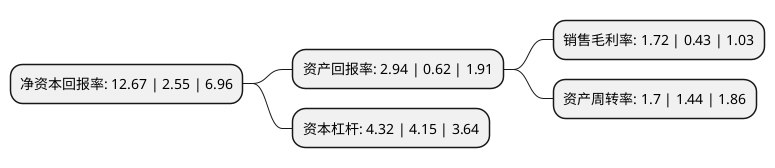

> 本页面由自动化程序生成于 2022年5月20日 01:24
> 内容可能存在错误，如有bug请提交issue至：https://github.com/Eroleice/doc-pi/issues
{.is-warning}

# 上市公司基本情况

## 基本资料

瑞茂通供应链管理股份有限公司（以下简称“瑞茂通”）成立于1998年06月25日，烟台市。于1998年07月03日在上交所主板上市。

瑞茂通注册资本101,647.746万元，主营业务:资产管理以下是详细信息：

- 公司名称: 瑞茂通供应链管理股份有限公司
- 股票代码: 600180.SH
- 所在地: 山东 - 烟台市
- 成立日期: 1998年06月25日
- 注册资本: 101,647.746万元
- 法定代表人: 李群立
- 主营业务: 主营业务:资产管理
- 公司官网: www.ccsoln.com
- 公司介绍: 公司于2000年开始进入大宗商品供应链领域，以煤炭为核心，聚焦石油化工产品、焦煤、焦炭等能源大宗商品产业链条，向产业客户提供购销、仓储物流、供应链金融等多样化、全方位供应链服务。历经多年的发展已成为中国A股领先的能源大宗商品综合服务商。同时，公司积极响应国家“一带一路”倡议号召，加速国际化布局，实现了对印度尼西亚、马来西亚、菲律宾、越南、巴基斯坦、印度、韩国、澳大利亚、南非等国家的业务拓展，初步构建全球化煤炭供应链网络。

## 股东及高管情况

上市公司第一大股东为郑州瑞茂通供应链有限公司，持股554,443,265股，占比54.55%，为上市公司实际控制人。

截至2022年03月31日，上市公司的前十大股东中，共有3名自然人股东，3名机构股东，4个产品账户，其中5%以上大股东共有2名。上市公司前十大股东明细如下：

> 截至2022年03月31日，上市公司前十大股东信息如下：

| 股东名称 | 持股数量（股） | 持股比例 |
| --- | --- | --- |
| 郑州瑞茂通供应链有限公司 | 554,443,265 | 54.55% |
| 上海豫辉投资管理中心(有限合伙) | 89,285,714 | 8.78% |
| 万永兴 | 31,250,000 | 3.07% |
| 长江财富资管-郑州新动能瑞茂通企业管理咨询中心(有限合伙)-长江财富-稳健6号单一资产管理计划 | 26,268,261 | 2.58% |
| 胡扬忠 | 17,359,460 | 1.71% |
| 刘轶 | 13,392,857 | 1.32% |
| 瑞茂通供应链管理股份有限公司-2021年员工持股计划 | 10,664,569 | 1.05% |
| 申万宏源证券有限公司 | 9,170,000 | 0.9% |
| 北京禾晟源投资管理有限公司-禾晟源景峰三号私募证券投资基金 | 7,602,684 | 0.75% |
| 北京禾晟源投资管理有限公司-禾晟源青见七号私募证劵投资基金 | 7,355,490 | 0.72% |

## 利润表分析

上市公司2021年总收入为476.42亿元，净利润为8.21亿元，实现盈利。

## 杜邦分析

> 数据列示周期：2021年 | 2020年 | 2019年
{.is-info}

上市公司的净资产收益率在近一年有所上升，上升幅度为396.86%，其变化情况分解如下：
- 上市公司的销售毛利率在近一年上升了300%，可能是生产效率的提升、商品原材料价格下跌或商品价格的上涨所致。
- 上市公司的资产周转率在近一年上升了18.06%，可能是源自于更快的销售回款或库存管理效果提升。
- 上市公司的财务杠杆比率在近一年上升了4.1%，可能是增加负债扩大生产规模。

