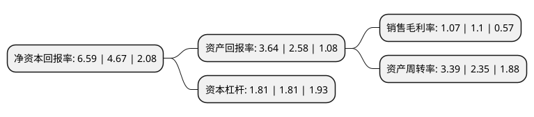

> 本页面由自动化程序生成于 2022年5月20日 01:29
> 内容可能存在错误，如有bug请提交issue至：https://github.com/Eroleice/doc-pi/issues
{.is-warning}

# 上市公司基本情况

## 基本资料

中储发展股份有限公司（以下简称“中储股份”）成立于1997年01月08日，天津市。于1997年01月21日在上交所主板上市。

中储股份注册资本219,980.103万元，主要业务:期现货交割物流，大宗商品供应链，物流+互联网，消费品物流，工程物流，金融物流。以下是详细信息：

- 公司名称: 中储发展股份有限公司
- 股票代码: 600787.SH
- 所在地: 天津 - 天津市
- 成立日期: 1997年01月08日
- 注册资本: 219,980.103万元
- 法定代表人: 梁伟华
- 主营业务: 期现货交割物流，大宗商品供应链，物流+互联网，消费品物流，工程物流，金融物流
- 公司官网: www.cmstd.com.cn
- 公司介绍: 公司是全国性大型综合物流企业之一，以物资经销和物流业务为主。公司业务涵盖期现货交割物流、大宗商品供应链、物流+互联网、消费品物流、工程物流、金融物流等领域。公司以专业化、网络化、集约化、信息化运作模式，形成了以实体网络为依托，以信息化为纽带，以现代物流技术为手段，以大客户为主要服务对象，具有仓储、运输、配送、质押监管、多式联运、加工制造、物流设计、物流贸易、科技开发、现货市场、电子商务、小额贷款、金属材料检验、物流地产开发、资本运作等综合配套的全方位、全天候多维物流服务体系。公司仓储网络覆盖亚洲、欧洲、美洲等世界主要经济区域，在国内20多个省、直辖市和自治区投资运营了物流园区，形成了立足中国、服务全球的仓储物流服务能力，能够为中外企业的全球化经营提供物流支持。公司拥有精细化、专业化、信息化管理流程和管理方法以及相当数量、素质较高的人才队伍，能够向客户提供个性化的供应链解决方案。公司所研制和生产的工业衡器、公路超载保护装置、起重衡等产品，部分国内市场占有率达50%以上，拥有一批核心自主知识产权。

## 股东及高管情况

上市公司第一大股东为中国物资储运集团有限公司，持股1,006,185,716股，占比45.74%，为上市公司实际控制人。

截至2022年03月31日，上市公司的前十大股东中，共有2名自然人股东，5名机构股东，1个产品账户，2个海外主体，其中5%以上大股东共有2名。上市公司前十大股东明细如下：

> 截至2022年03月31日，上市公司前十大股东信息如下：

| 股东名称 | 持股数量（股） | 持股比例 |
| --- | --- | --- |
| 中国物资储运集团有限公司 | 1,006,185,716 | 45.74% |
| CLH 12(HK)Limited | 339,972,649 | 15.45% |
| 香港中央结算有限公司(陆股通) | 105,243,159 | 4.78% |
| 中央汇金资产管理有限责任公司 | 20,634,600 | 0.94% |
| 国家第一养老金信托公司-自有资金 | 12,081,921 | 0.55% |
| 安大略省教师养老金计划委员会-自有资金 | 9,294,325 | 0.42% |
| 华夏人寿保险股份有限公司-自有资金 | 8,240,324 | 0.37% |
| 华泰证券股份有限公司 | 8,094,942 | 0.37% |
| 邹积庆 | 6,800,030 | 0.31% |
| 刘科全 | 6,180,000 | 0.28% |

## 利润表分析

上市公司2021年总收入为752.38亿元，净利润为8.05亿元，实现盈利。

## 杜邦分析

> 数据列示周期：2021年 | 2020年 | 2019年
{.is-info}

上市公司的净资产收益率在近一年有所上升，上升幅度为41.11%，其变化情况分解如下：
- 上市公司的销售毛利率在近一年下降了-2.73%，可能是生产效率的下降、商品原材料价格上涨或商品价格的下跌所致。
- 上市公司的资产周转率在近一年上升了44.26%，可能是源自于更快的销售回款或库存管理效果提升。
- 上市公司的财务杠杆比率在近一年下降了0%，可能是减少负债降低财务费用。

