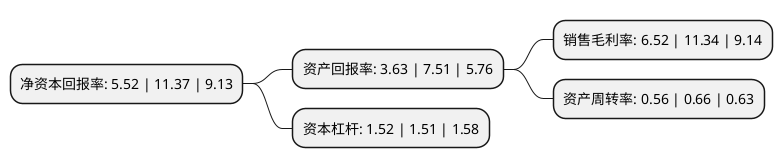

> 本页面由自动化程序生成于 2022年5月20日 01:29
> 内容可能存在错误，如有bug请提交issue至：https://github.com/Eroleice/doc-pi/issues
{.is-warning}

# 上市公司基本情况

## 基本资料

张家港保税科技(集团)股份有限公司（以下简称“保税科技”）成立于1994年06月28日，苏州市。于1997年03月06日在上交所主板上市。

保税科技注册资本121,215.216万元，主要业务:液体化工品，固体干散货仓储业务及代理等物流服务业务，为液体化工产品的生产厂商和贸易商提供货物的码头接卸，仓储等服务，适量参与化工品贸易与资本投资(包括二级市场投资)。以下是详细信息：

- 公司名称: 张家港保税科技(集团)股份有限公司
- 股票代码: 600794.SH
- 所在地: 江苏 - 苏州市
- 成立日期: 1994年06月28日
- 注册资本: 121,215.216万元
- 法定代表人: 唐勇
- 主营业务: 液体化工品，固体干散货仓储业务及代理等物流服务业务，为液体化工产品的生产厂商和贸易商提供货物的码头接卸，仓储等服务，适量参与化工品贸易与资本投资(包括二级市场投资)
- 公司官网: www.zftc.net
- 公司介绍: 公司主要从事液体化工品、固体干散货仓储业务及代理等物流服务业务，为液体化工产品的生产厂商和贸易商提供货物的码头接卸、仓储等服务，适量参与化工品贸易与资本投资。目前，公司提供包括代理、码头接卸、仓储管理、分拨运输、信息收集以及融资支持在内的一揽子综合物流服务，将传统的被动型码头仓储服务转变为以码头仓储业务为核心，提供配套运输、代理业务为支撑的主动型、一体化综合服务物流模式，打造完整的化工品物流供应链，为客户量身定做的整套综合物流服务，能够最大程度地满足各类客户的需求。依托于素有黄金水道之称的长江作为水路运输的天然优势，公司拥有液体化工产品能够大规模进出，贯通长江、直通东海的便利运输条件，可以辐射华东地区整个经济腹地(上海、浙江、江苏、山东等)，享受保税港区内政策优势，大部分储罐可做保税仓储业务。公司主要控股子公司长江国际通过提供高效、优质的服务，本着服务客户的经营理念，诚信为本，规范经营，已经在市场上积累了较好的信誉，形成了良好的口碑，品牌效应不断显现。长江国际曾荣获“4A级物流企业”、“中国仓储服务金牌企业”、“苏州市技术先进型服务企业”。

## 股东及高管情况

上市公司第一大股东为张家港保税区金港资产经营有限公司，持股432,517,788股，占比35.68%，为上市公司实际控制人。

截至2022年05月17日，上市公司的前十大股东中，共有6名自然人股东，4名机构股东，其中5%以上大股东共有2名。上市公司前十大股东明细如下：

> 截至2022年05月17日，上市公司前十大股东信息如下：

| 股东名称 | 持股数量（股） | 持股比例 |
| --- | --- | --- |
| 张家港保税区金港资产经营有限公司 | 432,517,788 | 35.68% |
| 共青城胜帮投资管理有限公司-共青城胜帮凯米投资合伙企业(有限合伙) | 93,338,882 | 7.7% |
| 深圳市前海益华投资有限公司 | 13,601,686 | 1.12% |
| 朱雪华 | 2,500,000 | 0.21% |
| 华泰证券股份有限公司 | 2,476,091 | 0.2% |
| 吴光福 | 2,274,000 | 0.19% |
| 吴金莺 | 2,241,000 | 0.18% |
| 陆宏翔 | 1,959,300 | 0.16% |
| 赵忠明 | 1,800,000 | 0.15% |
| 于冲 | 1,734,000 | 0.14% |

## 利润表分析

上市公司2021年总收入为18.71亿元，净利润为1.21亿元，实现盈利。

## 杜邦分析

> 数据列示周期：2021年 | 2020年 | 2019年
{.is-info}

上市公司的净资产收益率在近一年有所下降，下降幅度为-51.45%，其变化情况分解如下：
- 上市公司的销售毛利率在近一年下降了-42.5%，可能是生产效率的下降、商品原材料价格上涨或商品价格的下跌所致。
- 上市公司的资产周转率在近一年下降了-15.15%，可能是源自于更慢的销售回款或库存管理效果下降。
- 上市公司的财务杠杆比率在近一年上升了0.66%，可能是增加负债扩大生产规模。

