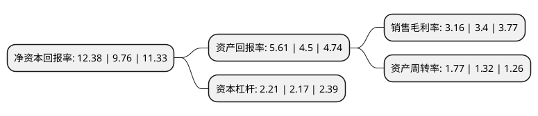

> 本页面由自动化程序生成于 2022年5月20日 01:31
> 内容可能存在错误，如有bug请提交issue至：https://github.com/Eroleice/doc-pi/issues
{.is-warning}

# 上市公司基本情况

## 基本资料

中国外运股份有限公司（以下简称“中国外运”）成立于2002年11月20日，北京市。于2019年01月18日在上交所主板上市。

中国外运注册资本740,080.388万元，主营业务包括货运代理，专业物流，仓储与码头服务，物流设备租赁和其他服务以下是详细信息：

- 公司名称: 中国外运股份有限公司
- 股票代码: 601598.SH
- 所在地: 北京 - 北京市
- 成立日期: 2002年11月20日
- 注册资本: 740,080.388万元
- 法定代表人: 王宏
- 主营业务: 主营业务包括货运代理，专业物流，仓储与码头服务，物流设备租赁和其他服务
- 公司官网: www.sinotrans.com
- 公司介绍: 公司是中国外运长航集团有限公司控股的H股公司，集海、陆、空货运、仓储码头服务、快递、船务代理及货运代理业务为一体，为广大客户提供综合物流服务，其业务主要由所属子公司(含控股)实行专业经营。公司拥有齐全、结构均衡的战略资产。通过除公司自身拥有一个覆盖中国重要战略和沿海地区的服务网络外，通过控股子公司中外运空运发展股份有限公司设立的分支机构，拥有覆盖国内主要城市和经济活跃地区的航空货运和快递服务网络；通过与母公司中国外运长航订立的多项服务协议，得以利用其所拥有的中国最庞大的服务网络；同时，通过与国际战略合作伙伴结成的同盟关系，在世界主要经济区域建立起强大的海外代理网络。

## 股东及高管情况

上市公司第一大股东为中国外运长航集团有限公司，持股2,472,216,200股，占比33.4%，为上市公司实际控制人。

截至2022年04月27日，上市公司的前十大股东中，共有5名自然人股东，3名机构股东，1个产品账户，1个海外主体，其中5%以上大股东共有2名。上市公司前十大股东明细如下：

> 截至2022年04月27日，上市公司前十大股东信息如下：

| 股东名称 | 持股数量（股） | 持股比例 |
| --- | --- | --- |
| 中国外运长航集团有限公司 | 2,472,216,200 | 33.4% |
| 招商局集团有限公司 | 1,600,597,439 | 21.63% |
| 香港中央结算有限公司(陆股通) | 113,717,664 | 1.54% |
| 陈经建 | 15,974,400 | 0.22% |
| 蒋春生 | 11,385,300 | 0.15% |
| 中国农业银行股份有限公司-中证500交易型开放式指数证券投资基金 | 9,039,114 | 0.12% |
| 中国人寿保险股份有限公司-分红-个人分红-005L-FH002沪 | 6,900,441 | 0.09% |
| 阮章新 | 6,850,000 | 0.09% |
| 陈世宇 | 6,759,147 | 0.09% |
| 元湉伟 | 5,200,000 | 0.07% |

## 利润表分析

上市公司2021年总收入为1,243.45亿元，净利润为39.32亿元，实现盈利。

## 杜邦分析

> 数据列示周期：2021年 | 2020年 | 2019年
{.is-info}

上市公司的净资产收益率在近一年有所上升，上升幅度为26.84%，其变化情况分解如下：
- 上市公司的销售毛利率在近一年下降了-7.06%，可能是生产效率的下降、商品原材料价格上涨或商品价格的下跌所致。
- 上市公司的资产周转率在近一年上升了34.09%，可能是源自于更快的销售回款或库存管理效果提升。
- 上市公司的财务杠杆比率在近一年上升了1.84%，可能是增加负债扩大生产规模。

