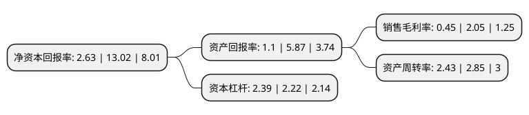

> 本页面由自动化程序生成于 2022年5月20日 01:32
> 内容可能存在错误，如有bug请提交issue至：https://github.com/Eroleice/doc-pi/issues
{.is-warning}

# 上市公司基本情况

## 基本资料

德邦物流股份有限公司（以下简称“德邦股份”）成立于2009年08月06日，上海市。于2018年01月16日在上交所主板上市。

德邦股份注册资本96,000万元，主要产品:快运业务，快递业务和其他业务(仓储供应链，跨境等)。以下是详细信息：

- 公司名称: 德邦物流股份有限公司
- 股票代码: 603056.SH
- 所在地: 上海 - 上海市
- 成立日期: 2009年08月06日
- 注册资本: 96,000万元
- 法定代表人: 崔维星
- 主营业务: 主要产品:快运业务，快递业务和其他业务(仓储供应链，跨境等)
- 公司官网: www.deppon.com
- 公司介绍: 公司致力成为以客户为中心，覆盖快递、快运、整车、仓储与供应链、跨境等多元业务的综合性物流供应商。公司凭借坚实的网络基础、强大的人才储备、深刻的市场洞悉，为跨行业的客户创造多元、灵活、高效的物流选择，让物流赋予企业更大的商业价值，赋予消费者更卓越的体验。公司始终紧随客户需求而持续创新，坚持自营门店与事业合伙人相结合的网络拓展模式，搭建优选线路，优化运力成本，为客户提供快速高效、便捷及时、安全可靠的服务。目前，公司正从国际快递、跨境电商、国际货代三大方向切入港澳台及国际市场，已开通港澳台地区以及美国、欧洲、日韩、东南亚、非洲等国家线路。通过FOSS、PDA、CRM、官网平台、APP等系统，公司实现营运端到端的透明化管理，多样化智能侦测和手机实时查看。经过多年努力，公司荣获“中国电子商务物流优秀服务商”、世界经济论坛“全球成长型公司”、“上海市重点道路货运物流企业”、“劳动与社会保障规范管理诚信单位”等荣誉称号。

## 股东及高管情况

上市公司第一大股东为宁波梅山保税港区德邦投资控股股份有限公司，持股682,890,461股，占比66.5%，为上市公司实际控制人。

截至2022年03月31日，上市公司的前十大股东中，共有5名自然人股东，2名机构股东，2个产品账户，1个海外主体，其中5%以上大股东共有2名。上市公司前十大股东明细如下：

> 截至2022年03月31日，上市公司前十大股东信息如下：

| 股东名称 | 持股数量（股） | 持股比例 |
| --- | --- | --- |
| 宁波梅山保税港区德邦投资控股股份有限公司 | 682,890,461 | 66.5% |
| 韵达控股股份有限公司 | 66,957,470 | 6.52% |
| 崔维星 | 43,009,184 | 4.19% |
| 魏巍 | 24,197,612 | 2.36% |
| 毛幼聪 | 10,070,024 | 0.98% |
| 香港中央结算有限公司(陆股通) | 9,515,078 | 0.93% |
| 德邦物流股份有限公司-第一期员工持股计划 | 8,905,392 | 0.87% |
| 魏娟意 | 7,614,302 | 0.74% |
| 德邦物流股份有限公司-第二期员工持股计划 | 7,133,300 | 0.69% |
| 林正飞 | 5,058,800 | 0.49% |

## 利润表分析

上市公司2021年总收入为313.59亿元，净利润为1.42亿元，实现盈利。

## 杜邦分析

> 数据列示周期：2021年 | 2020年 | 2019年
{.is-info}

上市公司的净资产收益率在近一年有所下降，下降幅度为-79.8%，其变化情况分解如下：
- 上市公司的销售毛利率在近一年下降了-78.05%，可能是生产效率的下降、商品原材料价格上涨或商品价格的下跌所致。
- 上市公司的资产周转率在近一年下降了-14.74%，可能是源自于更慢的销售回款或库存管理效果下降。
- 上市公司的财务杠杆比率在近一年上升了7.66%，可能是增加负债扩大生产规模。

