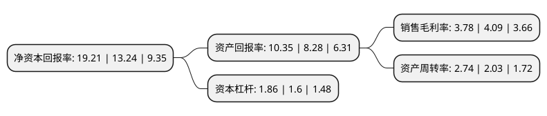

> 本页面由自动化程序生成于 2022年5月20日 01:32
> 内容可能存在错误，如有bug请提交issue至：https://github.com/Eroleice/doc-pi/issues
{.is-warning}

# 上市公司基本情况

## 基本资料

港中旅华贸国际物流股份有限公司（以下简称“华贸物流”）成立于1984年12月26日，上海市。于2012年05月29日在上交所主板上市。

华贸物流注册资本130,946.297万元，主营业务:跨境现代综合第三方物流。以下是详细信息：

- 公司名称: 港中旅华贸国际物流股份有限公司
- 股票代码: 603128.SH
- 所在地: 上海 - 上海市
- 成立日期: 1984年12月26日
- 注册资本: 130,946.297万元
- 法定代表人: 向宏
- 主营业务: 主营业务:跨境现代综合第三方物流
- 公司官网: www.ctsfreight.com
- 公司介绍: 公司是中国本土最具规模的提供跨境一站式综合物流服务的企业之一。公司主营跨境现代综合第三方物流，具体提供以国际货代为核心的跨境现代综合物流服务。同时公司属下的德祥集团、中特物流提供物流细分领域特种物流服务，前者提供特许资质进口分拨仓储物流服务，后者提供超限超重非标准化的物流运输服务，目前主要以特高压电力设备运输为主要服务对象。公司是中国最早获得一级国际货运代理资质的企业之一，也是中国最早成为国际航空协会会员的中国企业之一，拥有民用航空运输一类销售代理人、交通部无船承运人(NVOCC)、美国联邦海事委员会无船承运人(FMC)、交通部道路运输许可证、海关监管仓库、代理报关、代理报验等一整套国际运输业务经营资质，在行业内具有悠久的经营历史和市场品牌。公司在第三方物流行业的经营和发展历史悠久，是中国物流与采购联合会授予的5A级物流企业，网络的多家公司被当地政府部门评为重点物流企业，在物流行业内具有较高的行业口碑和较佳的品牌形象。

## 股东及高管情况

上市公司第一大股东为中国物流集团有限公司，持股599,644,827股，占比45.79%，为上市公司实际控制人。

截至2022年04月01日，上市公司的前十大股东中，共有1名机构股东，9个产品账户，其中5%以上大股东共有1名。上市公司前十大股东明细如下：

> 截至2022年04月01日，上市公司前十大股东信息如下：

| 股东名称 | 持股数量（股） | 持股比例 |
| --- | --- | --- |
| 中国物流集团有限公司 | 599,644,827 | 45.79% |
| 上海浦东发展银行股份有限公司-易方达创新未来18个月封闭运作混合型证券投资基金 | 41,852,362 | 3.2% |
| 上海高毅资产管理合伙企业(有限合伙)-高毅邻山1号远望基金 | 38,000,000 | 2.9% |
| 基本养老保险基金一二零五组合 | 37,086,800 | 2.83% |
| 中国工商银行股份有限公司-易方达科翔股票型证券投资基金 | 29,245,956 | 2.23% |
| 易方达基金-建设银行-易方达研究精选1号股票型资产管理计划 | 24,978,919 | 1.91% |
| 易方达基金管理有限公司-社保基金17041组合 | 24,351,287 | 1.86% |
| 港中旅华贸国际物流股份有限公司回购专用证券账户 | 20,622,962 | 1.57% |
| 全国社保基金四一四组合 | 18,470,297 | 1.41% |
| 中国银行-易方达平稳增长证券投资基金 | 15,771,870 | 1.2% |

## 利润表分析

上市公司2021年总收入为246.67亿元，净利润为9.33亿元，实现盈利。

## 杜邦分析

> 数据列示周期：2021年 | 2020年 | 2019年
{.is-info}

上市公司的净资产收益率在近一年有所上升，上升幅度为45.09%，其变化情况分解如下：
- 上市公司的销售毛利率在近一年下降了-7.58%，可能是生产效率的下降、商品原材料价格上涨或商品价格的下跌所致。
- 上市公司的资产周转率在近一年上升了34.98%，可能是源自于更快的销售回款或库存管理效果提升。
- 上市公司的财务杠杆比率在近一年上升了16.25%，可能是增加负债扩大生产规模。

