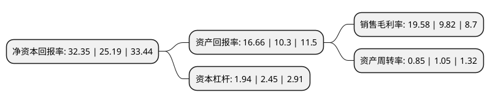

> 本页面由自动化程序生成于 2022年5月20日 01:34
> 内容可能存在错误，如有bug请提交issue至：https://github.com/Eroleice/doc-pi/issues
{.is-warning}

# 上市公司基本情况

## 基本资料

上海中谷物流股份有限公司（以下简称“中谷物流”）成立于2010年03月05日，上海市。于2020年09月25日在上交所主板上市。

中谷物流注册资本95,875.781万元，为客户提供定制化，高性价比的“门到门”全程集装箱物流解决方案。以下是详细信息：

- 公司名称: 上海中谷物流股份有限公司
- 股票代码: 603565.SH
- 所在地: 上海 - 上海市
- 成立日期: 2010年03月05日
- 注册资本: 95,875.781万元
- 法定代表人: 卢宗俊
- 主营业务: 为客户提供定制化，高性价比的“门到门”全程集装箱物流解决方案
- 公司官网: www.zhonggu56.com
- 公司介绍: 本公司以客户需求为中心，以集装箱为核心载体，以服务实体经济为宗旨，整合水路、公路、铁路运输资源协同运作，依托现代化物流信息平台，致力于为客户提供定制化、高性价比的“门到门”全程集装箱物流解决方案。本公司自成立以来保持快速、健康的发展态势，截至2018年12月31日，根据国际权威研究机构法国Alphaliner报告，本公司综合运力在全球排名第15位，国内排名前三。本公司以精品航线为特色，聚焦客户需求，凭借服务优质、运营高效的物流服务，在行业内积攒了良好口碑。本公司是国家5A级物流企业、中国物流与采购联合会副会长单位、中国物流与采购联合会采购与供应链管理专业委员会副会长单位。2018年度，公司董事长卢宗俊当选中国船东协会副会长并获得“改革开放40年物流40人”称号。2016年度和2017年度，本公司均获得了上海市浦东新区人民政府授予的“经济突出贡献奖”和中国(上海)自贸试验区管理委员会保税区管理局授予的“中国(上海)自贸试验区经济贡献百强企业”称号。

## 股东及高管情况

上市公司第一大股东为中谷海运集团有限公司，持股550,896,129股，占比57.46%，为上市公司实际控制人。

截至2022年03月31日，上市公司的前十大股东中，共有8名机构股东，1个产品账户，1个海外主体，其中5%以上大股东共有2名。上市公司前十大股东明细如下：

> 截至2022年03月31日，上市公司前十大股东信息如下：

| 股东名称 | 持股数量（股） | 持股比例 |
| --- | --- | --- |
| 中谷海运集团有限公司 | 550,896,129 | 57.46% |
| 宁波谷洋投资管理合伙企业(有限合伙) | 67,223,095 | 7.01% |
| 宁波谷泽投资管理合伙企业(有限合伙) | 34,036,114 | 3.55% |
| 宁波软银稳定成长投资合伙企业(有限合伙) | 18,539,530 | 1.93% |
| 宁波梅山保税港区沄合投资合伙企业(有限合伙) | 17,912,220 | 1.87% |
| 上海美顿投资管理有限公司 | 16,805,773 | 1.75% |
| UBS AG | 14,112,422 | 1.47% |
| 江霈(上海)创业投资中心(有限合伙) | 10,811,738 | 1.13% |
| 山东港口金融控股有限公司 | 10,053,619 | 1.05% |
| 上海自贸区股权投资基金管理有限公司-上海自贸试验区乾袤投资中心(有限合伙) | 8,762,696 | 0.91% |

## 利润表分析

上市公司2021年总收入为122.91亿元，净利润为24.06亿元，实现盈利。

## 杜邦分析

> 数据列示周期：2021年 | 2020年 | 2019年
{.is-info}

上市公司的净资产收益率在近一年有所上升，上升幅度为28.42%，其变化情况分解如下：
- 上市公司的销售毛利率在近一年上升了99.39%，可能是生产效率的提升、商品原材料价格下跌或商品价格的上涨所致。
- 上市公司的资产周转率在近一年下降了-19.05%，可能是源自于更慢的销售回款或库存管理效果下降。
- 上市公司的财务杠杆比率在近一年下降了-20.82%，可能是减少负债降低财务费用。

