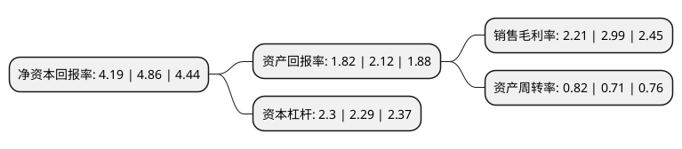

> 本页面由自动化程序生成于 2022年5月20日 01:34
> 内容可能存在错误，如有bug请提交issue至：https://github.com/Eroleice/doc-pi/issues
{.is-warning}

# 上市公司基本情况

## 基本资料

北京长久物流股份有限公司（以下简称“长久物流”）成立于2003年09月10日，北京市。于2016年08月10日在上交所主板上市。

长久物流注册资本56,027.88万元，主营业务:主要从事整车运输物流服务，主要服务内容:以整车运输业务为核心，为客户提供包括乘用车运输，商用车运输，整车仓储，零部件采购物流，售后备品物流等在内的全方面的汽车物流服务。以下是详细信息：

- 公司名称: 北京长久物流股份有限公司
- 股票代码: 603569.SH
- 所在地: 北京 - 北京市
- 成立日期: 2003年09月10日
- 注册资本: 56,027.88万元
- 法定代表人: 薄世久
- 主营业务: 主营业务:主要从事整车运输物流服务，主要服务内容:以整车运输业务为核心，为客户提供包括乘用车运输，商用车运输，整车仓储，零部件采购物流，售后备品物流等在内的全方面的汽车物流服务
- 公司官网: www.changjiulogistics.com
- 公司介绍: 公司是中国物流与采购联合会汽车物流分会理事长单位，是国内大型的独立于汽车制造企业的第三方汽车物流企业。公司涵盖汽车供应链中的整车物流、零部件物流、国际物流、多式联运及供应链金融业务；提供汽车行业专业的物流规划、运输、仓储、配送等相关服务。公司通过ISO9001并被中国物流与采购联合会授予“中国物流杰出企业”，被中国国际物流节组委会、物流时代周刊杂志社评为“中国最具社会责任物流企业”称号。

## 股东及高管情况

上市公司第一大股东为吉林省长久实业集团有限公司，持股401,440,533股，占比71.65%，为上市公司实际控制人。

截至2022年03月31日，上市公司的前十大股东中，共有7名自然人股东，2名机构股东，1个产品账户，其中5%以上大股东共有1名。上市公司前十大股东明细如下：

> 截至2022年03月31日，上市公司前十大股东信息如下：

| 股东名称 | 持股数量（股） | 持股比例 |
| --- | --- | --- |
| 吉林省长久实业集团有限公司 | 401,440,533 | 71.65% |
| 上海牧鑫资产管理有限公司-牧鑫鼎泰1号私募证券投资基金 | 28,014,000 | 5% |
| 李延春 | 23,511,044 | 4.2% |
| 李万君 | 23,511,044 | 4.2% |
| 新疆新长汇股权投资管理有限责任公司 | 6,304,472 | 1.13% |
| 朱呈祥 | 1,400,039 | 0.25% |
| 李继明 | 711,014 | 0.13% |
| 洪仲华 | 691,700 | 0.12% |
| 张金锭 | 691,100 | 0.12% |
| 高雷 | 640,018 | 0.11% |

## 利润表分析

上市公司2021年总收入为44.86亿元，净利润为0.99亿元，实现盈利。

## 杜邦分析

> 数据列示周期：2021年 | 2020年 | 2019年
{.is-info}

上市公司的净资产收益率在近一年有所下降，下降幅度为-13.79%，其变化情况分解如下：
- 上市公司的销售毛利率在近一年下降了-26.09%，可能是生产效率的下降、商品原材料价格上涨或商品价格的下跌所致。
- 上市公司的资产周转率在近一年上升了15.49%，可能是源自于更快的销售回款或库存管理效果提升。
- 上市公司的财务杠杆比率在近一年上升了0.44%，可能是增加负债扩大生产规模。

