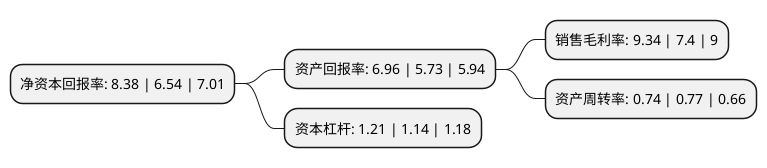

> 本页面由自动化程序生成于 2022年5月20日 01:34
> 内容可能存在错误，如有bug请提交issue至：https://github.com/Eroleice/doc-pi/issues
{.is-warning}

# 上市公司基本情况

## 基本资料

上海畅联国际物流股份有限公司（以下简称“畅联股份”）成立于2001年05月22日，上海市。于2017年09月13日在上交所主板上市。

畅联股份注册资本36,866.67万元，主营业务:为国际跨国企业提供精益供应链管理服务。主要产品:供应链物流和供应链贸易。以下是详细信息：

- 公司名称: 上海畅联国际物流股份有限公司
- 股票代码: 603648.SH
- 所在地: 上海 - 上海市
- 成立日期: 2001年05月22日
- 注册资本: 36,866.67万元
- 法定代表人: 徐峰
- 主营业务: 主营业务:为国际跨国企业提供精益供应链管理服务主要产品:供应链物流和供应链贸易
- 公司官网: www.chinaslc.com
- 公司介绍: 公司专注于为国际跨国企业提供精益供应链管理服务。在供应链中各环节依据准确、及时和个性化的物联网和信息技术服务为企业供应链中的采购、生产、销售等环节提供供应链综合管理方案的设计与实施，以及与之配套的口岸通关、仓储管理、货物配送等在内的一体化综合物流服务，帮助客户协调和优化供应链的各个流程，提高运作效率并降低运营成本。公司依托上海外高桥保税区作为公司总部和示范物流基地，积极推进服务网络的建设和拓展，形成了覆盖华东、华北、华南及中西部等重点区域、重要城市的全国化物流服务网络。公司服务的国际跨国企业主要集中于高科技电子、医疗器械和试剂、机械装备部件、进口食品和服饰等高端消费品、汽车等高端制造领域。历年来，公司获得中国(上海)自由贸易试验区优秀企业，国家AAAA级综合服务型物流企业等多项荣誉。

## 股东及高管情况

上市公司第一大股东为上海市浦东新区国有资产监督管理委员会，持股91,688,980股，占比24.87%，**疑似为**上市公司实际控制人。

截至2022年03月31日，上市公司的前十大股东中，共有2名自然人股东，6名机构股东，1个产品账户，1名其他股东，其中5%以上大股东共有3名。上市公司前十大股东明细如下：

> 未能通过持股比例判定出上市公司实际控制人（持股30%以上）
> 可能存在通过间接持股、联合持股、协议控制等方式拥有实际控制权的主体，具体请参考上市公司定期公告！
{.is-warning}

> 截至2022年03月31日，上市公司前十大股东信息如下：

| 股东名称 | 持股数量（股） | 持股比例 |
| --- | --- | --- |
| 上海市浦东新区国有资产监督管理委员会 | 91,688,980 | 24.87% |
| 上海仪电(集团)有限公司 | 49,663,945 | 13.47% |
| 上海外高桥保税区联合发展有限公司 | 38,040,701 | 10.32% |
| 嘉融投资有限公司 | 15,963,133 | 4.33% |
| 上海畅联国际物流股份有限公司回购专用证券账户 | 6,253,900 | 1.7% |
| 毛杭挺 | 4,801,200 | 1.3% |
| 徐峰 | 4,720,362 | 1.28% |
| 东航金控有限责任公司 | 4,037,036 | 1.1% |
| 大众交通(集团)股份有限公司 | 3,686,667 | 1% |
| 上海富春企业管理合伙企业(有限合伙) | 3,686,667 | 1% |

## 利润表分析

上市公司2021年总收入为15.92亿元，净利润为1.48亿元，实现盈利。

## 杜邦分析

> 数据列示周期：2021年 | 2020年 | 2019年
{.is-info}

上市公司的净资产收益率在近一年有所上升，上升幅度为28.13%，其变化情况分解如下：
- 上市公司的销售毛利率在近一年上升了26.22%，可能是生产效率的提升、商品原材料价格下跌或商品价格的上涨所致。
- 上市公司的资产周转率在近一年下降了-3.9%，可能是源自于更慢的销售回款或库存管理效果下降。
- 上市公司的财务杠杆比率在近一年上升了6.14%，可能是增加负债扩大生产规模。

