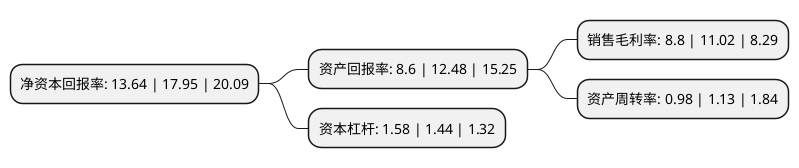

> 本页面由自动化程序生成于 2022年5月20日 01:35
> 内容可能存在错误，如有bug请提交issue至：https://github.com/Eroleice/doc-pi/issues
{.is-warning}

# 上市公司基本情况

## 基本资料

嘉友国际物流股份有限公司（以下简称“嘉友国际”）成立于2005年06月22日，北京市。于2018年02月06日在上交所主板上市。

嘉友国际注册资本31,696.07万元，主要业务:跨境多式联运，大宗矿产品物流，智能仓储等跨境多式联运综合物流服务及供应链贸易服务。以下是详细信息：

- 公司名称: 嘉友国际物流股份有限公司
- 股票代码: 603871.SH
- 所在地: 北京 - 北京市
- 成立日期: 2005年06月22日
- 注册资本: 31,696.07万元
- 法定代表人: 韩景华
- 主营业务: 跨境多式联运，大宗矿产品物流，智能仓储等跨境多式联运综合物流服务及供应链贸易服务
- 公司官网: www.jyinternational.com.cn
- 公司介绍: 公司是跨境多式联运综合物流服务及供应链贸易服务的提供商，主营业务包括跨境多式联运、大宗矿产品物流、智能仓储等跨境多式联运综合物流服务及供应链贸易服务。公司业务网络遍及世界六十多个国家和地区，其中中国、蒙古、中亚和非洲等二十多个“一带一路”沿线国家和地区是公司跨境物流业务的重点拓展区域，具有领先的物流设施和丰富的网络资源。同时公司坚持以科技助力物流发展的理念，建设物流领域专业的技术研发团队，在传统物流实践中引进先进的互联网和物联网技术，不断实施企业信息化、智能化应用，引导员工的创造性，培养出充满实战经验、富有竞争力的物流专业化团队。公司充分整合海陆空铁运输、海关公用保税及海关监管场所的仓储分拨、报关、报检、物流综合单证服务等各个环节，根据客户个性化需求制定跨境综合物流解决方案。公司是国际货运代理协会(FIATA)、中国国际货运代理协会(CIFA)以及国际货运联盟(WCA)会员，通过ISO9001质量体系认证。

## 股东及高管情况

上市公司第一大股东为嘉信益(天津)资产管理合伙企业(有限合伙)，持股88,719,500股，占比27.99%，**疑似为**上市公司实际控制人。

截至2022年03月31日，上市公司的前十大股东中，共有4名自然人股东，3名机构股东，3个产品账户，其中5%以上大股东共有5名。上市公司前十大股东明细如下：

> 未能通过持股比例判定出上市公司实际控制人（持股30%以上）
> 可能存在通过间接持股、联合持股、协议控制等方式拥有实际控制权的主体，具体请参考上市公司定期公告！
{.is-warning}

> 截至2022年03月31日，上市公司前十大股东信息如下：

| 股东名称 | 持股数量（股） | 持股比例 |
| --- | --- | --- |
| 嘉信益(天津)资产管理合伙企业(有限合伙) | 88,719,500 | 27.99% |
| 韩景华 | 47,575,512 | 15.01% |
| 紫金国际贸易有限公司 | 45,050,000 | 14.21% |
| 孟联 | 24,660,388 | 7.78% |
| 紫金矿业紫宝(厦门)投资合伙企业(有限合伙) | 16,432,128 | 5.18% |
| 紫金矿业股权投资管理(厦门)有限公司-紫金矿业紫牛(厦门)产业投资基金合伙企业(有限合伙) | 4,542,996 | 1.43% |
| 曹利玲 | 3,244,997 | 1.02% |
| 徐秋实 | 2,812,830 | 0.89% |
| 平安银行股份有限公司-中庚价值品质一年持有期混合型证券投资基金 | 2,624,318 | 0.83% |
| 阳光人寿保险股份有限公司-万能保险产品 | 2,479,903 | 0.78% |

## 利润表分析

上市公司2021年总收入为38.88亿元，净利润为3.42亿元，实现盈利。

## 杜邦分析

> 数据列示周期：2021年 | 2020年 | 2019年
{.is-info}

上市公司的净资产收益率在近一年有所下降，下降幅度为-24.01%，其变化情况分解如下：
- 上市公司的销售毛利率在近一年下降了-20.15%，可能是生产效率的下降、商品原材料价格上涨或商品价格的下跌所致。
- 上市公司的资产周转率在近一年下降了-13.27%，可能是源自于更慢的销售回款或库存管理效果下降。
- 上市公司的财务杠杆比率在近一年上升了9.72%，可能是增加负债扩大生产规模。

