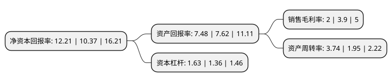

> 本页面由自动化程序生成于 2022年5月20日 01:36
> 内容可能存在错误，如有bug请提交issue至：https://github.com/Eroleice/doc-pi/issues
{.is-warning}

# 上市公司基本情况

## 基本资料

中创物流股份有限公司（以下简称“中创物流”）成立于2006年11月14日，青岛市。于2019年04月29日在上交所主板上市。

中创物流注册资本26,666.67万元，公司主营综合性现代物流业务，为进出口贸易参与主体提供基于国内沿海港口集装箱及干散货等多种货物贸易的一站式跨境综合物流服务。公司主营业务可划分为五大板块，分别为货运代理，场站，船舶代理，沿海运输及项目大件物流。以下是详细信息：

- 公司名称: 中创物流股份有限公司
- 股票代码: 603967.SH
- 所在地: 山东 - 青岛市
- 成立日期: 2006年11月14日
- 注册资本: 26,666.67万元
- 法定代表人: 李松青
- 主营业务: 公司主营综合性现代物流业务，为进出口贸易参与主体提供基于国内沿海港口集装箱及干散货等多种货物贸易的一站式跨境综合物流服务公司主营业务可划分为五大板块，分别为货运代理，场站，船舶代理，沿海运输及项目大件物流
- 公司官网: www.cmlog.com
- 公司介绍: 公司主营综合性现代物流业务，为进出口贸易参与主体提供基于国内沿海港口集装箱及干散货等多种货物贸易的一站式跨境综合物流服务。公司通过总包或者分包的形式，整合货物进出口物流链条上的各个环节，根据客户个性化需求制定全程物流解决方案，为客户提供全方位服务。公司的具体业务包括市场营销、询价报价、方案设计、成本核算等物流咨询服务，箱务管理、辅助备货、订舱代理、单证操作等物流过程服务，以及沿海运输、工程物流、大件运输等物流运输服务。公司是中国物流与采购联合会认证的中国5A级物流企业，且连年入围中国交通运输协会评选的中国物流百强企业和全国先进物流企业，并荣获“第十三届中国货运业大奖(金轮奖)综合服务十佳船舶代理公司”、“中国物流智能技术创新应用标杆企业”、“物流行业诚信互联体系建设共建单位”等称号。

## 股东及高管情况

上市公司第一大股东为青岛中创联合投资发展有限公司，持股140,000,000股，占比52.5%，为上市公司实际控制人。

截至2022年04月29日，上市公司的前十大股东中，共有8名自然人股东，2名机构股东，其中5%以上大股东共有5名。上市公司前十大股东明细如下：

> 截至2022年04月29日，上市公司前十大股东信息如下：

| 股东名称 | 持股数量（股） | 持股比例 |
| --- | --- | --- |
| 青岛中创联合投资发展有限公司 | 140,000,000 | 52.5% |
| 青岛中创联合投资发展有限公司 | 140,000,000 | 52.5% |
| 李松青 | 15,900,000 | 5.96% |
| 李松青 | 15,900,000 | 5.96% |
| 葛言华 | 14,100,000 | 5.29% |
| 谢立军 | 3,360,000 | 1.26% |
| 冷显顺 | 2,160,000 | 0.81% |
| 楚旭日 | 1,560,000 | 0.58% |
| 李涛 | 1,200,000 | 0.45% |
| 张培城 | 960,000 | 0.36% |

## 利润表分析

上市公司2021年总收入为124.13亿元，净利润为2.47亿元，实现盈利。

## 杜邦分析

> 数据列示周期：2021年 | 2020年 | 2019年
{.is-info}

上市公司的净资产收益率在近一年有所上升，上升幅度为17.74%，其变化情况分解如下：
- 上市公司的销售毛利率在近一年下降了-48.72%，可能是生产效率的下降、商品原材料价格上涨或商品价格的下跌所致。
- 上市公司的资产周转率在近一年上升了91.79%，可能是源自于更快的销售回款或库存管理效果提升。
- 上市公司的财务杠杆比率在近一年上升了19.85%，可能是增加负债扩大生产规模。

