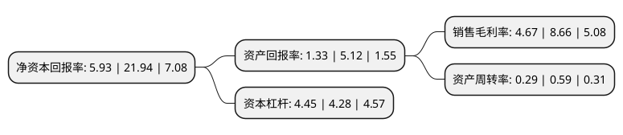

> 本页面由自动化程序生成于 2022年5月20日 01:01
> 内容可能存在错误，如有bug请提交issue至：https://github.com/Eroleice/doc-pi/issues
{.is-warning}

# 上市公司基本情况

## 基本资料

南京公用发展股份有限公司（以下简称“南京公用”）成立于1992年07月10日，南京市。于1996年08月06日在深交所主板上市。

南京公用注册资本57,833.193万元，主要业务:汽车营运，房产开发，旅游服务，商业。以下是详细信息：

- 公司名称: 南京公用发展股份有限公司
- 股票代码: 000421.SZ
- 所在地: 江苏 - 南京市
- 成立日期: 1992年07月10日
- 注册资本: 57,833.193万元
- 法定代表人: 李祥
- 主营业务: 汽车营运，房产开发，旅游服务，商业
- 公司官网: www.nj-public.com
- 公司介绍: 公司是一家以“客运交通”和“能源”为主业的综合性上市公司，主要经营出租汽车、房地产开发、电力能源、国内国际旅游、汽车销售、客运大巴、小额贷款、驾校培训等多种产业，是江苏省出租汽车龙头企业。公司出租汽车产业位于全省同行业中的领先地位；房地产业成功开发多个精品楼盘，在市场中赢得了良好反响；汽服产业业绩逐年上扬，已经成为南京市汽销市场的有力竞争者；友好国际旅行社近年来开设多家网点，规模和利润都再创新高。公司近年来先后荣获“全国五一劳动奖状”、“全国工人先锋号”、“江苏服务业名牌”、“国资系统创先争优先进基层党组织”、“南京市总部企业”等一系列荣誉称号。

## 股东及高管情况

上市公司第一大股东为南京公用控股(集团)有限公司，持股283,659,711股，占比49.05%，为上市公司实际控制人。

截至2022年03月31日，上市公司的前十大股东中，共有5名自然人股东，5名机构股东，其中5%以上大股东共有1名。上市公司前十大股东明细如下：

> 截至2022年03月31日，上市公司前十大股东信息如下：

| 股东名称 | 持股数量（股） | 持股比例 |
| --- | --- | --- |
| 南京公用控股(集团)有限公司 | 283,659,711 | 49.05% |
| 南京市城市建设投资控股(集团)有限责任公司 | 26,930,936 | 4.66% |
| 南京高淳港华燃气有限公司 | 8,593,750 | 1.49% |
| 赵昌富 | 7,000,000 | 1.21% |
| 许磊 | 6,500,000 | 1.12% |
| 胡志平 | 5,653,000 | 0.98% |
| 汪素香 | 4,535,000 | 0.78% |
| 上海强生集团有限公司 | 4,492,800 | 0.78% |
| 许喆 | 3,650,000 | 0.63% |
| 大众交通(集团)股份有限公司 | 3,621,331 | 0.63% |

## 利润表分析

上市公司2021年总收入为35.88亿元，净利润为1.67亿元，实现盈利。

## 杜邦分析

> 数据列示周期：2021年 | 2020年 | 2019年
{.is-info}

上市公司的净资产收益率在近一年有所下降，下降幅度为-72.97%，其变化情况分解如下：
- 上市公司的销售毛利率在近一年下降了-46.07%，可能是生产效率的下降、商品原材料价格上涨或商品价格的下跌所致。
- 上市公司的资产周转率在近一年下降了-50.85%，可能是源自于更慢的销售回款或库存管理效果下降。
- 上市公司的财务杠杆比率在近一年上升了3.97%，可能是增加负债扩大生产规模。

