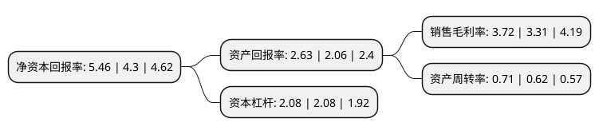

> 本页面由自动化程序生成于 2022年5月20日 01:02
> 内容可能存在错误，如有bug请提交issue至：https://github.com/Eroleice/doc-pi/issues
{.is-warning}

# 上市公司基本情况

## 基本资料

德龙汇能集团股份有限公司（以下简称“德龙汇能”）成立于1994年01月01日，成都市。于1996年03月12日在深交所主板上市。

德龙汇能注册资本35,863.101万元，主要业务:城市燃气业务，LNG业务和分布式能源业务。以下是详细信息：

- 公司名称: 德龙汇能集团股份有限公司
- 股票代码: 000593.SZ
- 所在地: 四川 - 成都市
- 成立日期: 1994年01月01日
- 注册资本: 35,863.101万元
- 法定代表人: 丁立国
- 主营业务: 城市燃气业务，LNG业务和分布式能源业务
- 公司官网: www.dtrq.com
- 公司介绍: 公司主营燃气业务，目前拥有上饶市大通燃气工程有限公司、大连新世纪燃气有限公司、德阳市旌旗天然气有限公司、罗江县天然气有限公司、成都华联商厦有限责任公司等全资子公司、控股四川大通睿恒能源有限公司，公司始终奉行“兼容并蓄，服务大众，回报社会”的企业理念，制定了向燃气全产业链发展的目标，致力于向社会推广和提供清洁能源综合供应方案，更好地服务于公众，为社会创造价值。

## 股东及高管情况

上市公司第一大股东为北京顶信瑞通科技发展有限公司，持股114,761,828股，占比32%，为上市公司实际控制人。

截至2022年03月31日，上市公司的前十大股东中，共有7名自然人股东，3名机构股东，其中5%以上大股东共有2名。上市公司前十大股东明细如下：

> 截至2022年03月31日，上市公司前十大股东信息如下：

| 股东名称 | 持股数量（股） | 持股比例 |
| --- | --- | --- |
| 北京顶信瑞通科技发展有限公司 | 114,761,828 | 32% |
| 天津大通投资集团有限公司 | 38,743,428 | 10.8% |
| 李朝波 | 4,889,700 | 1.36% |
| 深圳能源集团股份有限公司 | 1,540,000 | 0.43% |
| 董廷春 | 1,511,300 | 0.42% |
| 石鸿琴 | 1,432,600 | 0.4% |
| 程东海 | 1,400,000 | 0.39% |
| 何建荣 | 1,317,000 | 0.37% |
| 郭静 | 1,300,800 | 0.36% |
| 胡曙光 | 1,039,000 | 0.29% |

## 利润表分析

上市公司2021年总收入为15.07亿元，净利润为0.56亿元，实现盈利。

## 杜邦分析

> 数据列示周期：2021年 | 2020年 | 2019年
{.is-info}

上市公司的净资产收益率在近一年有所上升，上升幅度为26.98%，其变化情况分解如下：
- 上市公司的销售毛利率在近一年上升了12.39%，可能是生产效率的提升、商品原材料价格下跌或商品价格的上涨所致。
- 上市公司的资产周转率在近一年上升了14.52%，可能是源自于更快的销售回款或库存管理效果提升。
- 上市公司的财务杠杆比率在近一年下降了0%，可能是减少负债降低财务费用。

