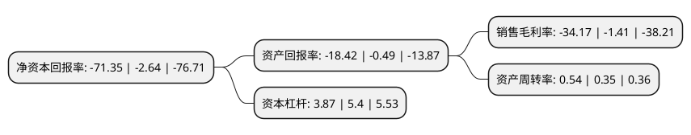

> 本页面由自动化程序生成于 2022年5月20日 01:03
> 内容可能存在错误，如有bug请提交issue至：https://github.com/Eroleice/doc-pi/issues
{.is-warning}

# 上市公司基本情况

## 基本资料

金鸿控股集团股份有限公司（以下简称“ST金鸿”）成立于1985年02月11日，吉林市。于1996年12月10日在深交所主板上市。

ST金鸿注册资本68,040.88万元，主营业务:天然气长输管道及城市燃气管网的建设和运营，环保工程服务业务以下是详细信息：

- 公司名称: 金鸿控股集团股份有限公司
- 股票代码: 000669.SZ
- 所在地: 吉林 - 吉林市
- 成立日期: 1985年02月11日
- 注册资本: 68,040.88万元
- 法定代表人: 王议农
- 主营业务: 主营业务:天然气长输管道及城市燃气管网的建设和运营，环保工程服务业务
- 公司官网: www.spjhe.com
- 公司介绍: 公司是一家专注天然气开发运用和环保工程的综合性企业。公司业务主要涉及天然气综合利用业务，包括气源开发与输送、长输管网建设与管理、城市燃气经营与销售、车用加气站投资与运营、分布式能源项目开发与建设等；环保工程服务业务，主要依托中科院技术并开展相关合作，致力于大气污染物控制环保技术与产品的研发应用、工程建设、项目运营等。作为企业的长期发展目标，公司将主要致力于清洁能源及可再生能源开发利用业务、环保工程类业务板块。通过关注与研究国家政策、市场发展动态，跟踪可再生能源技术发展成果等工作，适时进入可再生资源利用(包括风力发电、太阳能利用、生物燃料等)领域，将金鸿能源建设成为以新型、清洁、低碳能源开发和应用为业务方向的综合性能源投资企业。

## 股东及高管情况

上市公司第一大股东为新能国际投资有限公司，持股159,302,851股，占比23.41%，**疑似为**上市公司实际控制人。

截至2022年03月31日，上市公司的前十大股东中，共有5名自然人股东，4名机构股东，1个产品账户，其中5%以上大股东共有2名。上市公司前十大股东明细如下：

> 未能通过持股比例判定出上市公司实际控制人（持股30%以上）
> 可能存在通过间接持股、联合持股、协议控制等方式拥有实际控制权的主体，具体请参考上市公司定期公告！
{.is-warning}

> 截至2022年03月31日，上市公司前十大股东信息如下：

| 股东名称 | 持股数量（股） | 持股比例 |
| --- | --- | --- |
| 新能国际投资有限公司 | 159,302,851 | 23.41% |
| 联中实业有限公司 | 61,183,714 | 8.99% |
| 青岛久实投资管理有限公司-久实产业2期私募证券投资基金 | 22,513,263 | 3.31% |
| 陈义和 | 13,963,048 | 2.05% |
| 新余中讯投资管理有限公司 | 11,332,001 | 1.67% |
| 马国斌 | 10,594,940 | 1.56% |
| 李彦廷 | 8,540,800 | 1.26% |
| 益豪企业有限公司 | 7,408,460 | 1.09% |
| 虞何佳 | 7,380,300 | 1.08% |
| 邓章礼 | 6,329,279 | 0.93% |

## 利润表分析

上市公司2021年总收入为19.72亿元，净利润为-6.74亿元，**未实现盈利**。

## 杜邦分析

> 数据列示周期：2021年 | 2020年 | 2019年
{.is-info}

上市公司的净资产收益率在近一年有所上升，上升幅度为2602.65%，其变化情况分解如下：
- 上市公司的销售毛利率在近一年上升了2323.4%，可能是生产效率的提升、商品原材料价格下跌或商品价格的上涨所致。
- 上市公司的资产周转率在近一年上升了54.29%，可能是源自于更快的销售回款或库存管理效果提升。
- 上市公司的财务杠杆比率在近一年下降了-28.33%，可能是减少负债降低财务费用。

