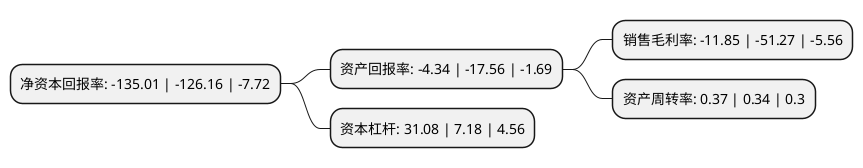

> 本页面由自动化程序生成于 2022年5月20日 01:03
> 内容可能存在错误，如有bug请提交issue至：https://github.com/Eroleice/doc-pi/issues
{.is-warning}

# 上市公司基本情况

## 基本资料

沈阳惠天热电股份有限公司（以下简称“惠天热电”）成立于1993年12月28日，沈阳市。于1997年02月27日在深交所主板上市。

惠天热电注册资本53,283.298万元，主要业务:为居民及非居民提供供热及供暖工程服务。以下是详细信息：

- 公司名称: 沈阳惠天热电股份有限公司
- 股票代码: 000692.SZ
- 所在地: 辽宁 - 沈阳市
- 成立日期: 1993年12月28日
- 注册资本: 53,283.298万元
- 法定代表人: 吴迪
- 主营业务: 为居民及非居民提供供热及供暖工程服务
- 公司官网: www.htrd.cn
- 公司介绍: 公司是以集中供热为核心，集科研设计、工业安装、房地产开发及股权投资于一体的集团化国有上市公司，供热规模位居全国前列，是全国最大的专业供热上市公司之一。公司主要业务是为居民及非居民提供供热及供暖工程服务。公司的经营模式为：在目标供热区域内，为各类民用商用建筑提供集中供热服务，与区域内用热用户签署供热协议，通过向用户收取采暖费或供暖工程款的方式实现运营收益。公司拥有甲级热力工程设计院和乙级工业安装工程公司，供热范围覆盖沈阳市多个区。公司先后荣获“模范职工之家”、“辽宁省企业信用AAA级单位”，被辽宁省授予“五一”奖状，并授予“先进创业集体”称号，被辽宁省建设厅评为文明单位，被辽宁省委、省政府评为文明单位以及被建设部评为全国房地产行业精神文明先进单位等。

## 股东及高管情况

上市公司第一大股东为沈阳供暖集团有限公司，持股187,050,118股，占比35.1%，为上市公司实际控制人。

截至2022年03月31日，上市公司的前十大股东中，共有7名自然人股东，2名机构股东，1个产品账户，其中5%以上大股东共有1名。上市公司前十大股东明细如下：

> 截至2022年03月31日，上市公司前十大股东信息如下：

| 股东名称 | 持股数量（股） | 持股比例 |
| --- | --- | --- |
| 沈阳供暖集团有限公司 | 187,050,118 | 35.1% |
| 杨英 | 4,650,000 | 0.87% |
| 田建江 | 3,961,943 | 0.74% |
| 沈阳新松机器人自动化股份有限公司 | 3,690,000 | 0.69% |
| 张国峰 | 3,601,402 | 0.68% |
| 肖克 | 2,948,800 | 0.55% |
| 吉敏 | 2,834,000 | 0.53% |
| 徐刚 | 2,812,600 | 0.53% |
| 宋广玉 | 2,627,300 | 0.49% |
| 上海浦东发展银行股份有限公司-博时价值臻选两年持有期灵活配置混合型证券投资基金 | 2,455,767 | 0.46% |

## 利润表分析

上市公司2021年总收入为19.87亿元，净利润为-2.36亿元，**未实现盈利**。

## 杜邦分析

> 数据列示周期：2021年 | 2020年 | 2019年
{.is-info}

上市公司的净资产收益率在近一年有所上升，上升幅度为7.01%，其变化情况分解如下：
- 上市公司的销售毛利率在近一年下降了-76.89%，可能是生产效率的下降、商品原材料价格上涨或商品价格的下跌所致。
- 上市公司的资产周转率在近一年上升了8.82%，可能是源自于更快的销售回款或库存管理效果提升。
- 上市公司的财务杠杆比率在近一年上升了332.87%，可能是增加负债扩大生产规模。

