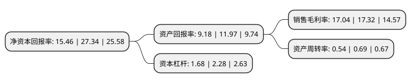

> 本页面由自动化程序生成于 2022年5月20日 01:05
> 内容可能存在错误，如有bug请提交issue至：https://github.com/Eroleice/doc-pi/issues
{.is-warning}

# 上市公司基本情况

## 基本资料

北京金房暖通节能技术股份有限公司（以下简称“金房节能”）成立于1992年11月08日，北京市。于2021年07月29日在深交所主板上市。

金房节能注册资本9,074.808万元，主营业务:公司专注于供热运营服务，供热领域节能改造和节能产品的研发，生产与销售。以下是详细信息：

- 公司名称: 北京金房暖通节能技术股份有限公司
- 股票代码: 001210.SZ
- 所在地: 北京 - 北京市
- 成立日期: 1992年11月08日
- 注册资本: 9,074.808万元
- 法定代表人: 杨建勋
- 主营业务: 主营业务:公司专注于供热运营服务，供热领域节能改造和节能产品的研发，生产与销售
- 公司官网: www.kingfore.net
- 公司介绍: 公司是国内知名的暖通节能服务提供商，专注于节能供热领域，主要从事供热运营服务、节能改造服务和节能产品的研发、生产和销售，致力于为客户提供高效、创新、满意的城市供热综合服务。公司深耕供热行业近三十年，以“用心温暖世界”为核心价值观，以“质量诚信、服务高效、技术创新”为质量管理方针，采用供热投资运营、委托管理运营和合同能源管理等经营服务模式，通过投资建设、收购、接管、承包等多种方式获得供热项目的长期经营管理权。自2004年开始，公司运营了中粮万科假日风景、龙湖大方居、金融街金色漫香林、中粮万科长阳半岛、恒大昌平高教园、首开华润城、石家庄保利等120多个供热项目，已实施供热运营面积接近2,400万平米，与首开股份、金融街、金隅嘉业、万科股份、龙湖中佰、恒大地产、绿地控股、招商嘉铭等房地产开发商建立了良好的合作关系。

## 股东及高管情况

上市公司第一大股东为杨建勋，持股23,891,857股，占比26.33%，**疑似为**上市公司实际控制人。

截至2022年03月31日，上市公司的前十大股东中，共有8名自然人股东，2名机构股东，其中5%以上大股东共有5名。上市公司前十大股东明细如下：

> 未能通过持股比例判定出上市公司实际控制人（持股30%以上）
> 可能存在通过间接持股、联合持股、协议控制等方式拥有实际控制权的主体，具体请参考上市公司定期公告！
{.is-warning}

> 截至2022年03月31日，上市公司前十大股东信息如下：

| 股东名称 | 持股数量（股） | 持股比例 |
| --- | --- | --- |
| 杨建勋 | 23,891,857 | 26.33% |
| 魏澄 | 9,595,328 | 10.57% |
| 付英 | 8,065,474 | 8.89% |
| 丁琦 | 5,908,848 | 6.51% |
| 深圳市领誉基石股权投资合伙企业(有限合伙) | 5,193,348 | 5.72% |
| 温丽 | 3,260,368 | 3.59% |
| 王牧晨 | 2,927,890 | 3.23% |
| 黄红 | 2,927,890 | 3.23% |
| 马鞍山信裕股权投资合伙企业(有限合伙) | 2,071,384 | 2.28% |
| 马鞍山信裕 | 2,071,384 | 2.28% |

## 利润表分析

上市公司2021年总收入为7.9亿元，净利润为1.34亿元，实现盈利。

## 杜邦分析

> 数据列示周期：2021年 | 2020年 | 2019年
{.is-info}

上市公司的净资产收益率在近一年有所下降，下降幅度为-43.45%，其变化情况分解如下：
- 上市公司的销售毛利率在近一年下降了-1.62%，可能是生产效率的下降、商品原材料价格上涨或商品价格的下跌所致。
- 上市公司的资产周转率在近一年下降了-21.74%，可能是源自于更慢的销售回款或库存管理效果下降。
- 上市公司的财务杠杆比率在近一年下降了-26.32%，可能是减少负债降低财务费用。

