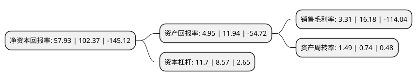

> 本页面由自动化程序生成于 2022年5月20日 01:07
> 内容可能存在错误，如有bug请提交issue至：https://github.com/Eroleice/doc-pi/issues
{.is-warning}

# 上市公司基本情况

## 基本资料

四川升达林业产业股份有限公司（以下简称“ST升达”）成立于1995年03月09日，成都市。于2008年07月16日在深交所中小板上市。

ST升达注册资本75,232.827万元，本公司目前主营业务为液化天然气的生产和销售，城镇燃气，加气站等。以下是详细信息：

- 公司名称: 四川升达林业产业股份有限公司
- 股票代码: 002259.SZ
- 所在地: 四川 - 成都市
- 成立日期: 1995年03月09日
- 注册资本: 75,232.827万元
- 法定代表人: 赖旭日
- 主营业务: 本公司目前主营业务为液化天然气的生产和销售，城镇燃气，加气站等
- 公司官网: www.shengdawood.com
- 公司介绍: 公司是一家积极向清洁能源转型的上市公司，以清洁能源为公司主营业务，快速推进LNG工厂、LNG加气站和城镇燃气等项目建设。公司的主要经营模式为：从上游天然气生产和销售企业购买气源后，通过LNG工厂加工销售，或通过自身城镇燃气管网系统以及CNG/LNG加气站，销售给居民、商业、工业等终端用户并提供相关输配服务；同时，公司为城镇燃气新用户提供燃气安装服务。公司以清洁能源“上游(勘探与开采)--中游(加工与物流)--下游(应用与分销)”的整个产业链建设作为长期发展战略，并按长、中、短结合的方式初步形成了液化天然气生产与销售、城镇燃气(管道输配)、LNG物流、加气站与调峰站等业务板块。

## 股东及高管情况

上市公司第一大股东为华宝信托有限责任公司-华宝宝升宏达集合资金信托计划，持股213,115,525股，占比28.33%，**疑似为**上市公司实际控制人。

截至2022年03月31日，上市公司的前十大股东中，共有6名自然人股东，2名机构股东，2个产品账户，其中5%以上大股东共有1名。上市公司前十大股东明细如下：

> 未能通过持股比例判定出上市公司实际控制人（持股30%以上）
> 可能存在通过间接持股、联合持股、协议控制等方式拥有实际控制权的主体，具体请参考上市公司定期公告！
{.is-warning}

> 截至2022年03月31日，上市公司前十大股东信息如下：

| 股东名称 | 持股数量（股） | 持股比例 |
| --- | --- | --- |
| 华宝信托有限责任公司-华宝宝升宏达集合资金信托计划 | 213,115,525 | 28.33% |
| 陈龙 | 18,671,902 | 2.48% |
| 上海云胜投资管理有限公司 | 16,753,000 | 2.23% |
| 诺安资产-工商银行-诺安资管舜耕天禾2号资产管理计划 | 14,306,232 | 1.9% |
| 余青麦 | 8,498,400 | 1.13% |
| 赵毅明 | 8,304,413 | 1.1% |
| 朱伟 | 5,869,300 | 0.78% |
| 王涛 | 4,988,700 | 0.66% |
| 上海博爱健康投资有限公司 | 4,861,264 | 0.65% |
| 黄育清 | 4,503,001 | 0.6% |

## 利润表分析

上市公司2021年总收入为15.12亿元，净利润为0.5亿元，实现盈利。

## 杜邦分析

> 数据列示周期：2021年 | 2020年 | 2019年
{.is-info}

上市公司的净资产收益率在近一年有所下降，下降幅度为-43.41%，其变化情况分解如下：
- 上市公司的销售毛利率在近一年下降了-79.54%，可能是生产效率的下降、商品原材料价格上涨或商品价格的下跌所致。
- 上市公司的资产周转率在近一年上升了101.35%，可能是源自于更快的销售回款或库存管理效果提升。
- 上市公司的财务杠杆比率在近一年上升了36.52%，可能是增加负债扩大生产规模。

