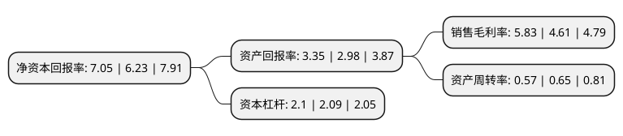

> 本页面由自动化程序生成于 2022年5月20日 01:07
> 内容可能存在错误，如有bug请提交issue至：https://github.com/Eroleice/doc-pi/issues
{.is-warning}

# 上市公司基本情况

## 基本资料

陕西省天然气股份有限公司（以下简称“陕天然气”）成立于1995年01月20日，西安市。于2008年08月13日在深交所中小板上市。

陕天然气注册资本111,207.545万元，本公司主要从事天然气长输管道建设及经营，业务模式是从上游天然气开发商(长庆油田)购入天然气，通过公司建设经营的天然气长输管道输送到省内各城市或大型直供用户处，向相关城市燃气公司或直供用户销售天然气，并收取管输费。以下是详细信息：

- 公司名称: 陕西省天然气股份有限公司
- 股票代码: 002267.SZ
- 所在地: 陕西 - 西安市
- 成立日期: 1995年01月20日
- 注册资本: 111,207.545万元
- 法定代表人: 刘宏波
- 主营业务: 本公司主要从事天然气长输管道建设及经营，业务模式是从上游天然气开发商(长庆油田)购入天然气，通过公司建设经营的天然气长输管道输送到省内各城市或大型直供用户处，向相关城市燃气公司或直供用户销售天然气，并收取管输费
- 公司官网: www.shaanxigas.com
- 公司介绍: 公司负责陕西全省天然气长输管网的规划、建设、运营和管理，为省经济发展提供了有力的能源支撑。公司基本形成了一支数量充足、专业齐全、结构合理、素质优良、作风过硬的天然气技术、管理人才队伍，为公司的快速发展提供了人力保证。公司通过了ISO9001质量管理体系、ISO14001环境管理体系、OHSMS18001职业健康安全管理体系认证，形成了较为完善和高效的管理体系。同时，公司探索形成了一套适合我省不同地域地貌环境中管道运行管理的有效模式，建立健全了完善的应急预案系统，全面推行安全生产“标准化、规范化、精细化”管理，有效应对了各类自然灾害，实现了安全生产的稳定、有序、可控。公司探索提炼了以“天然之气，厚德者兴”为核心的企业文化理念体系，形成了一种“为工作拼命，为事业忘我”的靖西精神，多次受到中华全国总工会、国家安全生产监督管理总局、国家体育总局等国家部委的表彰以及陕西省政府通令嘉奖。

## 股东及高管情况

上市公司第一大股东为陕西燃气集团有限公司，持股716,530,456股，占比64.43%，为上市公司实际控制人。

截至2022年03月31日，上市公司的前十大股东中，共有1名自然人股东，2名机构股东，7个产品账户，其中5%以上大股东共有1名。上市公司前十大股东明细如下：

> 截至2022年03月31日，上市公司前十大股东信息如下：

| 股东名称 | 持股数量（股） | 持股比例 |
| --- | --- | --- |
| 陕西燃气集团有限公司 | 716,530,456 | 64.43% |
| 中央汇金资产管理有限责任公司 | 15,754,800 | 1.42% |
| 鹿向杰 | 6,028,100 | 0.54% |
| 广发基金-农业银行-广发中证金融资产管理计划 | 5,270,300 | 0.47% |
| 银华基金-农业银行-银华中证金融资产管理计划 | 5,270,300 | 0.47% |
| 博时基金-农业银行-博时中证金融资产管理计划 | 5,270,300 | 0.47% |
| 中欧基金-农业银行-中欧中证金融资产管理计划 | 5,270,300 | 0.47% |
| 大成基金-农业银行-大成中证金融资产管理计划 | 5,270,300 | 0.47% |
| 易方达基金-农业银行-易方达中证金融资产管理计划 | 5,270,300 | 0.47% |
| 南方基金-农业银行-南方中证金融资产管理计划 | 5,270,300 | 0.47% |

## 利润表分析

上市公司2021年总收入为75.62亿元，净利润为4.4亿元，实现盈利。

## 杜邦分析

> 数据列示周期：2021年 | 2020年 | 2019年
{.is-info}

上市公司的净资产收益率在近一年有所上升，上升幅度为13.16%，其变化情况分解如下：
- 上市公司的销售毛利率在近一年上升了26.46%，可能是生产效率的提升、商品原材料价格下跌或商品价格的上涨所致。
- 上市公司的资产周转率在近一年下降了-12.31%，可能是源自于更慢的销售回款或库存管理效果下降。
- 上市公司的财务杠杆比率在近一年上升了0.48%，可能是增加负债扩大生产规模。

