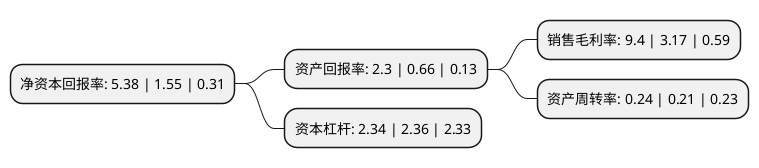

> 本页面由自动化程序生成于 2022年5月20日 01:16
> 内容可能存在错误，如有bug请提交issue至：https://github.com/Eroleice/doc-pi/issues
{.is-warning}

# 上市公司基本情况

## 基本资料

天壕环境股份有限公司（以下简称“天壕环境”）成立于2007年05月30日，北京市。于2012年06月28日在深交所创业板上市。

天壕环境注册资本88,140.892万元，余热发电合同能源管理服务，城市燃气供应及支干线管输以下是详细信息：

- 公司名称: 天壕环境股份有限公司
- 股票代码: 300332.SZ
- 所在地: 北京 - 北京市
- 成立日期: 2007年05月30日
- 注册资本: 88,140.892万元
- 法定代表人: 陈作涛
- 主营业务: 余热发电合同能源管理服务，城市燃气供应及支干线管输
- 公司官网: www.trce.com.cn
- 公司介绍: 公司是国内以合同能源管理模式从事余热发电节能服务的领先企业。公司上市以后借助资本市场的优势，围绕节能、环保、清洁能源领域，实现了主营业务的跨行业发展。目前，公司已形成了以工业客户及天然气长输管道加压站余热余压利用为主的节能板块、以城市燃气供应及支干线管输业务为主的清洁能源板块，并涉足工业客户烟气综合治理及互联网金融信息服务业务。公司被评选为“2015节能服产业品牌企业”，并获得“十二五”节能服务产业突出贡献奖，中美合作合同能源管理示范项目等荣誉。公司将继续秉承“节能、环保、共赢”的经营理念，实现技术和业务模式的创新、升级，成为“水、电、气”一体化的中国环境综合投资服务运营商。

## 股东及高管情况

上市公司第一大股东为天壕投资集团有限公司，持股137,209,641股，占比15.57%，**疑似为**上市公司实际控制人。

截至2022年03月31日，上市公司的前十大股东中，共有6名自然人股东，3名机构股东，1个海外主体，其中5%以上大股东共有2名。上市公司前十大股东明细如下：

> 未能通过持股比例判定出上市公司实际控制人（持股30%以上）
> 可能存在通过间接持股、联合持股、协议控制等方式拥有实际控制权的主体，具体请参考上市公司定期公告！
{.is-warning}

> 截至2022年03月31日，上市公司前十大股东信息如下：

| 股东名称 | 持股数量（股） | 持股比例 |
| --- | --- | --- |
| 天壕投资集团有限公司 | 137,209,641 | 15.57% |
| 陈作涛 | 44,362,867 | 5.03% |
| 王向东 | 22,973,800 | 2.61% |
| 湖北省国有资本运营有限公司 | 19,292,648 | 2.19% |
| 楚天舒 | 17,492,721 | 1.98% |
| 苏州厚扬启航投资中心(有限合伙) | 15,739,401 | 1.79% |
| 谢晶 | 11,629,900 | 1.32% |
| 黄婷 | 10,320,900 | 1.17% |
| GIC PRIVATE LIMITED | 9,683,800 | 1.1% |
| 娄有辙 | 6,816,819 | 0.77% |

## 利润表分析

上市公司2021年总收入为20.51亿元，净利润为1.92亿元，实现盈利。

## 杜邦分析

> 数据列示周期：2021年 | 2020年 | 2019年
{.is-info}

上市公司的净资产收益率在近一年有所上升，上升幅度为247.1%，其变化情况分解如下：
- 上市公司的销售毛利率在近一年上升了196.53%，可能是生产效率的提升、商品原材料价格下跌或商品价格的上涨所致。
- 上市公司的资产周转率在近一年上升了14.29%，可能是源自于更快的销售回款或库存管理效果提升。
- 上市公司的财务杠杆比率在近一年下降了-0.85%，可能是减少负债降低财务费用。

