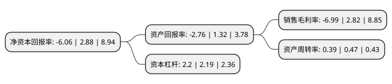

> 本页面由自动化程序生成于 2022年5月20日 01:16
> 内容可能存在错误，如有bug请提交issue至：https://github.com/Eroleice/doc-pi/issues
{.is-warning}

# 上市公司基本情况

## 基本资料

广州迪森热能技术股份有限公司（以下简称“迪森股份”）成立于1996年07月16日，广州市。于2012年07月10日在深交所创业板上市。

迪森股份注册资本37,295.001万元，主要产品:热力，燃料。主营业务:利用天然气，生物质，清洁煤等清洁能源为工业及商业端(B端)用户提供热，冷，电等清洁能源综合服务，并提供燃气锅炉装备产品。以下是详细信息：

- 公司名称: 广州迪森热能技术股份有限公司
- 股票代码: 300335.SZ
- 所在地: 广东 - 广州市
- 成立日期: 1996年07月16日
- 注册资本: 37,295.001万元
- 法定代表人: 马革
- 主营业务: 主要产品:热力，燃料主营业务:利用天然气，生物质，清洁煤等清洁能源为工业及商业端(B端)用户提供热，冷，电等清洁能源综合服务，并提供燃气锅炉装备产品
- 公司官网: www.devotiongroup.com
- 公司介绍: 公司是国内利用生物质等新型清洁能源提供热能服务的领先企业。公司核心业务处于天然气产业链下游(相关装备及运营服务行业)，定位为“清洁能源综合服务商”，主要利用天然气、生物质、清洁煤等清洁能源为工业及商业端(B端)用户提供热、冷、电等清洁能源综合服务，并提供燃气锅炉装备产品；同时，以“小松鼠”燃气壁挂炉为核心，为家庭消费终端(C端)用户提供以家庭供热/暖为核心的舒适家居系统解决方案。公司热能服务的客户群体涉及造纸、钢铁、建材、纺织、医药化工、食品饮料等多个行业。公司掌握领先的生物质能应用技术，成长为专业的生物质能生产应用技术设备提供商、生物质燃料供应商和节能减排项目系统集成商。公司拥有多项专利及多项专有技术，是国内目前生物质能源领域知识产权拥有量最多的企业之一，是国家创新型企业、高新技术企业和广东省知识产权示范企业。

## 股东及高管情况

上市公司第一大股东为常厚春，持股50,919,599股，占比13.65%，**疑似为**上市公司实际控制人。

截至2022年03月31日，上市公司的前十大股东中，共有9名自然人股东，1名机构股东，其中5%以上大股东共有3名。上市公司前十大股东明细如下：

> 未能通过持股比例判定出上市公司实际控制人（持股30%以上）
> 可能存在通过间接持股、联合持股、协议控制等方式拥有实际控制权的主体，具体请参考上市公司定期公告！
{.is-warning}

> 截至2022年03月31日，上市公司前十大股东信息如下：

| 股东名称 | 持股数量（股） | 持股比例 |
| --- | --- | --- |
| 常厚春 | 50,919,599 | 13.65% |
| 李祖芹 | 39,907,935 | 10.7% |
| 马革 | 28,040,059 | 7.52% |
| 深圳前海金迪投资合伙企业(有限合伙) | 3,680,982 | 0.99% |
| 郭庆利 | 2,571,900 | 0.69% |
| 谢升敬 | 2,060,000 | 0.55% |
| 田国英 | 2,019,300 | 0.54% |
| 向军 | 1,830,000 | 0.49% |
| 陈燕芳 | 1,822,426 | 0.49% |
| 朱咏梅 | 1,600,000 | 0.43% |

## 利润表分析

上市公司2021年总收入为12.49亿元，净利润为-0.88亿元，**未实现盈利**。

## 杜邦分析

> 数据列示周期：2021年 | 2020年 | 2019年
{.is-info}

上市公司的净资产收益率在近一年有所下降，下降幅度为-310.42%，其变化情况分解如下：
- 上市公司的销售毛利率在近一年下降了-347.87%，可能是生产效率的下降、商品原材料价格上涨或商品价格的下跌所致。
- 上市公司的资产周转率在近一年下降了-17.02%，可能是源自于更慢的销售回款或库存管理效果下降。
- 上市公司的财务杠杆比率在近一年上升了0.46%，可能是增加负债扩大生产规模。

