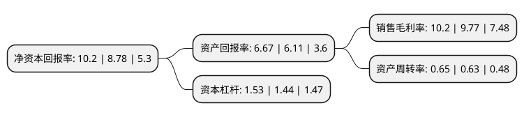

> 本页面由自动化程序生成于 2022年5月20日 01:17
> 内容可能存在错误，如有bug请提交issue至：https://github.com/Eroleice/doc-pi/issues
{.is-warning}

# 上市公司基本情况

## 基本资料

杭州中泰深冷技术股份有限公司（以下简称“中泰股份”）成立于2006年01月18日，杭州市。于2015年03月26日在深交所创业板上市。

中泰股份注册资本37,819.03万元，主营业务为深冷技术的工艺开发，设备设计，制造和销售。主要产品为板翅式换热器，冷箱和成套装置。以下是详细信息：

- 公司名称: 杭州中泰深冷技术股份有限公司
- 股票代码: 300435.SZ
- 所在地: 浙江 - 杭州市
- 成立日期: 2006年01月18日
- 注册资本: 37,819.03万元
- 法定代表人: 章有虎
- 主营业务: 主营业务为深冷技术的工艺开发，设备设计，制造和销售主要产品为板翅式换热器，冷箱和成套装置
- 公司官网: www.hz-ztpe.com
- 公司介绍: 公司是一家深冷技术工艺及设备提供商、国家重点支持的高新技术企业，主营业务为深冷技术的工艺开发、设备设计、制造和销售。公司成立以来，一直坚持以“深冷技术研发为核心、关键设备制造为基础、成套装置供应为重点、清洁能源建设为方向”的主营业务定位。公司在深冷技术设备的开发和制造方面处于国内领先的地位，已掌握关键部机设计技术和工艺设计技术等主要应用技术，通过“工艺设计+关键设备自制+配套设备外购”的方式，公司具备较强的深冷技术工艺及设备提供能力，拥有突出的专业优势，已取得多项专利。经过近几年的迅速发展，公司在天然气、煤化工、石油化工等领域，特别在天然气领域积累了广泛的客户资源并形成一定的品牌优势。作为国内深冷技术工艺及设备提供商，公司具有国家质检总局颁发的A2级压力容器设计许可证，A2级压力容器制造许可证，A级压力管道元件制造许可证，获得ASME压力容器“U”钢印认证和KGSC认证。公司将不断增强研发能力，提高工艺技术水平，开拓新的市场，提升公司的核心竞争力，将公司打造成为国内一流、国际知名的深冷技术工艺及设备提供商。

## 股东及高管情况

上市公司第一大股东为浙江中泰钢业集团有限公司，持股121,418,709股，占比32.11%，为上市公司实际控制人。

截至2022年03月31日，上市公司的前十大股东中，共有5名自然人股东，4名机构股东，1个海外主体，其中5%以上大股东共有5名。上市公司前十大股东明细如下：

> 截至2022年03月31日，上市公司前十大股东信息如下：

| 股东名称 | 持股数量（股） | 持股比例 |
| --- | --- | --- |
| 浙江中泰钢业集团有限公司 | 121,418,709 | 32.11% |
| 卞传瑞 | 30,230,466 | 7.99% |
| 王骏飞 | 22,264,302 | 5.89% |
| 刘立冬 | 22,180,259 | 5.86% |
| 章有虎 | 21,374,482 | 5.65% |
| 杭州富阳地轩股权投资合伙企业(有限合伙) | 2,204,600 | 0.58% |
| 颜秉秋 | 2,119,299 | 0.56% |
| 海通证券股份有限公司 | 1,753,300 | 0.46% |
| MORGANSTANLEY&CO.INTERNATIONALPLC. | 1,320,876 | 0.35% |
| 中国国际金融香港资产管理有限公司-客户资金2 | 1,154,174 | 0.31% |

## 利润表分析

上市公司2021年总收入为24.06亿元，净利润为2.45亿元，实现盈利。

## 杜邦分析

> 数据列示周期：2021年 | 2020年 | 2019年
{.is-info}

上市公司的净资产收益率在近一年有所上升，上升幅度为16.17%，其变化情况分解如下：
- 上市公司的销售毛利率在近一年上升了4.4%，可能是生产效率的提升、商品原材料价格下跌或商品价格的上涨所致。
- 上市公司的资产周转率在近一年上升了3.17%，可能是源自于更快的销售回款或库存管理效果提升。
- 上市公司的财务杠杆比率在近一年上升了6.25%，可能是增加负债扩大生产规模。

