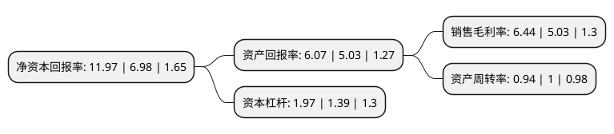

> 本页面由自动化程序生成于 2022年5月20日 01:25
> 内容可能存在错误，如有bug请提交issue至：https://github.com/Eroleice/doc-pi/issues
{.is-warning}

# 上市公司基本情况

## 基本资料

河南安彩高科股份有限公司（以下简称“安彩高科”）成立于1998年09月21日，安阳市。于1999年07月14日在上交所主板上市。

安彩高科注册资本86,295.597万元，主要产品:天然气，管道运输，光伏玻璃，浮法玻璃。以下是详细信息：

- 公司名称: 河南安彩高科股份有限公司
- 股票代码: 600207.SH
- 所在地: 河南 - 安阳市
- 成立日期: 1998年09月21日
- 注册资本: 86,295.597万元
- 法定代表人: 何毅敏
- 主营业务: 主要产品:天然气，管道运输，光伏玻璃，浮法玻璃
- 公司官网: www.acht.com.cn
- 公司介绍: 公司是国家重点高新技术企业，曾是中国最大的彩色玻壳生产基地。公司主要产销太阳能光伏超白压延玻璃、优质浮法玻璃、TCO玻璃、节能玻璃、液化天然气、压缩天然气等产品。多年的自主创新、跨越式发展，公司形成了完整的研发体系，拥有了先进的工艺装备，积淀了丰富的企业文化。安彩高科以光伏产业为突破口，充分发挥自身优势，大力推进技术创新，全力实施品牌战略，不断拓展市场空间，成功实现产业转型，取得了良好经济效益、社会效益和环保效益。企业通过ISO9001质量管理体系、ISO14001环境管理体系和OHSMS18001职业健康安全管理体系认证。先后获得“中国电子行业功勋企业”、“全国文明单位”、“全国质量效益型先进单位”等荣誉称号。

## 股东及高管情况

上市公司第一大股东为河南投资集团有限公司，持股407,835,649股，占比47.26%，为上市公司实际控制人。

截至2022年03月31日，上市公司的前十大股东中，共有6名自然人股东，3名机构股东，1个产品账户，其中5%以上大股东共有2名。上市公司前十大股东明细如下：

> 截至2022年03月31日，上市公司前十大股东信息如下：

| 股东名称 | 持股数量（股） | 持股比例 |
| --- | --- | --- |
| 河南投资集团有限公司 | 407,835,649 | 47.26% |
| 富鼎电子科技(嘉善)有限公司 | 147,012,578 | 17.04% |
| 郑州投资控股有限公司 | 25,943,396 | 3.01% |
| 廖强 | 16,092,528 | 1.86% |
| 平安证券股份有限公司约定购回式证券交易专用证券账户 | 4,500,000 | 0.52% |
| 周剑萍 | 3,134,598 | 0.36% |
| 高炳显 | 1,900,085 | 0.22% |
| 汤红玲 | 1,550,000 | 0.18% |
| 周荣华 | 1,550,000 | 0.18% |
| 黄怡钦 | 1,400,033 | 0.16% |

## 利润表分析

上市公司2021年总收入为33.38亿元，净利润为2.14亿元，实现盈利。

## 杜邦分析

> 数据列示周期：2021年 | 2020年 | 2019年
{.is-info}

上市公司的净资产收益率在近一年有所上升，上升幅度为71.49%，其变化情况分解如下：
- 上市公司的销售毛利率在近一年上升了28.03%，可能是生产效率的提升、商品原材料价格下跌或商品价格的上涨所致。
- 上市公司的资产周转率在近一年下降了-6%，可能是源自于更慢的销售回款或库存管理效果下降。
- 上市公司的财务杠杆比率在近一年上升了41.73%，可能是增加负债扩大生产规模。

