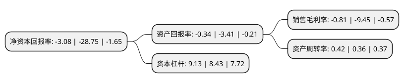

> 本页面由自动化程序生成于 2022年5月20日 01:27
> 内容可能存在错误，如有bug请提交issue至：https://github.com/Eroleice/doc-pi/issues
{.is-warning}

# 上市公司基本情况

## 基本资料

山西省国新能源股份有限公司（以下简称“国新能源”）成立于1993年11月04日，太原市。于1992年10月13日在上交所主板上市。

国新能源注册资本108,466.369万元，主营业务:天然气长输管道及城市燃气管网的建设和运营以下是详细信息：

- 公司名称: 山西省国新能源股份有限公司
- 股票代码: 600617.SH
- 所在地: 山西 - 太原市
- 成立日期: 1993年11月04日
- 注册资本: 108,466.369万元
- 法定代表人: 刘军
- 主营业务: 主营业务:天然气长输管道及城市燃气管网的建设和运营
- 公司官网: null
- 公司介绍: 公司已发展为以燃气为核心主业，含中药材、贸易等产业板块的现代化国有大型能源集团。经重大资产重组，公司主营业务转向天然气输气管网的规划建设、经营管理及对外专营，管道天然气、压缩天然气、液化天然气的储运、配送与销售以及天然气加气站的建设与经营等业务。公司作为山西省最大的天然气输气管网运营企业之一，已建成北起大同、南至运城、贯通全省南北、沟通国家级气源的省级天然气管网，年管输设计能力大，管网覆盖全省多市。公司始终秉承“学无止境、追求卓越”的企业精神，树立“爱省、奉献、创新、发展”的核心价值观，坚持服务低碳生产力、低碳消费、新型产业集群、生态文明建设和新型城镇化建设的“五个服务”理念，大力实施气化山西战略。

## 股东及高管情况

上市公司第一大股东为华新燃气集团有限公司，持股636,526,026股，占比46.19%，为上市公司实际控制人。

截至2022年03月31日，上市公司的前十大股东中，共有5名自然人股东，3名机构股东，2个产品账户，其中5%以上大股东共有2名。上市公司前十大股东明细如下：

> 截至2022年03月31日，上市公司前十大股东信息如下：

| 股东名称 | 持股数量（股） | 持股比例 |
| --- | --- | --- |
| 华新燃气集团有限公司 | 636,526,026 | 46.19% |
| 太原市宏展房地产开发有限公司 | 136,868,470 | 9.93% |
| 山西田森集团物流配送有限公司 | 38,161,721 | 2.77% |
| 横琴广金美好基金管理有限公司-广金美好薛定谔三号私募证券投资基金 | 21,000,000 | 1.52% |
| 卢文星 | 10,010,980 | 0.73% |
| 肖荣英 | 8,122,000 | 0.59% |
| 张建春 | 8,000,000 | 0.58% |
| 李金琛 | 7,930,000 | 0.58% |
| 高风坤 | 6,206,700 | 0.45% |
| 横琴广金美好基金管理有限公司-广金美好薛定谔十八号私募证券投资基金 | 5,760,000 | 0.42% |

## 利润表分析

上市公司2021年总收入为126.07亿元，净利润为-1.02亿元，**未实现盈利**。

## 杜邦分析

> 数据列示周期：2021年 | 2020年 | 2019年
{.is-info}

上市公司的净资产收益率在近一年有所下降，下降幅度为-89.29%，其变化情况分解如下：
- 上市公司的销售毛利率在近一年下降了-91.43%，可能是生产效率的下降、商品原材料价格上涨或商品价格的下跌所致。
- 上市公司的资产周转率在近一年上升了16.67%，可能是源自于更快的销售回款或库存管理效果提升。
- 上市公司的财务杠杆比率在近一年上升了8.3%，可能是增加负债扩大生产规模。

