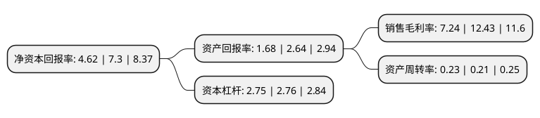

> 本页面由自动化程序生成于 2022年5月20日 01:27
> 内容可能存在错误，如有bug请提交issue至：https://github.com/Eroleice/doc-pi/issues
{.is-warning}

# 上市公司基本情况

## 基本资料

上海大众公用事业(集团)股份有限公司（以下简称“大众公用”）成立于1992年01月01日，上海市。于1993年03月04日在上交所主板上市。

大众公用注册资本295,243.468万元，主营业务:城市燃气，城市交通，隧桥设施，污水处理等以下是详细信息：

- 公司名称: 上海大众公用事业(集团)股份有限公司
- 股票代码: 600635.SH
- 所在地: 上海 - 上海市
- 成立日期: 1992年01月01日
- 注册资本: 295,243.468万元
- 法定代表人: 杨国平
- 主营业务: 主营业务:城市燃气，城市交通，隧桥设施，污水处理等
- 公司官网: www.dzug.cn
- 公司介绍: 公司成立于1991年12月24日，原名是上海浦东大众出租汽车股份有限公司，是全国出租汽车行业中第一家股份制公司，也是浦东新区成立后的第一家上市公司。公司股票于1993年3月4日在上海证券交易所正式挂牌上市。2003年5月，公司更名为“上海大众公用事业(集团)股份有限公司”，2016年12月5日，集团境外上市外资股(H股)在香港联交所主板挂牌并开始上市交易。经过三十年的发展，集团从一个与上海浦东开发开放共同进步，在业内率先上市的交通运输企业，发展成为公用事业与金融创投齐头并进的投资控股型企业。燃气产业为“大众公用”大力发展的核心产业。控股企业上海大众燃气有限公司是一家集燃气输配、销售和服务于一体的大型城市燃气运营企业，占上海燃气销售市场近40%的市场份额，拥有近200万户燃气用户，6500余公里燃气地下管网。环境市政产业是“大众公用”发展迅速的产业板块。目前已投资污水处理、隧道、公路建设等领域，运营上海大众嘉定污水处理有限公司、江苏大众水务集团有限公司、上海翔殷路隧道等。金融创投产业是集团抓住资本市场蓬勃发展的历史机遇，大力拓展的产业。集团拥有全资的“大众资本”，参股的“深创投”、“兴烨创投”等多个创投平台，已投资银行、证券、基金、拟上市公司、金融类企业股权等。历经多年发展，集团直投及创投平台已投资培育出100余家上市企业。

## 股东及高管情况

上市公司第一大股东为香港中央结算(代理人)有限公司，持股533,547,000股，占比18.07%，**疑似为**上市公司实际控制人。

截至2022年03月31日，上市公司的前十大股东中，共有6名自然人股东，2名机构股东，2个海外主体，其中5%以上大股东共有3名。上市公司前十大股东明细如下：

> 未能通过持股比例判定出上市公司实际控制人（持股30%以上）
> 可能存在通过间接持股、联合持股、协议控制等方式拥有实际控制权的主体，具体请参考上市公司定期公告！
{.is-warning}

> 截至2022年03月31日，上市公司前十大股东信息如下：

| 股东名称 | 持股数量（股） | 持股比例 |
| --- | --- | --- |
| 香港中央结算(代理人)有限公司 | 533,547,000 | 18.07% |
| 上海大众企业管理有限公司 | 495,143,859 | 16.77% |
| 上海燃气(集团)有限公司 | 153,832,735 | 5.21% |
| 蔡志双 | 14,930,735 | 0.51% |
| 香港中央结算有限公司(陆股通) | 14,382,417 | 0.49% |
| 施福龙 | 7,055,700 | 0.24% |
| 林泽华 | 7,020,258 | 0.24% |
| 何忠 | 6,100,000 | 0.21% |
| 丁秀敏 | 5,591,600 | 0.19% |
| 林军 | 5,267,086 | 0.18% |

## 利润表分析

上市公司2021年总收入为55.37亿元，净利润为3.92亿元，实现盈利。

## 杜邦分析

> 数据列示周期：2021年 | 2020年 | 2019年
{.is-info}

上市公司的净资产收益率在近一年有所下降，下降幅度为-36.71%，其变化情况分解如下：
- 上市公司的销售毛利率在近一年下降了-41.75%，可能是生产效率的下降、商品原材料价格上涨或商品价格的下跌所致。
- 上市公司的资产周转率在近一年上升了9.52%，可能是源自于更快的销售回款或库存管理效果提升。
- 上市公司的财务杠杆比率在近一年下降了-0.36%，可能是减少负债降低财务费用。

