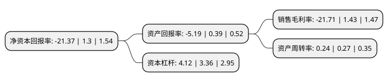

> 本页面由自动化程序生成于 2022年5月20日 01:28
> 内容可能存在错误，如有bug请提交issue至：https://github.com/Eroleice/doc-pi/issues
{.is-warning}

# 上市公司基本情况

## 基本资料

大连热电股份有限公司（以下简称“ST热电”）成立于1993年09月01日，大连市。于1996年07月16日在上交所主板上市。

ST热电注册资本40,459.96万元，电力，热力。以下是详细信息：

- 公司名称: 大连热电股份有限公司
- 股票代码: 600719.SH
- 所在地: 辽宁 - 大连市
- 成立日期: 1993年09月01日
- 注册资本: 40,459.96万元
- 法定代表人: 邵阳
- 主营业务: 电力，热力
- 公司官网: www.dlrd.com
- 公司介绍: 公司是大连地区供热、供电联产龙头企业，所属集团是东北地区最大的热电联产、集中供热企业。公司主要经营发电上网，同时为居民及工商业用户提供采暖、供热服务。主要产品有电力和热力两大类，共有电力、工业蒸汽、高温水和居民供暖四个品种。公司引进移动储能技术和装备拓宽服务领域，采用新材料“PE-RT”管材应用于热水管网建设，建成大连地区首座吸收水塔余热供热项目，启动“大连电池储能调峰电站示范工程”项目立项，考察论证空气源热泵、电锅炉等供热新技术，为实施清洁能源规划做技术储备。公司通过了国际标准化组织的“三体系”认证，先后被评为“十一五”辽宁省节能减排先进单位、辽宁省公用行业安全生产管理先进单位、辽宁省安保工作二等功、发电企业安全生产标准化二级，质量、环境、职业健康安全管理“三体系”认证，多年被评为大连市“重合同守信用企业”。

## 股东及高管情况

上市公司第一大股东为大连市热电集团有限公司，持股133,133,784股，占比32.91%，为上市公司实际控制人。

截至2022年03月31日，上市公司的前十大股东中，共有5名自然人股东，4名机构股东，1个海外主体，其中5%以上大股东共有1名。上市公司前十大股东明细如下：

> 截至2022年03月31日，上市公司前十大股东信息如下：

| 股东名称 | 持股数量（股） | 持股比例 |
| --- | --- | --- |
| 大连市热电集团有限公司 | 133,133,784 | 32.91% |
| 上海星河数码投资有限公司 | 20,118,461 | 4.97% |
| 周宇光 | 12,969,553 | 3.21% |
| 刘其昌 | 4,585,857 | 1.13% |
| 华泰证券股份有限公司 | 4,357,540 | 1.08% |
| 上海特玺投资合伙企业(有限合伙) | 3,743,500 | 0.93% |
| 宿建扬 | 3,694,500 | 0.91% |
| 高华-汇丰-GOLDMAN, SACHS & CO.LLC | 3,154,000 | 0.78% |
| 李伟华 | 3,026,000 | 0.75% |
| 骆申涛 | 2,168,920 | 0.54% |

## 杜邦分析

> 数据列示周期：2021年 | 2020年 | 2019年
{.is-info}

上市公司的净资产收益率在近一年有所下降，下降幅度为-1743.85%，其变化情况分解如下：
- 上市公司的销售毛利率在近一年下降了-1618.18%，可能是生产效率的下降、商品原材料价格上涨或商品价格的下跌所致。
- 上市公司的资产周转率在近一年下降了-11.11%，可能是源自于更慢的销售回款或库存管理效果下降。
- 上市公司的财务杠杆比率在近一年上升了22.62%，可能是增加负债扩大生产规模。

