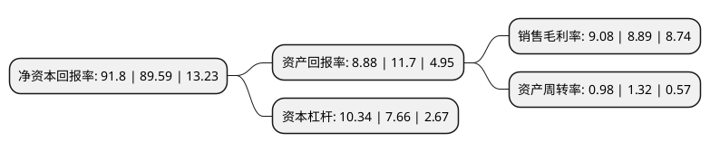

> 本页面由自动化程序生成于 2022年5月20日 01:29
> 内容可能存在错误，如有bug请提交issue至：https://github.com/Eroleice/doc-pi/issues
{.is-warning}

# 上市公司基本情况

## 基本资料

新奥天然气股份有限公司（以下简称“新奥股份”）成立于1992年12月29日，石家庄市。于1994年01月03日在上交所主板上市。

新奥股份注册资本284,585.362万元，主营业务:液化天然气生产/销售与投资，能源技术工程服务，甲醇等能源化工产品生产，销售与贸易，煤炭的开采，洗选与贸易，以及生物制农兽药原料药及制剂的生产与销售以下是详细信息：

- 公司名称: 新奥天然气股份有限公司
- 股票代码: 600803.SH
- 所在地: 河北 - 石家庄市
- 成立日期: 1992年12月29日
- 注册资本: 284,585.362万元
- 法定代表人: 王玉锁
- 主营业务: 主营业务:液化天然气生产/销售与投资，能源技术工程服务，甲醇等能源化工产品生产，销售与贸易，煤炭的开采，洗选与贸易，以及生物制农兽药原料药及制剂的生产与销售
- 公司官网: www.enn-ec.com.cn
- 公司介绍: 新奥生态控股股份有限公司是河北省最早上市企业之一，股票代码：600803。作为新奥集团清洁能源产业链重要组成部分，我们从国家发展需求和战略使命出发，着力发展天然气上游产业链，提供产品和服务。新奥股份致力于实现“具有创新力和竞争力的天然气上游供应商”愿景。核心业务涵盖天然气开发、生产、加工和投资；能源技术工程服务；甲醇等能源化工产品生产和销售；煤炭开采与洗选。未来，我们将凭借技术创新和全价值链能力，以创新模式实现可持续发展。

## 股东及高管情况

上市公司第一大股东为ENN   GROUP INTERNATIONAL INVESTMENT LIMITED，持股1,370,626,680股，占比48.16%，为上市公司实际控制人。

截至2022年03月31日，上市公司的前十大股东中，共有4名机构股东，3个产品账户，3个海外主体，其中5%以上大股东共有4名。上市公司前十大股东明细如下：

> 截至2022年03月31日，上市公司前十大股东信息如下：

| 股东名称 | 持股数量（股） | 持股比例 |
| --- | --- | --- |
| ENN   GROUP INTERNATIONAL INVESTMENT LIMITED | 1,370,626,680 | 48.16% |
| ENN GROUP INTERNATIONAL INVESTMENT LIMITED | 1,370,626,680 | 48.16% |
| 新奥控股投资股份有限公司 | 430,737,451 | 15.14% |
| 香港中央结算有限公司(陆股通) | 157,928,366 | 5.55% |
| 弘创(深圳)投资中心(有限合伙) | 106,900,820 | 3.76% |
| 河北威远集团有限公司 | 89,004,283 | 3.13% |
| 全国社保基金一零六组合 | 33,908,800 | 1.19% |
| 中国银行股份有限公司-国泰江源优势精选灵活配置混合型证券投资基金 | 15,504,444 | 0.54% |
| 华能贵诚信托有限公司 | 15,329,614 | 0.54% |
| 中信证券股份有限公司-社保基金1106组合 | 15,304,657 | 0.54% |

## 利润表分析

上市公司2021年总收入为1,160.3亿元，净利润为105.3亿元，实现盈利。

## 杜邦分析

> 数据列示周期：2021年 | 2020年 | 2019年
{.is-info}

上市公司的净资产收益率在近一年有所上升，上升幅度为2.47%，其变化情况分解如下：
- 上市公司的销售毛利率在近一年上升了2.14%，可能是生产效率的提升、商品原材料价格下跌或商品价格的上涨所致。
- 上市公司的资产周转率在近一年下降了-25.76%，可能是源自于更慢的销售回款或库存管理效果下降。
- 上市公司的财务杠杆比率在近一年上升了34.99%，可能是增加负债扩大生产规模。

