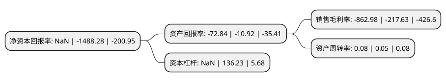

> 本页面由自动化程序生成于 2022年5月20日 01:29
> 内容可能存在错误，如有bug请提交issue至：https://github.com/Eroleice/doc-pi/issues
{.is-warning}

# 上市公司基本情况

## 基本资料

中兴天恒能源科技(北京)股份公司（以下简称“*ST中天”）成立于1988年07月19日，北京市。于1994年04月25日在上交所主板上市。

*ST中天注册资本136,665.438万元，天然气(CNG和LNG)的生产和销售，及开发，制造和销售天然气储运设备和天然气汽车改装设备等以下是详细信息：

- 公司名称: 中兴天恒能源科技(北京)股份公司
- 股票代码: 600856.SH
- 所在地: 北京 - 北京市
- 成立日期: 1988年07月19日
- 注册资本: 136,665.438万元
- 法定代表人: 黄杰
- 主营业务: 天然气(CNG和LNG)的生产和销售，及开发，制造和销售天然气储运设备和天然气汽车改装设备等
- 公司官网: www.snencn.cn
- 公司介绍: 公司是一家在清洁能源领域专注打造天然气全产业链的专业运营企业。公司主营业务分为天然气(CNG和LNG)的生产和销售，包括CNG加气母站、CNG加气子站、LNG点对点工业客户及LNG液化工厂等；LNG接收站投资建设及运营；海外油气资产开发运营。公司目前已建成以武汉为核心的CNG生产和销售网络，以青岛为核心的天然气及新能源设备制造产业基地，以浙江、湖北、江苏、山东、安徽等地为基地的天然气分销网络，并由天然气中下游利用端向上游资源端延伸，投资运营境内液化工厂、LNG接收站及并购海外油气资产，天然气全产业链已经形成。

## 股东及高管情况

上市公司第一大股东为中原信托有限公司-中原财富-成长434期-中天能源股权收益权投资集合资金信托计划，持股152,622,951股，占比11.17%，**疑似为**上市公司实际控制人。

截至2022年03月31日，上市公司的前十大股东中，共有5名自然人股东，2名机构股东，2个产品账户，1个海外主体，其中5%以上大股东共有2名。上市公司前十大股东明细如下：

> 未能通过持股比例判定出上市公司实际控制人（持股30%以上）
> 可能存在通过间接持股、联合持股、协议控制等方式拥有实际控制权的主体，具体请参考上市公司定期公告！
{.is-warning}

> 截至2022年03月31日，上市公司前十大股东信息如下：

| 股东名称 | 持股数量（股） | 持股比例 |
| --- | --- | --- |
| 中原信托有限公司-中原财富-成长434期-中天能源股权收益权投资集合资金信托计划 | 152,622,951 | 11.17% |
| MKCP VC Investments(Mauritius)I Ltd. | 100,324,908 | 7.34% |
| 北信瑞丰资管-招商银行-长城资本管理有限公司 | 56,200,000 | 4.11% |
| 渤海国际信托股份有限公司-渤海信托·恒利丰201号集合资金信托计划 | 52,222,222 | 3.82% |
| 中国华融资产管理股份有限公司 | 30,000,000 | 2.2% |
| 邓天洲 | 5,000,000 | 0.37% |
| 杨洋 | 4,312,300 | 0.32% |
| 陈玲红 | 4,239,400 | 0.31% |
| 毕会玲 | 4,000,000 | 0.29% |
| 陈冬妹 | 3,883,600 | 0.28% |

## 利润表分析

上市公司2021年总收入为8.47亿元，净利润为-73.18亿元，**未实现盈利**。

## 杜邦分析

> 数据列示周期：2021年 | 2020年 | 2019年
{.is-info}

上市公司的净资产收益率在近一年有所下降，下降幅度为NaN%，其变化情况分解如下：
- 上市公司的销售毛利率在近一年上升了296.54%，可能是生产效率的提升、商品原材料价格下跌或商品价格的上涨所致。
- 上市公司的资产周转率在近一年上升了60%，可能是源自于更快的销售回款或库存管理效果提升。
- 上市公司的财务杠杆比率在近一年下降了NaN%，可能是减少负债降低财务费用。

