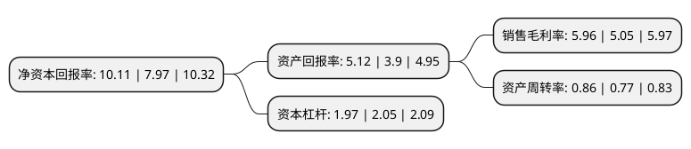

> 本页面由自动化程序生成于 2022年5月20日 01:29
> 内容可能存在错误，如有bug请提交issue至：https://github.com/Eroleice/doc-pi/issues
{.is-warning}

# 上市公司基本情况

## 基本资料

重庆燃气集团股份有限公司（以下简称“重庆燃气”）成立于1995年04月24日，重庆市。于2014年09月30日在上交所主板上市。

重庆燃气注册资本157,134万元，主营业务为城市燃气供应以及燃气设施设备的安装服务。以下是详细信息：

- 公司名称: 重庆燃气集团股份有限公司
- 股票代码: 600917.SH
- 所在地: 重庆 - 重庆市
- 成立日期: 1995年04月24日
- 注册资本: 157,134万元
- 法定代表人: 王颂秋
- 主营业务: 主营业务为城市燃气供应以及燃气设施设备的安装服务
- 公司官网: www.cqgas.cn
- 公司介绍: 公司是一家国有控股上市企业。公司多年来致力于精耕燃气供应、输、储、配、销售及管网的设计、制造、安装、维修、销售、管理、技术咨询；区域供热、供冷、热电联产的供应；燃气高新技术开发，管材防腐加工，燃气具销售等经营业务。公司作为关系国计民生的管理服务型企业，立足城市燃气供应行业基础性、服务性、公共安全性三大特征，以“奉献光热、追求卓越”为企业核心理念，秉承“诚信、优质、安全、创新”的企业精神，依法合规的运营，通过充足的气源、安全合理的燃气输配管网、充分的储气调峰设施和高度自动化的调度手段、完善的抢险应急救援机制及全方位、人性化的优质服务打造重庆市天然气安全供应保障体系。

## 股东及高管情况

上市公司第一大股东为重庆市能源投资集团有限公司，持股645,420,000股，占比41.07%，为上市公司实际控制人。

截至2022年03月31日，上市公司的前十大股东中，共有2名自然人股东，6名机构股东，1个产品账户，1个海外主体，其中5%以上大股东共有4名。上市公司前十大股东明细如下：

> 截至2022年03月31日，上市公司前十大股东信息如下：

| 股东名称 | 持股数量（股） | 持股比例 |
| --- | --- | --- |
| 重庆市能源投资集团有限公司 | 645,420,000 | 41.07% |
| 华润燃气(中国)投资有限公司 | 350,000,000 | 22.27% |
| 华润燃气投资(中国)有限公司 | 265,589,330 | 16.9% |
| 重庆市城市建设投资(集团)有限公司 | 132,260,000 | 8.42% |
| 重庆渝隆资产经营(集团)有限公司 | 7,002,000 | 0.45% |
| 中央汇金资产管理有限责任公司 | 4,402,772 | 0.28% |
| 白建国 | 2,423,861 | 0.15% |
| 中国农业银行股份有限公司-中证500交易型开放式指数证券投资基金 | 1,961,363 | 0.12% |
| 赵霞芬 | 1,900,000 | 0.12% |
| 香港中央结算有限公司(陆股通) | 1,489,993 | 0.09% |

## 利润表分析

上市公司2021年总收入为78.09亿元，净利润为4.65亿元，实现盈利。

## 杜邦分析

> 数据列示周期：2021年 | 2020年 | 2019年
{.is-info}

上市公司的净资产收益率在近一年有所上升，上升幅度为26.85%，其变化情况分解如下：
- 上市公司的销售毛利率在近一年上升了18.02%，可能是生产效率的提升、商品原材料价格下跌或商品价格的上涨所致。
- 上市公司的资产周转率在近一年上升了11.69%，可能是源自于更快的销售回款或库存管理效果提升。
- 上市公司的财务杠杆比率在近一年下降了-3.9%，可能是减少负债降低财务费用。

