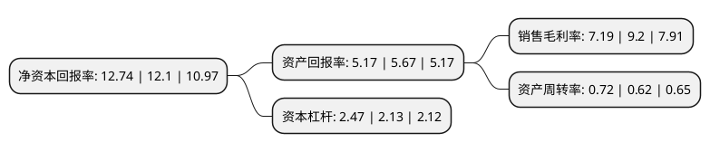

> 本页面由自动化程序生成于 2022年5月20日 01:30
> 内容可能存在错误，如有bug请提交issue至：https://github.com/Eroleice/doc-pi/issues
{.is-warning}

# 上市公司基本情况

## 基本资料

深圳市燃气集团股份有限公司（以下简称“深圳燃气”）成立于1996年04月30日，深圳市。于2009年12月25日在上交所主板上市。

深圳燃气注册资本221,409.221万元，燃气购销，燃气输配管网，天然气利用工程建设与经营和相关专业技术服务为主业。主要产品为天然气和液化石油气。以下是详细信息：

- 公司名称: 深圳市燃气集团股份有限公司
- 股票代码: 601139.SH
- 所在地: 广东 - 深圳市
- 成立日期: 1996年04月30日
- 注册资本: 221,409.221万元
- 法定代表人: 李真
- 主营业务: 燃气购销，燃气输配管网，天然气利用工程建设与经营和相关专业技术服务为主业主要产品为天然气和液化石油气
- 公司官网: www.szgas.com.cn
- 公司介绍: 公司是一家以燃气批发、管道和瓶装燃气供应、燃气输配管网的投资和建设企业，主营城市管道燃气供应、液化石油气批发、瓶装液化石油气零售和燃气投资业务。公司运用市场化手段，成功控股深圳市及江西、安徽、广西等多个异地城市的燃气项目。公司推行安全优质的品牌策略，引进欧洲现代化灌装设备，拥有深圳市规模巨大的液化气储配基地，占据深圳市最大的瓶装气市场份额。公司坚持贯彻“安全最优先权”的原则，建立了严密的安全技术管理标准体系，全面推行安全生产责任制，追求“0”责任事故，保障“100%”责任落实，隐患整改落实率和应急处置及时准确率“100%”。燃气供应服务连续多年被中国质量协会列为全国用户满意服务项目、被广东省用户委员会授予用户“三满意”荣誉称号。

## 股东及高管情况

上市公司第一大股东为深圳市人民政府国有资产监督管理委员会，持股1,153,583,786股，占比40.1%，为上市公司实际控制人。

截至2022年03月31日，上市公司的前十大股东中，共有6名机构股东，2个产品账户，1个海外主体，1名其他股东，其中5%以上大股东共有5名。上市公司前十大股东明细如下：

> 截至2022年03月31日，上市公司前十大股东信息如下：

| 股东名称 | 持股数量（股） | 持股比例 |
| --- | --- | --- |
| 深圳市人民政府国有资产监督管理委员会 | 1,153,583,786 | 40.1% |
| 香港中华煤气投资有限公司 | 470,610,934 | 16.36% |
| 港华投资有限公司 | 267,500,792 | 9.3% |
| 深圳市资本运营集团有限公司 | 258,045,449 | 8.97% |
| 南方希望实业有限公司 | 173,891,581 | 6.04% |
| 香港中央结算有限公司(陆股通) | 65,264,266 | 2.27% |
| 中央汇金资产管理有限责任公司 | 27,458,870 | 0.95% |
| 香港中华煤气(深圳)有限公司 | 23,530,468 | 0.82% |
| 富达基金(香港)有限公司-客户资金 | 16,062,732 | 0.56% |
| 全国社保基金四一三组合 | 13,800,000 | 0.48% |

## 利润表分析

上市公司2021年总收入为214.14亿元，净利润为15.4亿元，实现盈利。

## 杜邦分析

> 数据列示周期：2021年 | 2020年 | 2019年
{.is-info}

上市公司的净资产收益率在近一年有所上升，上升幅度为5.29%，其变化情况分解如下：
- 上市公司的销售毛利率在近一年下降了-21.85%，可能是生产效率的下降、商品原材料价格上涨或商品价格的下跌所致。
- 上市公司的资产周转率在近一年上升了16.13%，可能是源自于更快的销售回款或库存管理效果提升。
- 上市公司的财务杠杆比率在近一年上升了15.96%，可能是增加负债扩大生产规模。

