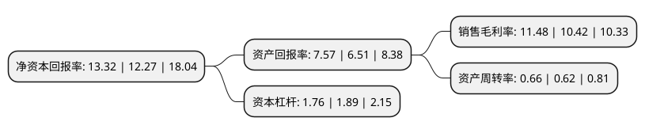

> 本页面由自动化程序生成于 2022年5月20日 01:32
> 内容可能存在错误，如有bug请提交issue至：https://github.com/Eroleice/doc-pi/issues
{.is-warning}

# 上市公司基本情况

## 基本资料

成都燃气集团股份有限公司（以下简称“成都燃气”）成立于1986年04月11日，成都市。于2019年12月17日在上交所主板上市。

成都燃气注册资本88,889万元，公司的主营业务为城市燃气输配，销售，城市燃气工程施工以及燃气表具销售等。本公司产品主要为天然气以下是详细信息：

- 公司名称: 成都燃气集团股份有限公司
- 股票代码: 603053.SH
- 所在地: 四川 - 成都市
- 成立日期: 1986年04月11日
- 注册资本: 88,889万元
- 法定代表人: 罗龙
- 主营业务: 公司的主营业务为城市燃气输配，销售，城市燃气工程施工以及燃气表具销售等本公司产品主要为天然气
- 公司官网: www.cdgas.com
- 公司介绍: 公司前身为成都市煤气总公司，是国内大中城市中最早从事城镇燃气供应的公司之一。2005年3月成立中外合资企业，由成都城建投资管理集团有限责任公司、华润燃气有限公司、港华燃气有限公司及成都城市燃气有限责任公司工会四家股东投资组建。经过四十余年的发展，综合实力居国内同行业领先地位。公司业务涵盖天然气工程规划、设计、施工安装，天然气输配、应用、管理，燃气智能化系统研发、设备制造，燃气专用设备、压力容器、计量装置检测，以及天然气市场拓展等方面。拥有完善的输供气管网体系、先进的技术设备和训练有素的员工队伍，积累了先进的城市燃气管理经验和较高的技术水平，曾参与多部城市燃气管理规范的起草。

## 股东及高管情况

上市公司第一大股东为成都城建投资管理集团有限责任公司，持股328,000,000股，占比36.9%，为上市公司实际控制人。

截至2022年03月31日，上市公司的前十大股东中，共有7名自然人股东，3名机构股东，其中5%以上大股东共有3名。上市公司前十大股东明细如下：

> 截至2022年03月31日，上市公司前十大股东信息如下：

| 股东名称 | 持股数量（股） | 持股比例 |
| --- | --- | --- |
| 成都城建投资管理集团有限责任公司 | 328,000,000 | 36.9% |
| 华润燃气投资(中国)有限公司 | 288,000,000 | 32.4% |
| 港华燃气投资有限公司 | 104,000,000 | 11.7% |
| 夏顺东 | 1,976,945 | 0.22% |
| 李贵国 | 968,900 | 0.11% |
| 耿生新 | 900,000 | 0.1% |
| 王强 | 780,000 | 0.09% |
| 史炜 | 641,800 | 0.07% |
| 余成君 | 619,500 | 0.07% |
| 张艳芬 | 614,600 | 0.07% |

## 利润表分析

上市公司2021年总收入为43.81亿元，净利润为5.03亿元，实现盈利。

## 杜邦分析

> 数据列示周期：2021年 | 2020年 | 2019年
{.is-info}

上市公司的净资产收益率在近一年有所上升，上升幅度为8.56%，其变化情况分解如下：
- 上市公司的销售毛利率在近一年上升了10.17%，可能是生产效率的提升、商品原材料价格下跌或商品价格的上涨所致。
- 上市公司的资产周转率在近一年上升了6.45%，可能是源自于更快的销售回款或库存管理效果提升。
- 上市公司的财务杠杆比率在近一年下降了-6.88%，可能是减少负债降低财务费用。

