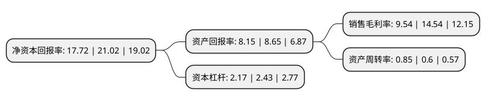

> 本页面由自动化程序生成于 2022年5月20日 01:36
> 内容可能存在错误，如有bug请提交issue至：https://github.com/Eroleice/doc-pi/issues
{.is-warning}

# 上市公司基本情况

## 基本资料

杭州热电集团股份有限公司（以下简称“杭州热电”）成立于1997年05月26日，杭州市。于2021年06月30日在上交所主板上市。

杭州热电注册资本40,010万元，主营工业园区热电联产，集中供热，公司提供的主要产品是蒸汽与电力。以下是详细信息：

- 公司名称: 杭州热电集团股份有限公司
- 股票代码: 605011.SH
- 所在地: 浙江 - 杭州市
- 成立日期: 1997年05月26日
- 注册资本: 40,010万元
- 法定代表人: 许阳
- 主营业务: 主营工业园区热电联产，集中供热，公司提供的主要产品是蒸汽与电力
- 公司官网: www.hzrdjt.com
- 公司介绍: 公司是一家主营工业园区热电联产、集中供热的节能环保型企业。公司提供的主要产品是蒸汽与电力。公司生产的蒸汽向工业园区内的工业用户供应；电力直接出售给国家电网公司。热电联产具有节约能源、改善环境、提高供热质量、增加电力供应等综合效益。热电厂的建设是城市治理大气污染和提高能源利用率的重要措施，是集中供热的重要组成部分，是提高人民生活质量的公益性基础设施。公司设立以来，深耕于热电联产行业，主营业务及主要产品均未发生重大变化。公司在多年的实际经营过程中积累了丰富的行业经验，培育了专业素质高、经验丰富的优秀管理团队，管理团队熟悉各项项目管理流程和项目实施细节。公司已经形成了相对成熟的管理模式和经营管理经验，实行精细化管理，成本控制能力较强。

## 股东及高管情况

上市公司第一大股东为杭州市城市建设投资集团有限公司，持股246,600,000股，占比61.63%，为上市公司实际控制人。

截至2022年03月31日，上市公司的前十大股东中，共有3名自然人股东，6名机构股东，1个产品账户，其中5%以上大股东共有2名。上市公司前十大股东明细如下：

> 截至2022年03月31日，上市公司前十大股东信息如下：

| 股东名称 | 持股数量（股） | 持股比例 |
| --- | --- | --- |
| 杭州市城市建设投资集团有限公司 | 246,600,000 | 61.63% |
| 杭州市实业投资集团有限公司 | 81,000,000 | 20.24% |
| 浙江华视投资管理有限公司 | 18,000,000 | 4.5% |
| 浙江自贸区杭热壹号投资合伙企业(有限合伙) | 4,872,445 | 1.22% |
| 浙江自贸区杭热贰号投资合伙企业(有限合伙) | 4,828,940 | 1.21% |
| 浙江自贸区杭热叁号投资合伙企业(有限合伙) | 4,698,615 | 1.17% |
| 温雪峰 | 687,343 | 0.17% |
| 周雪芬 | 300,000 | 0.07% |
| 江阴江梁投资管理中心(有限合伙)-江梁投资天鹿二号基金 | 260,000 | 0.06% |
| 钟仁美 | 256,825 | 0.06% |

## 利润表分析

上市公司2021年总收入为31.82亿元，净利润为3.03亿元，实现盈利。

## 杜邦分析

> 数据列示周期：2021年 | 2020年 | 2019年
{.is-info}

上市公司的净资产收益率在近一年有所下降，下降幅度为-15.7%，其变化情况分解如下：
- 上市公司的销售毛利率在近一年下降了-34.39%，可能是生产效率的下降、商品原材料价格上涨或商品价格的下跌所致。
- 上市公司的资产周转率在近一年上升了41.67%，可能是源自于更快的销售回款或库存管理效果提升。
- 上市公司的财务杠杆比率在近一年下降了-10.7%，可能是减少负债降低财务费用。

