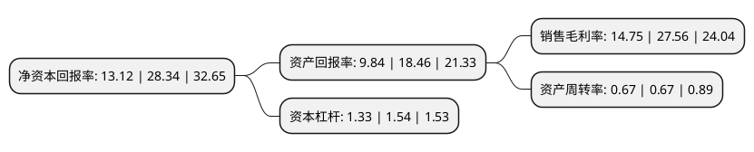

> 本页面由自动化程序生成于 2022年5月20日 01:36
> 内容可能存在错误，如有bug请提交issue至：https://github.com/Eroleice/doc-pi/issues
{.is-warning}

# 上市公司基本情况

## 基本资料

浙江新中港热电股份有限公司（以下简称“新中港”）成立于1997年10月17日，绍兴市。于2021年07月07日在上交所主板上市。

新中港注册资本40,045.1万元，公司自设立以来一直专注于热电联产业务，公司产品主要包括热力业务和电力业务。以下是详细信息：

- 公司名称: 浙江新中港热电股份有限公司
- 股票代码: 605162.SH
- 所在地: 浙江 - 绍兴市
- 成立日期: 1997年10月17日
- 注册资本: 40,045.1万元
- 法定代表人: 谢百军
- 主营业务: 公司自设立以来一直专注于热电联产业务，公司产品主要包括热力业务和电力业务
- 公司官网: www.zjxzgrd.com
- 公司介绍: 公司采用热电联产的方式进行热力产品和电力产品的生产及供应，以化石能源为燃料(主要使用煤炭，少部分天然气作补充)，在锅炉中燃烧将水加热为高温高压(及以上)过热蒸汽，利用蒸汽驱动汽轮机进而带动发电机发电，利用抽汽和排汽的中低压蒸汽供热，一个流程实现热能和电能的同时生产，以全背压运行的方式对外供应。这种生产方式不但相比于传统凝汽发电厂、热电分产型企业，而且比抽凝式热电联产机组，更符合能源梯级利用的原则，彻底避免了大量冷凝端能源损失；又发挥新型循环流化床锅炉的环保优势，集中治理污染物排放，使能源得到高效、清洁利用。公司通过打造以热定电的“高参数全背压机组配套新型循环流化床锅炉”的独特工艺，不断创新，在节约能源和清洁燃煤方面走在热电联产行业前列。公司商号中，“清洁能源”指生产方式当前以煤炭的清洁高效利用为主(达到天然气电厂排放标准)，辅以天然气调峰补充，今后计划逐步加大清洁能源、可再生能源的比重，并且进一步降低能耗，实现一次能源利用的清洁化、高效化。

## 股东及高管情况

上市公司第一大股东为浙江越盛集团有限公司，持股299,021,050股，占比74.67%，为上市公司实际控制人。

截至2022年03月31日，上市公司的前十大股东中，共有5名自然人股东，3名机构股东，2个产品账户，其中5%以上大股东共有1名。上市公司前十大股东明细如下：

> 截至2022年03月31日，上市公司前十大股东信息如下：

| 股东名称 | 持股数量（股） | 持股比例 |
| --- | --- | --- |
| 浙江越盛集团有限公司 | 299,021,050 | 74.67% |
| 深圳平安天煜股权投资基金合伙企业(有限合伙) | 14,226,500 | 3.55% |
| 晋商财富投资控股有限公司 | 2,845,300 | 0.71% |
| 欧娜 | 1,422,650 | 0.36% |
| 嘉兴煜港投资管理合伙企业(有限合伙) | 1,422,650 | 0.36% |
| 杨菁 | 1,422,650 | 0.36% |
| 陈壮伟 | 1,290,000 | 0.32% |
| 黄华 | 979,890 | 0.24% |
| 湖南金证投资咨询顾问有限公司-金证喜洋洋1号私募证券投资基金 | 692,300 | 0.17% |
| 田军 | 630,300 | 0.16% |

## 利润表分析

上市公司2021年总收入为7.7亿元，净利润为1.13亿元，实现盈利。

## 杜邦分析

> 数据列示周期：2021年 | 2020年 | 2019年
{.is-info}

上市公司的净资产收益率在近一年有所下降，下降幅度为-53.71%，其变化情况分解如下：
- 上市公司的销售毛利率在近一年下降了-46.48%，可能是生产效率的下降、商品原材料价格上涨或商品价格的下跌所致。
- 上市公司的资产周转率在近一年下降了0%，可能是源自于更慢的销售回款或库存管理效果下降。
- 上市公司的财务杠杆比率在近一年下降了-13.64%，可能是减少负债降低财务费用。

