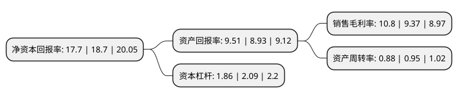

> 本页面由自动化程序生成于 2022年5月20日 01:37
> 内容可能存在错误，如有bug请提交issue至：https://github.com/Eroleice/doc-pi/issues
{.is-warning}

# 上市公司基本情况

## 基本资料

河南蓝天燃气股份有限公司（以下简称“蓝天燃气”）成立于2002年12月31日，驻马店市。于2021年01月29日在上交所主板上市。

蓝天燃气注册资本46,270.2万元，天然气管道输送服务及管道天然气;城市管道天然气销售及燃气管道安装服务以下是详细信息：

- 公司名称: 河南蓝天燃气股份有限公司
- 股票代码: 605368.SH
- 所在地: 河南 - 驻马店市
- 成立日期: 2002年12月31日
- 注册资本: 46,270.2万元
- 法定代表人: 陈启勇
- 主营业务: 天然气管道输送服务及管道天然气;城市管道天然气销售及燃气管道安装服务
- 公司官网: www.hnltrq.com.cn
- 公司介绍: 公司是从事天然气管道输送服务及管道天然气销售的综合天然气供应商。2010年，公司收购了豫南燃气100%股权和中油洁能50%股权，进入了城市燃气业务领域。豫南燃气主营业务为城市管道天然气销售及燃气管道安装，在新郑市及驻马店市取得城市管道燃气业务30年特许经营权。公司经营的豫南支线途径郑州、许昌、漯河、驻马店，供气区域为新郑、许昌、漯河、平顶山、驻马店及信阳等地区，系该区域主要的供气支干线，为西气东输一线最大的单一区域支干线管道。公司取得了驻马店中心规划区、正阳县、上蔡县、新蔡县、确山县、泌阳县、平舆县、遂平县、汝南县、新郑市城区、薛店镇、封丘县、延津县、原阳县、长垣县等特定区域的燃气特许经营权，公司拥有驻东支线、新长输气管道两条地方输配支线，全长约294.33公里。上述拥有特许经营权地区城市管网总长度2,087.72公里。

## 股东及高管情况

上市公司第一大股东为河南蓝天集团股份有限公司，持股243,423,000股，占比52.61%，为上市公司实际控制人。

截至2022年03月31日，上市公司的前十大股东中，共有7名自然人股东，3名机构股东，其中5%以上大股东共有2名。上市公司前十大股东明细如下：

> 截至2022年03月31日，上市公司前十大股东信息如下：

| 股东名称 | 持股数量（股） | 持股比例 |
| --- | --- | --- |
| 河南蓝天集团股份有限公司 | 243,423,000 | 52.61% |
| 李新华 | 33,400,000 | 7.22% |
| 熊保明 | 11,256,000 | 2.43% |
| 李国喜 | 5,796,000 | 1.25% |
| 嘉兴嵩山常棣一期投资合伙企业(有限合伙) | 5,700,000 | 1.23% |
| 扶廷明 | 4,512,000 | 0.98% |
| 谢先兴 | 4,320,000 | 0.93% |
| 彭盛楠 | 4,217,200 | 0.91% |
| 河南华泰建设有限公司 | 4,200,000 | 0.91% |
| 张新义 | 4,082,000 | 0.88% |

## 利润表分析

上市公司2021年总收入为39亿元，净利润为4.21亿元，实现盈利。

## 杜邦分析

> 数据列示周期：2021年 | 2020年 | 2019年
{.is-info}

上市公司的净资产收益率在近一年有所下降，下降幅度为-5.35%，其变化情况分解如下：
- 上市公司的销售毛利率在近一年上升了15.26%，可能是生产效率的提升、商品原材料价格下跌或商品价格的上涨所致。
- 上市公司的资产周转率在近一年下降了-7.37%，可能是源自于更慢的销售回款或库存管理效果下降。
- 上市公司的财务杠杆比率在近一年下降了-11%，可能是减少负债降低财务费用。

