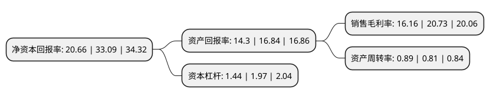

> 本页面由自动化程序生成于 2022年5月20日 01:37
> 内容可能存在错误，如有bug请提交issue至：https://github.com/Eroleice/doc-pi/issues
{.is-warning}

# 上市公司基本情况

## 基本资料

恒盛能源股份有限公司（以下简称“恒盛能源”）成立于2007年03月05日，衢州市。于2021年08月19日在上交所主板上市。

恒盛能源注册资本20,000万元，蒸汽，热水的生产和供应，热力发电以下是详细信息：

- 公司名称: 恒盛能源股份有限公司
- 股票代码: 605580.SH
- 所在地: 浙江 - 衢州市
- 成立日期: 2007年03月05日
- 注册资本: 20,000万元
- 法定代表人: 余国旭
- 主营业务: 蒸汽，热水的生产和供应，热力发电
- 公司官网: null
- 公司介绍: 公司是浙江龙游经济开发区最早投产运营的区域性公用热电联产企业，主营业务为蒸汽生产和供应,电力的生产和销售,以煤炭和生物质材料作为燃料,通过热电联产方式生产蒸汽和电力,承担供热范围内工业用户的蒸汽供应,并将所生产的电力出售给国家电网.公司供热范围覆盖整个浙江龙游经济开发区城北片区，热电联产设备全部采用高参数的锅炉和汽轮机组，具有综合能耗低、热效率高的技术优势。自运营以来始终坚持“安全稳定、环保经济、高效节能”的企业价值观，持续为园区内的造纸、食品饮料、纺织印染等客户集中供应蒸汽，有效降低了园区的工业能耗，实现了节能减排，促进了地方经济发展。

## 股东及高管情况

上市公司第一大股东为余国旭，持股63,620,000股，占比31.81%，为上市公司实际控制人。

截至2022年03月31日，上市公司的前十大股东中，共有10名自然人股东，其中5%以上大股东共有4名。上市公司前十大股东明细如下：

> 截至2022年03月31日，上市公司前十大股东信息如下：

| 股东名称 | 持股数量（股） | 持股比例 |
| --- | --- | --- |
| 余国旭 | 63,620,000 | 31.81% |
| 杜顺仙 | 41,660,000 | 20.83% |
| 余恒 | 21,920,000 | 10.96% |
| 余杜康 | 21,360,000 | 10.68% |
| 赵子明 | 448,600 | 0.22% |
| 徐洁芬 | 400,000 | 0.2% |
| 王建国 | 360,000 | 0.18% |
| 余国升 | 330,000 | 0.17% |
| 曾文锋 | 321,400 | 0.16% |
| 邹月琴 | 298,200 | 0.15% |

## 利润表分析

上市公司2021年总收入为7.7亿元，净利润为1.24亿元，实现盈利。

## 杜邦分析

> 数据列示周期：2021年 | 2020年 | 2019年
{.is-info}

上市公司的净资产收益率在近一年有所下降，下降幅度为-37.56%，其变化情况分解如下：
- 上市公司的销售毛利率在近一年下降了-22.05%，可能是生产效率的下降、商品原材料价格上涨或商品价格的下跌所致。
- 上市公司的资产周转率在近一年上升了9.88%，可能是源自于更快的销售回款或库存管理效果提升。
- 上市公司的财务杠杆比率在近一年下降了-26.9%，可能是减少负债降低财务费用。

