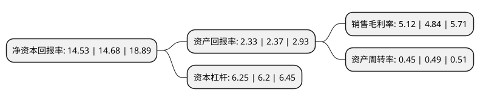

> 本页面由自动化程序生成于 2022年5月20日 01:31
> 内容可能存在错误，如有bug请提交issue至：https://github.com/Eroleice/doc-pi/issues
{.is-warning}

# 上市公司基本情况

## 基本资料

中国人民保险集团股份有限公司（以下简称“中国人保”）成立于1996年08月22日，北京市。于2018年11月16日在上交所主板上市。

中国人保注册资本4,422,399.058万元，主营业务:本集团拥有人保财险，人保寿险，人保健康，人保再保险，人保香港及人保养老(筹)，经营保险业务。其中，人保财险在中国境内主要经营财产险业务，人保寿险和人保健康经营寿险和健康险业务，人保再保险经营专业再保险业务，人保香港在中国香港经营财产险业务，人保养老(筹)开展企业年金，职业年金等业务。同时，本集团拥有人保资产，人保投控及人保资本，经营资产管理业务。以下是详细信息：

- 公司名称: 中国人民保险集团股份有限公司
- 股票代码: 601319.SH
- 所在地: 北京 - 北京市
- 成立日期: 1996年08月22日
- 注册资本: 4,422,399.058万元
- 法定代表人: 罗熹
- 主营业务: 主营业务:本集团拥有人保财险，人保寿险，人保健康，人保再保险，人保香港及人保养老(筹)，经营保险业务其中，人保财险在中国境内主要经营财产险业务，人保寿险和人保健康经营寿险和健康险业务，人保再保险经营专业再保险业务，人保香港在中国香港经营财产险业务，人保养老(筹)开展企业年金，职业年金等业务同时，本集团拥有人保资产，人保投控及人保资本，经营资产管理业务
- 公司官网: www.picc.com
- 公司介绍: 公司是一家综合性保险(金融)公司。公司拥有深厚的历史底蕴和杰出的品牌优势，作为国内历史最为悠久的保险公司，中国人保与共和国同生共长，先后为三峡工程、岭澳核电站、中国航天、青藏铁路、国家大剧院等国家重大工程提供优质风险保障，为国家经济建设做出了积极贡献；中国人保成立以来，始终关注民生，保障民生，有效发挥保险保障各项职能，从工矿企业、交通运输、农业生产、对外贸易等经济社会重要领域，到关系百姓的人身保障、机动车辆、“菜篮子”“米袋子”工程等，覆盖和渗透到国民经济的各个领域。

## 股东及高管情况

上市公司第一大股东为中华人民共和国财政部，持股26,906,570,608股，占比60.84%，为上市公司实际控制人。

截至2022年03月31日，上市公司的前十大股东中，共有2名自然人股东，1名机构股东，4个产品账户，2个海外主体，1名其他股东，其中5%以上大股东共有3名。上市公司前十大股东明细如下：

> 截至2022年03月31日，上市公司前十大股东信息如下：

| 股东名称 | 持股数量（股） | 持股比例 |
| --- | --- | --- |
| 中华人民共和国财政部 | 26,906,570,608 | 60.84% |
| 香港中央结算(代理人)有限公司 | 8,702,589,361 | 19.68% |
| 全国社会保障基金理事会 | 5,605,582,779 | 12.68% |
| 香港中央结算有限公司(陆股通) | 129,712,675 | 0.29% |
| 国信证券股份有限公司-方正富邦中证保险主题指数型证券投资基金 | 39,496,276 | 0.09% |
| 北京恒兆伟业投资有限公司 | 20,607,653 | 0.05% |
| 基本养老保险基金一一零一组合 | 14,022,400 | 0.03% |
| 中国农业银行股份有限公司-景顺长城沪深300指数增强型证券投资基金 | 13,589,059 | 0.03% |
| 章碧海 | 13,547,122 | 0.03% |
| 李少夫 | 11,920,000 | 0.03% |

## 杜邦分析

> 数据列示周期：2021年 | 2020年 | 2019年
{.is-info}

上市公司的净资产收益率在近一年有所下降，下降幅度为-1.02%，其变化情况分解如下：
- 上市公司的销售毛利率在近一年上升了5.79%，可能是生产效率的提升、商品原材料价格下跌或商品价格的上涨所致。
- 上市公司的资产周转率在近一年下降了-8.16%，可能是源自于更慢的销售回款或库存管理效果下降。
- 上市公司的财务杠杆比率在近一年上升了0.81%，可能是增加负债扩大生产规模。

