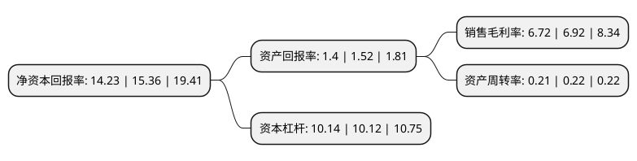

> 本页面由自动化程序生成于 2022年5月20日 01:31
> 内容可能存在错误，如有bug请提交issue至：https://github.com/Eroleice/doc-pi/issues
{.is-warning}

# 上市公司基本情况

## 基本资料

新华人寿保险股份有限公司（以下简称“新华保险”）成立于1996年09月28日，北京市。于2011年12月16日在上交所主板上市。

新华保险注册资本311,954.66万元，人民币，外币的人身保险(包括各类人身保险，健康保险，意外伤害保险);为境内外的保险机构代理保险，检验，理赔等业务;保险咨询;依照有关法规从事资金运用业务;经中国保监会批准的其他业务。目前，本公司在中国境内向个人和团体提供人寿保险，意外伤害保险和健康保险等产品与服务。同时，本公司还经营保险资产管理业务，主要通过本公司控股的资产管理公司进行。本公司设立以来，主营业务没有发生重大变化。以下是详细信息：

- 公司名称: 新华人寿保险股份有限公司
- 股票代码: 601336.SH
- 所在地: 北京 - 北京市
- 成立日期: 1996年09月28日
- 注册资本: 311,954.66万元
- 法定代表人: 徐志斌
- 主营业务: 人民币，外币的人身保险(包括各类人身保险，健康保险，意外伤害保险);为境内外的保险机构代理保险，检验，理赔等业务;保险咨询;依照有关法规从事资金运用业务;经中国保监会批准的其他业务目前，本公司在中国境内向个人和团体提供人寿保险，意外伤害保险和健康保险等产品与服务同时，本公司还经营保险资产管理业务，主要通过本公司控股的资产管理公司进行本公司设立以来，主营业务没有发生重大变化
- 公司官网: www.newchinalife.com
- 公司介绍: 公司是一家全国性的大型寿险企业，目前拥有新华资产管理股份有限公司、新华家园养老企业管理(北京)有限公司等子公司。2011年，公司在中国香港联合交易所和上海证券交易所同步上市。公司建立了几乎覆盖全国各省、市、自治区的机构网络和多元化的销售渠道，为客户提供各类便捷、优质的人寿保险、健康保险、人身意外伤害保险及养老保险服务。公司围绕“转型发展”和“自主经营”两大主题，确定了以续期拉动增长的转型发展路径，并以预算管理为抓手，引导机构增强自主经营能力。通过环环相扣的系列举措，有效提升了经营管理水平，激发了健康、持续、快速发展的动力。

## 股东及高管情况

上市公司第一大股东为香港中央结算(代理人)有限公司，持股1,033,271,031股，占比33.12%，为上市公司实际控制人。

截至2022年03月31日，上市公司的前十大股东中，共有5名机构股东，3个产品账户，2个海外主体，其中5%以上大股东共有3名。上市公司前十大股东明细如下：

> 截至2022年03月31日，上市公司前十大股东信息如下：

| 股东名称 | 持股数量（股） | 持股比例 |
| --- | --- | --- |
| 香港中央结算(代理人)有限公司 | 1,033,271,031 | 33.12% |
| 中央汇金投资有限责任公司 | 977,530,534 | 31.34% |
| 中国宝武钢铁集团有限公司 | 377,162,581 | 12.09% |
| 中国证券金融股份有限公司 | 93,339,003 | 2.99% |
| 香港中央结算有限公司(陆股通) | 37,101,581 | 1.19% |
| 中央汇金资产管理有限责任公司 | 28,249,200 | 0.91% |
| 科华天元(天津)商业运营管理有限公司 | 15,500,000 | 0.5% |
| 国信证券股份有限公司-方正富邦中证保险主题指数型证券投资基金 | 11,594,894 | 0.37% |
| 大成基金-农业银行-大成中证金融资产管理计划 | 8,713,289 | 0.28% |
| 华夏基金-农业银行-华夏中证金融资产管理计划 | 7,863,699 | 0.25% |

## 杜邦分析

> 数据列示周期：2021年 | 2020年 | 2019年
{.is-info}

上市公司的净资产收益率在近一年有所下降，下降幅度为-7.36%，其变化情况分解如下：
- 上市公司的销售毛利率在近一年下降了-2.89%，可能是生产效率的下降、商品原材料价格上涨或商品价格的下跌所致。
- 上市公司的资产周转率在近一年下降了-4.55%，可能是源自于更慢的销售回款或库存管理效果下降。
- 上市公司的财务杠杆比率在近一年上升了0.2%，可能是增加负债扩大生产规模。

