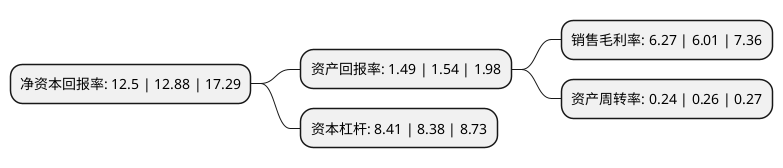

> 本页面由自动化程序生成于 2022年5月20日 01:31
> 内容可能存在错误，如有bug请提交issue至：https://github.com/Eroleice/doc-pi/issues
{.is-warning}

# 上市公司基本情况

## 基本资料

中国太平洋保险(集团)股份有限公司（以下简称“中国太保”）成立于1991年05月13日，上海市。于2007年12月25日在上交所主板上市。

中国太保注册资本962,034.146万元，主要通过下属的中国太平洋人寿保险股份有限公司(以下简称“太保寿险”)和中国太平洋财产保险股份有限公司(以下简称“太保产险”)为客户提供全面的人寿及财产保险产品和服务，并通过下属的太平洋资产管理有限责任公司管理和运用保险资金。以下是详细信息：

- 公司名称: 中国太平洋保险(集团)股份有限公司
- 股票代码: 601601.SH
- 所在地: 上海 - 上海市
- 成立日期: 1991年05月13日
- 注册资本: 962,034.146万元
- 法定代表人: 孔庆伟
- 主营业务: 主要通过下属的中国太平洋人寿保险股份有限公司(以下简称“太保寿险”)和中国太平洋财产保险股份有限公司(以下简称“太保产险”)为客户提供全面的人寿及财产保险产品和服务，并通过下属的太平洋资产管理有限责任公司管理和运用保险资金
- 公司官网: www.cpic.com.cn
- 公司介绍: 公司是在1991年5月13日成立的中国太平洋保险公司的基础上组建而成的保险集团公司，总部设在上海，是国内领先的“A+H”股上市综合性保险集团。公司专注保险主业,围绕保险主业链条不断丰富经营范围，目前已经实现了寿险、产险、养老险、健康险、农险和资产管理的全保险牌照布局，各业务板块正在实现共享发展；关注客户需求,推动实施以客户需求为导向的战略转型，“以客户需求为导向”的价值观和方法论已经内化成公司的生命基因；聚焦价值增长：寿险业务追求高质量的新业务价值增长，产险业务坚持承保盈利，资产管理业务实现投资收益持续超越负债成本。

## 股东及高管情况

上市公司第一大股东为香港中央结算(代理人)有限公司，持股2,772,582,429股，占比28.82%，**疑似为**上市公司实际控制人。

截至2022年03月31日，上市公司的前十大股东中，共有6名机构股东，1个产品账户，3个海外主体，其中5%以上大股东共有4名。上市公司前十大股东明细如下：

> 未能通过持股比例判定出上市公司实际控制人（持股30%以上）
> 可能存在通过间接持股、联合持股、协议控制等方式拥有实际控制权的主体，具体请参考上市公司定期公告！
{.is-warning}

> 截至2022年03月31日，上市公司前十大股东信息如下：

| 股东名称 | 持股数量（股） | 持股比例 |
| --- | --- | --- |
| 香港中央结算(代理人)有限公司 | 2,772,582,429 | 28.82% |
| 申能(集团)有限公司 | 1,326,776,782 | 13.79% |
| 华宝投资有限公司 | 1,284,277,846 | 13.35% |
| 上海国有资产经营有限公司 | 584,112,339 | 6.07% |
| 上海海烟投资管理有限公司 | 468,828,104 | 4.87% |
| 中国证券金融股份有限公司 | 271,089,843 | 2.82% |
| 香港中央结算有限公司(陆股通) | 190,227,978 | 1.98% |
| 上海国际集团有限公司 | 160,000,000 | 1.66% |
| Citibank, National Association | 149,838,515 | 1.56% |
| 中国国有企业结构调整基金股份有限公司 | 115,181,140 | 1.2% |

## 杜邦分析

> 数据列示周期：2021年 | 2020年 | 2019年
{.is-info}

上市公司的净资产收益率在近一年有所下降，下降幅度为-2.95%，其变化情况分解如下：
- 上市公司的销售毛利率在近一年上升了4.33%，可能是生产效率的提升、商品原材料价格下跌或商品价格的上涨所致。
- 上市公司的资产周转率在近一年下降了-7.69%，可能是源自于更慢的销售回款或库存管理效果下降。
- 上市公司的财务杠杆比率在近一年上升了0.36%，可能是增加负债扩大生产规模。

