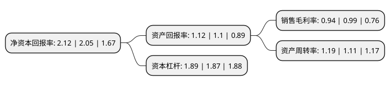

> 本页面由自动化程序生成于 2022年5月20日 01:01
> 内容可能存在错误，如有bug请提交issue至：https://github.com/Eroleice/doc-pi/issues
{.is-warning}

# 上市公司基本情况

## 基本资料

深圳中恒华发股份有限公司（以下简称“深华发A”）成立于1981年12月08日，深圳市。于1992年04月28日在深交所主板上市。

深华发A注册资本28,316.123万元，主要产品:彩电，电路板，注塑件。以下是详细信息：

- 公司名称: 深圳中恒华发股份有限公司
- 股票代码: 000020.SZ
- 所在地: 广东 - 深圳市
- 成立日期: 1981年12月08日
- 注册资本: 28,316.123万元
- 法定代表人: 李中秋
- 主营业务: 主要产品:彩电，电路板，注塑件
- 公司官网: www.hwafa.com.cn
- 公司介绍: 公司是深圳证券交易所早期上市的公司之一，是全国外商投资双优企业。公司经营业务主要分为液晶显示器整机业务、注塑件生产业务、保丽龙(轻型材料包装)生产业务、物业租赁业务。公司拥有三间大型工厂，国内多家知名大型生产企业云集周边，基于加工配套服务业的辐射半径要求，客户资源优质稳定，已形成良好的长期合作关系,尤其注塑业务与保丽龙业务迄今经营多年，年产能力及规模居华中地区前列;在深圳市福田区华强北商圈及光明新区公明街道均拥有数万平方米的大型物业，每年物业租赁收入可观。公司未来自有土地资源的开发与经营将成为公司循序渐进式的长期稳定的收入来源和新的利润增长点。

## 股东及高管情况

上市公司第一大股东为武汉中恒新科技产业集团有限公司，持股119,289,894股，占比42.13%，为上市公司实际控制人。

截至2022年03月31日，上市公司的前十大股东中，共有5名自然人股东，4名机构股东，1个海外主体，其中5%以上大股东共有2名。上市公司前十大股东明细如下：

> 截至2022年03月31日，上市公司前十大股东信息如下：

| 股东名称 | 持股数量（股） | 持股比例 |
| --- | --- | --- |
| 武汉中恒新科技产业集团有限公司 | 119,289,894 | 42.13% |
| 赛格(香港)有限公司 | 16,569,560 | 5.85% |
| GOOD HOPE CORNER INVESTMENTS LTD. | 7,072,000 | 2.5% |
| 长江证劵经纪(香港)有限公司 | 5,355,249 | 1.89% |
| 国元证券经纪(香港)有限公司 | 3,870,117 | 1.37% |
| 李中秋 | 2,830,000 | 1% |
| 黄雪林 | 2,033,301 | 0.72% |
| 金国萍 | 1,869,300 | 0.66% |
| 李玮 | 1,610,000 | 0.57% |
| 姚明 | 1,527,800 | 0.54% |

## 利润表分析

上市公司2021年总收入为7.65亿元，净利润为0.07亿元，实现盈利。

## 杜邦分析

> 数据列示周期：2021年 | 2020年 | 2019年
{.is-info}

上市公司的净资产收益率在近一年有所上升，上升幅度为3.41%，其变化情况分解如下：
- 上市公司的销售毛利率在近一年下降了-5.05%，可能是生产效率的下降、商品原材料价格上涨或商品价格的下跌所致。
- 上市公司的资产周转率在近一年上升了7.21%，可能是源自于更快的销售回款或库存管理效果提升。
- 上市公司的财务杠杆比率在近一年上升了1.07%，可能是增加负债扩大生产规模。

