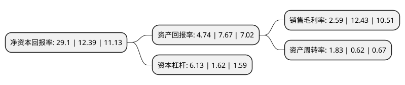

> 本页面由自动化程序生成于 2022年5月20日 01:01
> 内容可能存在错误，如有bug请提交issue至：https://github.com/Eroleice/doc-pi/issues
{.is-warning}

# 上市公司基本情况

## 基本资料

深圳市桑达实业股份有限公司（以下简称“深桑达A”）成立于1993年12月04日，深圳市。于1993年10月28日在深交所主板上市。

深桑达A注册资本113,874.484万元，主要业务:电子设备，电子元器件，电子消费通信产品的生产，销售及房地产开发。主要产品:彩电回扫变压器，手机，“棕榈湾”楼盘，模块电源。以下是详细信息：

- 公司名称: 深圳市桑达实业股份有限公司
- 股票代码: 000032.SZ
- 所在地: 广东 - 深圳市
- 成立日期: 1993年12月04日
- 注册资本: 113,874.484万元
- 法定代表人: 陈士刚
- 主营业务: 电子设备，电子元器件，电子消费通信产品的生产，销售及房地产开发主要产品:彩电回扫变压器，手机，“棕榈湾”楼盘，模块电源
- 公司官网: www.sedind.com
- 公司介绍: 公司是一家以电子整机产品、新兴电子元器件等电子高新技术产品为主导的上市公司。公司主要经营以电子整机产品、新兴电子元器件等电子高新技术产品为主导，兼及房地产、商贸等多个领域。公司在坚持科技创新，不断开发新技术和新产品的同时，努力拓展发展空间，现已与国外多家知名企业开展广泛的技术交流与合作；以诚信为基础，以共赢为目标，公司业已建立良好的市场信誉，实现了集研发、生产、销售与售后服务于一体的战略体系；公司通过多年的发展，培养和锻炼了一支敬业、奉献、高素质的专业人才队伍，成为公司各项事业持续向前推进的有力保障。

## 股东及高管情况

上市公司第一大股东为中国中电国际信息服务有限公司，持股202,650,154股，占比17.8%，**疑似为**上市公司实际控制人。

截至2022年03月31日，上市公司的前十大股东中，共有1名自然人股东，8名机构股东，1个产品账户，其中5%以上大股东共有3名。上市公司前十大股东明细如下：

> 未能通过持股比例判定出上市公司实际控制人（持股30%以上）
> 可能存在通过间接持股、联合持股、协议控制等方式拥有实际控制权的主体，具体请参考上市公司定期公告！
{.is-warning}

> 截至2022年03月31日，上市公司前十大股东信息如下：

| 股东名称 | 持股数量（股） | 持股比例 |
| --- | --- | --- |
| 中国中电国际信息服务有限公司 | 202,650,154 | 17.8% |
| 中国电子信息产业集团有限公司 | 199,241,427 | 17.5% |
| 中电金投控股有限公司 | 81,863,640 | 7.19% |
| 工银金融资产投资有限公司 | 48,595,470 | 4.27% |
| 中电智慧基金管理有限公司-中电海河智慧新兴产业投资基金(天津)合伙企业(有限合伙) | 48,595,470 | 4.27% |
| 陈士刚 | 48,595,470 | 4.27% |
| 德盛投资集团有限公司 | 38,987,364 | 3.42% |
| 中国电子进出口有限公司 | 38,391,238 | 3.37% |
| 横琴宏德嘉业投资中心(有限合伙) | 35,581,603 | 3.12% |
| 横琴宏图嘉业投资中心(有限合伙) | 35,581,603 | 3.12% |

## 利润表分析

上市公司2021年总收入为427.03亿元，净利润为11.07亿元，实现盈利。

## 杜邦分析

> 数据列示周期：2021年 | 2020年 | 2019年
{.is-info}

上市公司的净资产收益率在近一年有所上升，上升幅度为134.87%，其变化情况分解如下：
- 上市公司的销售毛利率在近一年下降了-79.16%，可能是生产效率的下降、商品原材料价格上涨或商品价格的下跌所致。
- 上市公司的资产周转率在近一年上升了195.16%，可能是源自于更快的销售回款或库存管理效果提升。
- 上市公司的财务杠杆比率在近一年上升了278.4%，可能是增加负债扩大生产规模。

