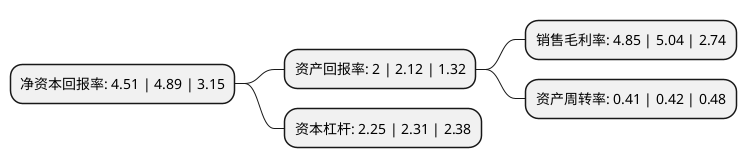

> 本页面由自动化程序生成于 2022年5月20日 01:01
> 内容可能存在错误，如有bug请提交issue至：https://github.com/Eroleice/doc-pi/issues
{.is-warning}

# 上市公司基本情况

## 基本资料

天马微电子股份有限公司（以下简称“深天马A”）成立于1983年11月08日，深圳市。于1995年03月15日在深交所主板上市。

深天马A注册资本245,774.766万元，主要产品:液晶显示器，液晶显示模块。以下是详细信息：

- 公司名称: 天马微电子股份有限公司
- 股票代码: 000050.SZ
- 所在地: 广东 - 深圳市
- 成立日期: 1983年11月08日
- 注册资本: 245,774.766万元
- 法定代表人: 彭旭辉
- 主营业务: 主要产品:液晶显示器，液晶显示模块
- 公司官网: www.tianma.com
- 公司介绍: 公司是一家在全球范围内提供显示解决方案和快速服务支持的创新型科技企业，主要经营液晶显示器(LCD)及液晶显示模块(LCM)。公司聚焦于移动终端消费类显示市场和车载、医疗、工控等专业类显示市场，这两大类产品广泛应用于智能手机、平板电脑、车载显示、医疗显示、工业仪表、智能穿戴和智能家居等众多领域。公司是国内规模最大的液晶显示器及模块制造商之一。2018年公司通过重大资产重组拥有厦门天马100%股权以及天马有机发光60%股权,有利于上市公司充分发挥协同效应及规模优势，提升市场综合竞争力，提高上市公司盈利能力和可持续发展能力。

## 股东及高管情况

上市公司第一大股东为厦门金财产业发展有限公司，持股389,610,040股，占比15.85%，**疑似为**上市公司实际控制人。

截至2022年03月31日，上市公司的前十大股东中，共有1名自然人股东，7名机构股东，1个产品账户，1个海外主体，其中5%以上大股东共有5名。上市公司前十大股东明细如下：

> 未能通过持股比例判定出上市公司实际控制人（持股30%以上）
> 可能存在通过间接持股、联合持股、协议控制等方式拥有实际控制权的主体，具体请参考上市公司定期公告！
{.is-warning}

> 截至2022年03月31日，上市公司前十大股东信息如下：

| 股东名称 | 持股数量（股） | 持股比例 |
| --- | --- | --- |
| 厦门金财产业发展有限公司 | 389,610,040 | 15.85% |
| 中航国际控股有限公司 | 291,567,326 | 11.86% |
| 湖北省科技投资集团有限公司 | 196,619,812 | 8% |
| 中国航空技术深圳有限公司 | 179,516,146 | 7.3% |
| 中国航空技术国际控股有限公司 | 172,097,332 | 7% |
| 武汉光谷新技术产业投资有限公司 | 99,352,467 | 4.04% |
| 湖北长江天马定增投资基金合伙企业(有限合伙) | 81,924,922 | 3.33% |
| 马信琪 | 50,056,535 | 2.04% |
| 香港中央结算有限公司(陆股通) | 39,417,501 | 1.6% |
| 中国航空技术厦门有限公司 | 36,525,940 | 1.49% |

## 利润表分析

上市公司2021年总收入为318.29亿元，净利润为15.42亿元，实现盈利。

## 杜邦分析

> 数据列示周期：2021年 | 2020年 | 2019年
{.is-info}

上市公司的净资产收益率在近一年有所下降，下降幅度为-7.77%，其变化情况分解如下：
- 上市公司的销售毛利率在近一年下降了-3.77%，可能是生产效率的下降、商品原材料价格上涨或商品价格的下跌所致。
- 上市公司的资产周转率在近一年下降了-2.38%，可能是源自于更慢的销售回款或库存管理效果下降。
- 上市公司的财务杠杆比率在近一年下降了-2.6%，可能是减少负债降低财务费用。

