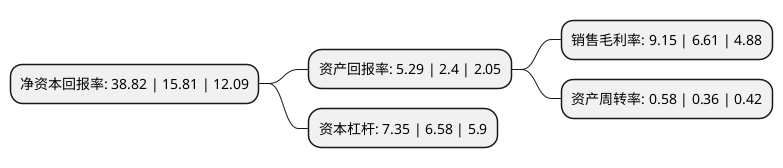

> 本页面由自动化程序生成于 2022年5月20日 01:01
> 内容可能存在错误，如有bug请提交issue至：https://github.com/Eroleice/doc-pi/issues
{.is-warning}

# 上市公司基本情况

## 基本资料

TCL科技集团股份有限公司（以下简称“TCL科技”）成立于1982年03月11日，惠州市。于2004年01月30日在深交所主板上市。

TCL科技注册资本1,403,064.242万元，主要业务:多媒体电子业务，通信业务，电脑，家电，电气业务。主要产品:多媒体产品，其他家电产品，移动电话，电脑，电话机，电工产品，IT产品。以下是详细信息：

- 公司名称: TCL科技集团股份有限公司
- 股票代码: 000100.SZ
- 所在地: 广东 - 惠州市
- 成立日期: 1982年03月11日
- 注册资本: 1,403,064.242万元
- 法定代表人: 李东生
- 主营业务: 多媒体电子业务，通信业务，电脑，家电，电气业务主要产品:多媒体产品，其他家电产品，移动电话，电脑，电话机，电工产品，IT产品
- 公司官网: www.tcltech.com
- 公司介绍: TCL集团创立于1981年，2004年1月在深交所主板上市，38年以来TCL一直坚守实业，在持续变革创新中突出竞争优势。2018年底，TCL集团启动了以专业化经营为核心的重组，转型为聚焦半导体显示及材料业务的科技创新产业集团，并以产业牵引，发展产业金融和投资业务。TCL集团以产品技术创新为重要驱动力，提升技术能力和工业能力，保持优于行业的效率和效益指标。旗下TCL华星是全球半导体显示行业的引领者，旗下有2条8.5代面板生产线，2条11代超大型、商用显示生产线，1条6代LTPS面板生产线和1条AMOLED生产线，目前55吋电视面板市占率居全球第1位，LTPS手机面板市占率提升至全球第2位，AMOLED即将量产。TCL将以全球行业领先为目标，不断提高竞争力，持续健康发展，用优秀的业绩，为中国经济、社会发展做贡献，为股东创造更大的价值。

## 股东及高管情况

上市公司第一大股东为李东生及其一致行动人，持股1,158,599,393股，占比8.26%，**疑似为**上市公司实际控制人。

截至2022年03月31日，上市公司的前十大股东中，共有4名机构股东，4个产品账户，1个海外主体，1名其他股东，其中5%以上大股东共有2名。上市公司前十大股东明细如下：

> 未能通过持股比例判定出上市公司实际控制人（持股30%以上）
> 可能存在通过间接持股、联合持股、协议控制等方式拥有实际控制权的主体，具体请参考上市公司定期公告！
{.is-warning}

> 上市公司第一大股东持股不超过10%，请检查是否存在公司控制权风险！
{.is-danger}

> 截至2022年03月31日，上市公司前十大股东信息如下：

| 股东名称 | 持股数量（股） | 持股比例 |
| --- | --- | --- |
| 李东生及其一致行动人 | 1,158,599,393 | 8.26% |
| 惠州市投资控股有限公司 | 743,139,840 | 5.3% |
| 武汉光谷产业投资有限公司 | 558,552,396 | 3.98% |
| 香港中央结算有限公司(陆股通) | 380,385,171 | 2.71% |
| 中国证券金融股份有限公司 | 373,231,553 | 2.66% |
| 西藏天丰企业管理有限公司 | 215,582,406 | 1.54% |
| TCL科技集团股份有限公司-2021-2023年员工持股计划(第一期) | 113,143,154 | 0.81% |
| 信泰人寿保险股份有限公司-传统产品 | 104,190,172 | 0.74% |
| 南方基金-农业银行-南方中证金融资产管理计划 | 74,761,500 | 0.53% |
| 工银瑞信基金-农业银行-工银瑞信中证金融资产管理计划 | 74,761,500 | 0.53% |

## 利润表分析

上市公司2021年总收入为1,636.9亿元，净利润为149.58亿元，实现盈利。

## 杜邦分析

> 数据列示周期：2021年 | 2020年 | 2019年
{.is-info}

上市公司的净资产收益率在近一年有所上升，上升幅度为145.54%，其变化情况分解如下：
- 上市公司的销售毛利率在近一年上升了38.43%，可能是生产效率的提升、商品原材料价格下跌或商品价格的上涨所致。
- 上市公司的资产周转率在近一年上升了61.11%，可能是源自于更快的销售回款或库存管理效果提升。
- 上市公司的财务杠杆比率在近一年上升了11.7%，可能是增加负债扩大生产规模。

